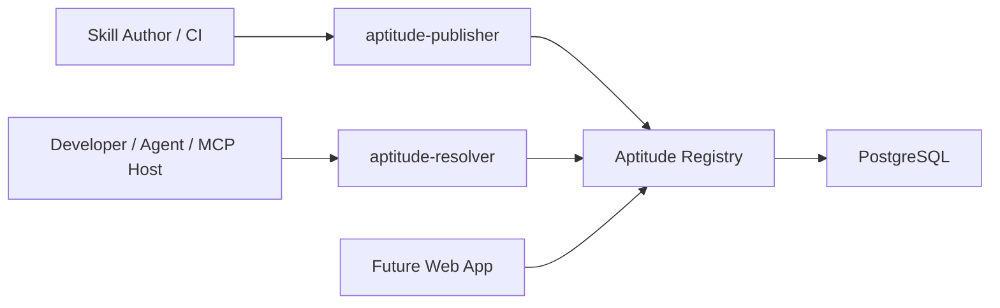

# Aptitude

[](https://www.python.org/)
[](https://docs.astral.sh/uv/)
[](https://fastapi.tiangolo.com/)
[](https://www.postgresql.org/)
[](https://docs.pytest.org/)
[](https://docs.astral.sh/ruff/)
[](https://www.docker.com/)
[](https://github.com/features/actions)
[](https://cloud.google.com/)

Aptitude is a governed, versioned skill infrastructure for AI systems.

It turns skills into structured artifacts that can be published, discovered,
resolved, locked, and materialized through a clear split between publishing,
registry facts, and client-side decision making. The platform is CLI-first and
MCP-first, with deterministic execution centered on immutable versions and
resolver-generated lockfiles.

## Pain Points

The current AI skill ecosystem lacks the structure needed to discover, trust,
govern, and compose skills reliably at scale.

- Accessibility: skills are scattered across repos, docs, and prompts, with no standard discovery mechanism.
- Quality and security: validation, benchmarking, provenance, and trust signals are inconsistent or missing.
- Governance and control: organizations lack closed, policy-controlled registries and lifecycle enforcement.
- Dependency management and atomicity: skills are rarely packaged as atomic, reusable units with explicit dependency relationships.

These gaps lead to low reuse, brittle agent behavior, unsafe capability usage,
and non-deterministic execution.

## The Aptitude Solution

Aptitude turns skills into governed, versioned assets that can be safely
discovered, resolved, and reused through a three-layer model:

- Publish, govern, store: validated skills are packaged and published as immutable versioned artifacts.
- Discover, retrieve: consumers query indexed metadata and fetch exact versions under policy-controlled visibility.
- Decide, resolve, execute: the resolver selects candidates, expands dependencies, applies governance, and generates deterministic locks and execution plans.

In practice, this turns loose capabilities into governed assets, prompt chaos
into structured infrastructure, and trial-and-error usage into deterministic
execution.

## What Aptitude Includes

- `aptitude-publisher` for authoring workflows, packaging, validation, and CI-driven publication
- `Aptitude Registry` for immutable storage, indexed discovery, exact fetch, lifecycle state, and audit
- `aptitude-resolver` for query interpretation, candidate reranking, dependency solving, governance checks, lock generation, and local materialization
- PostgreSQL as the canonical store for metadata, content digests, lifecycle state, and audit records
- A documentation and operations layer that defines architecture, contracts, contributor workflows, and runbooks



## System Model

Aptitude is intentionally split by ownership:

- Publisher enforces skill quality before publication through packaging, validation, benchmarking, security checks, and provenance capture.
- Registry stores immutable facts: published metadata, artifacts, checksums, lifecycle state, indexed discovery data, and audit records.
- Resolver makes runtime decisions: query interpretation, candidate reranking, version selection, dependency expansion, governance evaluation, lock generation, and execution planning.

This boundary is deliberate: the registry returns facts, while the resolver makes the final decision about what to install and how to execute it.

## Core Technical Flows

- Publish: author or CI submits validated artifacts through the publisher into the registry as immutable versions.
- Discovery: the registry returns candidate skills from indexed metadata and descriptions without making the final runtime choice.
- Resolution: the resolver pins versions, expands dependencies, applies governance, and generates a deterministic lockfile.
- Materialization: the resolver fetches exact artifacts, verifies integrity, and prepares the local environment.
- Lock replay: existing locks skip discovery and solving so execution can be reproduced exactly.

This model keeps storage and search stable while allowing resolver-side ranking and planning logic to evolve without changing registry truth.

## Why This Model

- Skills become reusable, versioned assets instead of ad hoc prompt glue.
- Indexed discovery remains fast because candidate retrieval stays close to canonical metadata.
- Runtime selection remains context-aware because final choice and graph solving happen in the resolver.
- Reproducibility comes from immutable published versions, checksum-backed fetches, and client-side locks.
- Governance can separate what exists, what is visible, and what is allowed at execution time.

## How To Run

Use `uvx` to launch the resolver directly without a manual install:

```bash
uvx aptitude-resolver@latest
```

Launch the installation wizard:

```bash
uvx aptitude-resolver@latest install
```

Launch the installation wizard with a free-text query:

```bash
uvx aptitude-resolver@latest install "query input (free text)"
```

Launch the sync wizard:

```bash
uvx aptitude-resolver@latest sync
```

## Repositories

- **[Aptitude/.github](https://github.com/Aptitude/.github)** - organization profile, shared documentation, architecture references, and admin material
- **[Aptitude/aptitude-server](https://github.com/Aptitude/aptitude-server)** - registry backend and public HTTP API
- **[Aptitude/aptitude-resolver](https://github.com/Aptitude/aptitude-resolver)** - agent-facing resolver for discovery, solving, lock generation, and execution planning
- **[Aptitude/aptitude-publisher](https://github.com/Aptitude/aptitude-publisher)** - publishing and release surface for authors and CI

## Documentation Map

- [Product Overview](./project%20overview.md)
- [High-Level Design](./high-level-design.md)
- [Registry Docs](./docs/registry/README.md)
- [Registry Architecture Overview](./docs/registry/architecture/system-overview.md)
- [Registry API Contract](./docs/registry/reference/api-contract.md)
- [Resolver Docs](./docs/resolver/README.md)
- [Resolver Architecture Overview](./docs/resolver/architecture/system-overview.md)
- [Registry/Resolver Boundary](./docs/registry/architecture/server-resolver-boundary.md)
