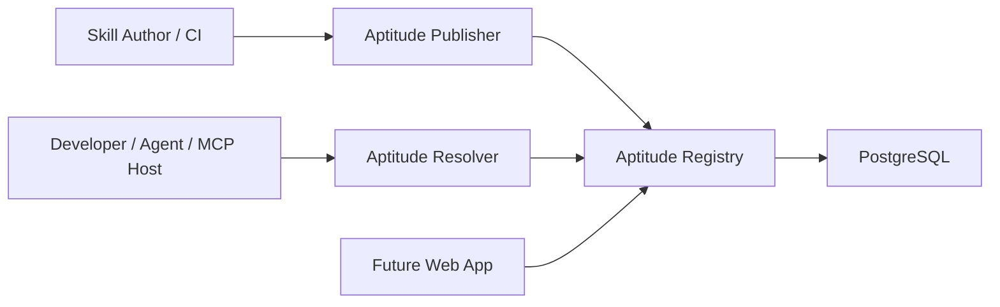

# Aptitude

[](https://www.python.org/)
[](https://docs.astral.sh/uv/)
[](https://fastapi.tiangolo.com/)
[](https://www.postgresql.org/)
[](https://docs.pytest.org/)
[](https://docs.astral.sh/ruff/)
[](https://www.docker.com/)
[](https://github.com/features/actions)
[](https://cloud.google.com/)

Aptitude is a governed, versioned skill platform for AI systems.

It turns skills into structured artifacts that can be published through a
controlled workflow, stored as immutable registry facts, and resolved locally
into deterministic locks and execution plans. The platform is CLI-first and
MCP-friendly, with a deliberate boundary: the registry serves facts, while the
resolver makes the final runtime decisions.

## Pain Points

The current AI skill ecosystem lacks the structure needed to discover, trust,
govern, and compose skills reliably at scale.

- Accessibility: skills are scattered across repos, docs, and prompts, and
  discovery often falls back to GitHub crawling or source installs.
- Quality and security: publication, validation, provenance, and trust signals
  are inconsistent or missing.
- Governance and control: organizations lack closed, policy-controlled
  registries, lifecycle enforcement, and configurable execution guardrails.
- Dependency management and reproducibility: skills are rarely packaged as
  atomic units with explicit dependencies, exact versions, and shareable locks.

These gaps lead to low reuse, brittle agent behavior, unsafe capability usage,
and non-deterministic execution.

## The Aptitude Solution

Aptitude turns skills into governed, versioned assets that can be safely
published, discovered, resolved, and replayed through a three-layer model:

- Author and publish: publisher workflows package, validate, and submit skills
  as immutable, versioned artifacts.
- Store and serve facts: the registry stores metadata, content, lifecycle
  state, and audit history while serving indexed discovery and exact fetch.
- Decide and materialize: the resolver interprets user intent, reranks
  candidates, solves dependencies, applies governance, and produces lockfiles
  and local materialization plans.

In practice, this turns loose capabilities into governed assets, prompt chaos
into structured infrastructure, and trial-and-error usage into deterministic
execution.

## What Aptitude Includes

- `aptitude-publisher` for authoring workflows, packaging, validation, and
  publication into the catalog
- `Aptitude Registry` for immutable metadata and content storage, indexed
  discovery, exact fetch, lifecycle state, and audit
- `aptitude-resolver` for query interpretation, candidate reranking, version
  selection, dependency solving, governance checks, lock generation, and local
  materialization
- PostgreSQL as the canonical runtime store for registry metadata, content,
  lifecycle state, provenance snapshots, and audit records
- A documentation and operations layer that defines architecture, contracts,
  contributor workflows, and runbooks



## System Model

Aptitude is intentionally split by ownership:

- Publisher owns authoring and publication workflows: packaging, validation,
  CI-driven release paths, and submission into the registry.
- Registry stores immutable facts: published metadata, markdown content,
  authored dependency selectors, lifecycle state, provenance snapshots, and
  audit records.
- Resolver makes local decisions: query interpretation, candidate reranking,
  version selection, dependency solving, governance evaluation, lock
  generation, execution planning, and materialization.

This boundary is deliberate: the registry returns facts, while the resolver
makes the final decision about what to install and how to execute it.

## Core Technical Flows

- Publish: an author or CI pipeline packages and validates a skill, then
  publishes an immutable version into the registry.
- Discovery: the registry returns candidate skills from indexed metadata and
  search projections without making the final runtime choice.
- Resolution: the resolver selects versions, expands dependency graphs, applies
  governance, and generates a deterministic lockfile.
- Materialization: the resolver fetches exact content, verifies integrity, and
  prepares the local environment.
- Lock replay: existing locks skip discovery and dependency solving so
  execution can be reproduced exactly.

This model keeps storage and search stable while allowing resolver-side ranking
and planning logic to evolve without changing registry truth.

## Why This Model

- Skills become reusable, versioned assets instead of ad hoc prompt glue.
- Publication is controlled and repeatable instead of relying on scattered
  repositories as the installation unit.
- Registry reads stay fast because discovery, exact fetch, and dependency-edge
  reads are treated as distinct workloads over canonical data.
- Runtime selection stays context-aware because ranking, version choice, and
  dependency solving happen in the resolver, not the registry.
- Reproducibility comes from immutable published versions, checksum-backed
  fetches, client-side locks, and shareable lockfiles.
- Governance can separate what exists in the catalog, what is visible to a
  caller, and what is allowed at execution time.
- The result is an MCP-friendly platform with clearer operational boundaries
  and more predictable agent behavior.

## Competitive Landscape

The market has tools for skill sharing, runtime capability use, and skill
research, but most solutions only solve part of the lifecycle.

- Skills marketplaces and installer-style tools help distribute skills, but usually depend on weaker governance and less reproducible installation models.
- Runtime frameworks and model tool-calling APIs help agents use capabilities, but they are not structured registry and lifecycle systems.
- Research systems explore skill creation and evaluation, but they are not enterprise-oriented control planes.

Aptitude is different because it combines a closed publication model, structured
artifact storage, atomic dependency-aware skill composition, shareable
lockfiles, and configurable policy enforcement in one agent-friendly platform.

## How To Run

Use `uvx` to run the resolver without a manual install:

```bash
uvx aptitude-resolver@latest --help
```

Start the install-first CLI entrypoint:

```bash
uvx aptitude-resolver@latest
```

Install from a free-text query:

```bash
uvx aptitude-resolver@latest install "Postman Primary Skill"
```

Replay an existing lockfile:

```bash
uvx aptitude-resolver@latest sync --lock aptitude.lock.json
```

## Repositories

- **[Aptitude/.github](https://github.com/Aptitude/.github)** - organization profile, shared documentation, architecture references, and admin material
- **[Aptitude/aptitude-server](https://github.com/Aptitude/aptitude-server)** - Aptitude Registry backend and public HTTP API
- **[Aptitude/aptitude-resolver](https://github.com/Aptitude/aptitude-resolver)** - agent-facing resolver for discovery, solving, lock generation, and execution planning
- **[Aptitude/aptitude-publisher](https://github.com/Aptitude/aptitude-publisher)** - authoring, packaging, validation, and publication workflows for authors and CI

## Documentation Map -

- [Product Overview](https://github.com/aptitude-stack/docs/blob/main/project-overview.md)
- [Competitive Landscape](https://github.com/aptitude-stack/docs/blob/main/docs/project/competitive-landscape.md)
- [High-Level Design](https://github.com/aptitude-stack/docs/blob/main/high-level-design.md)
- [Registry Docs](https://github.com/aptitude-stack/docs/blob/main/docs/registry/README.md)
- [Registry Architecture Overview](https://github.com/aptitude-stack/docs/blob/main/docs/registry/architecture/system-overview.md)
- [Registry API Contract](https://github.com/aptitude-stack/docs/blob/main/docs/registry/reference/api-contract.md)
- [Resolver Docs](https://github.com/aptitude-stack/docs/blob/main/docs/resolver/README.md)
- [Resolver Architecture Overview](https://github.com/aptitude-stack/docs/blob/main/docs/resolver/architecture/system-overview.md)
- [Registry/Resolver Boundary](https://github.com/aptitude-stack/docs/blob/main/docs/registry/architecture/server-resolver-boundary.md)
