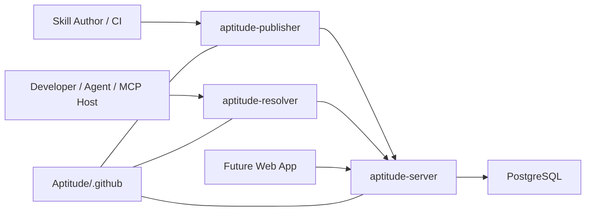

# Aptitude

Aptitude is a versioned, dependency-aware ecosystem for AI skills.

It gives teams and agent platforms a clean way to publish reusable skills,
govern them through a registry, discover the right candidates quickly, and
produce deterministic execution plans through a stable client-server contract.

Today, Aptitude is CLI-first and MCP-first. A future web application can sit on
top of the same APIs, but the core product boundary remains split across
publisher, registry, and resolver surfaces.

## What Aptitude Includes

- `aptitude-publisher` for authoring and CI publishing workflows
- `aptitude-server` for validation, immutable storage, discovery, fetch,
  lifecycle governance, and audit
- `aptitude-resolver` for CLI and MCP integration, reranking, dependency
  solving, lock generation, and execution planning
- PostgreSQL as the canonical store for metadata, content digests, lifecycle
  state, and audit records
- `Aptitude/.github` as the organization-level documentation and admin hub

## Architecture

Aptitude is intentionally split by ownership:

- Server owns data-local work: publish validation, immutable storage, search,
  exact fetch, lifecycle policy, and audit.
- Resolver owns decision-local work: prompt interpretation, reranking, final
  selection, dependency solving, lock generation, and execution planning.
- Publisher owns packaging and release UX, but the server remains the only
  authoritative source of truth for published skill state.

This keeps the registry fast and cache-friendly while allowing runtime
selection and planning logic to evolve independently on the client side.

## Why This Model

- AI skills become reusable, versioned artifacts instead of ad hoc prompt glue.
- Discovery stays fast because candidate retrieval happens close to indexed
  metadata and descriptions.
- Final skill choice remains context-aware because reranking and solving stay in
  the resolver.
- Reproducibility comes from immutable published versions and client-side locks.

## Repositories

- **[Aptitude/.github](https://github.com/Aptitude/.github)** - Organization
  profile, shared documentation, architecture references, and admin material.
- **[Aptitude/aptitude-server](https://github.com/Aptitude/aptitude-server)** -
  Registry backend and public HTTP API.
- **[Aptitude/aptitude-resolver](https://github.com/Aptitude/aptitude-resolver)** -
  Agent-facing resolver for discovery, lock generation, and execution planning.
- **[Aptitude/aptitude-publisher](https://github.com/Aptitude/aptitude-publisher)** -
  Publishing and release surface for authors and CI.

## Project Docs

- [Aptitude Stack Overview](../docs/project/overview.md)
- [Repository Map](../docs/project/repository-map.md)
- [Scope and Ownership Boundary](../docs/project/scope.md)
- [Publisher, Server, Resolver Architecture](../docs/project/publisher-server-resolver-architecture.md)
- [Server API Contract](../docs/project/api-contract.md)
- [High-Level Design](../docs/high-level-design.md)
