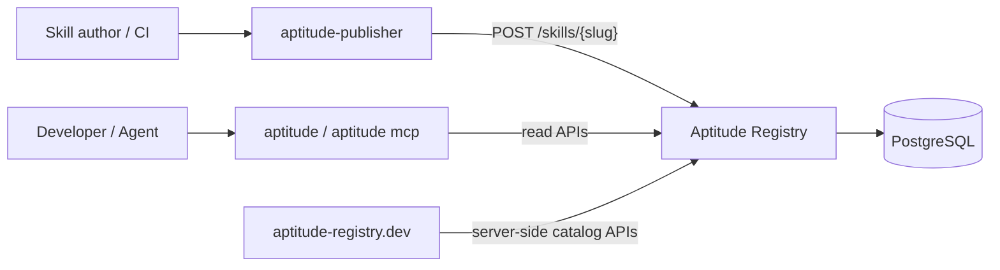

# Aptitude Docs

Aptitude is a governed skill platform for AI systems. It treats skills as
versioned artifacts: authors publish them, the registry stores immutable facts
about them, and the resolver selects and materializes them into reproducible
local execution plans.

The system is intentionally split into three components:

- **Publisher** - local author and CI tool that evaluates a skill folder,
  prepares registry metadata, and uploads a deterministic `.tar.zst` bundle.
- **Registry** - FastAPI service that stores immutable skill versions,
  governance state, search indexes, audit events, catalog feeds, and exact
  artifact bytes.
- **Resolver** - local CLI and MCP server that interprets user intent, selects a
  candidate, solves dependencies, applies client policy, writes a lockfile, and
  materializes artifacts.

The most important boundary is simple:

> Publisher prepares. Registry stores facts. Resolver makes runtime decisions.

## Start Here

| Goal | Read |
| --- | --- |
| Understand the product | [Product Overview](https://github.com/aptitude-stack/docs/blob/main/product-overview.md) |
| Understand the technical design | [System Architecture](https://github.com/aptitude-stack/docs/blob/main/architecture.md) |
| Review the design summary | [High-Level Design](https://github.com/aptitude-stack/docs/blob/main/high-level-design.md) |
| Understand the publisher | [Publisher Overview](https://github.com/aptitude-stack/docs/blob/main/publisher/product-overview.md) |
| Understand the registry | [Registry Overview](https://github.com/aptitude-stack/docs/blob/main/registry/product-overview.md) |
| Understand the resolver | [Resolver Overview](https://github.com/aptitude-stack/docs/blob/main/resolver/product-overview.md) |

## Component Docs

### Publisher

- [Overview](https://github.com/aptitude-stack/docs/blob/main/publisher/product-overview.md) - scope, users, commands, and
  ownership boundary.
- [Architecture](https://github.com/aptitude-stack/docs/blob/main/publisher/architecture.md) - package map, pipeline, gates,
  artifacts, and registry transport.
- [Evaluation Pipeline](https://github.com/aptitude-stack/docs/blob/main/publisher/evaluation-pipeline.md) - stage-by-stage
  reference for inspection and publish runs.
- [Audit Pipeline](https://github.com/aptitude-stack/docs/blob/main/publisher/audit-pipeline.md) - local `.publisher_artifacts`
  trace model.
- [Policies](https://github.com/aptitude-stack/docs/blob/main/publisher/policies.md) - security, validation, and registry
  governance handoff.

### Registry

- [Overview](https://github.com/aptitude-stack/docs/blob/main/registry/product-overview.md) - service scope, API families, and
  operating model.
- [Architecture](https://github.com/aptitude-stack/docs/blob/main/registry/architecture.md) - interface, core, persistence,
  search, governance, and operations design.
- [Discovery Mechanism](https://github.com/aptitude-stack/docs/blob/main/registry/discovery-mechanism.md) - lexical, semantic,
  co-usage, fusion, and catalog search behavior.
- [Policies](https://github.com/aptitude-stack/docs/blob/main/registry/policies.md) - token scopes, namespaces, lifecycle,
  review state, and visibility controls.
- [Tables](https://github.com/aptitude-stack/docs/blob/main/registry/tables.md) - root docs schema summary. The registry repo's
  own `registry/docs/reference/schema.md` is the deeper canonical schema
  reference.

### Resolver

- [Overview](https://github.com/aptitude-stack/docs/blob/main/resolver/product-overview.md) - CLI/MCP scope and local decision
  model.
- [Architecture](https://github.com/aptitude-stack/docs/blob/main/resolver/architecture.md) - package map, fresh planning, lock
  replay, and materialization.
- [Policies](https://github.com/aptitude-stack/docs/blob/main/resolver/policies.md) - config layers, policy context, selection
  preferences, and two-phase governance.
- [Ranking](https://github.com/aptitude-stack/docs/blob/main/resolver/ranking.md) - candidate ranking, version selection, and
  final root selection.

## Runtime Map

```mermaid
flowchart LR
    Author["Skill author / CI"] --> Publisher["aptitude-publisher"]
    Publisher -->|"POST /skills/{slug}"| Registry["Aptitude Registry"]
    User["Developer / Agent"] --> Resolver["aptitude / aptitude mcp"]
    Resolver -->|"read APIs"| Registry
    Website["aptitude-registry.dev"] -->|"server-side catalog APIs"| Registry
    Registry --> DB[("PostgreSQL")]
```

## Repositories

| Repo | Role |
| --- | --- |
| `publisher/` | Local publish client for authors and CI. |
| `registry/` | Hosted registry API and PostgreSQL-backed control plane. |
| `resolver/` | Local CLI, MCP server, dependency solver, lock writer, and materializer. |
| `website/` | Next.js catalog website that reads the registry server-side. |
| `docs/` | Cross-component product, architecture, and design docs. |

## Current Public Surfaces

| Surface | Main entrypoints |
| --- | --- |
| Publisher CLI | `aptitude-publisher inspect`, `aptitude-publisher publish` |
| Resolver CLI | `aptitude`, `aptitude install`, `aptitude sync --lock`, `aptitude policy show`, `aptitude manifest`, `aptitude mcp` |
| Resolver MCP | `uvx aptitude-resolver mcp` |
| Registry API | `POST /skills/{slug}`, `POST /discovery`, `GET /skills/{slug}`, `GET /skills/{slug}/{version}`, `GET /resolution/{slug}/{version}`, `GET /skills/{slug}/{version}/content` |
| Website catalog APIs | `/catalog/skills`, `/catalog/top-skills`, `/catalog/skill-graph`, `/catalog/search`, `/catalog/star-events`, `/catalog/user-stars` |

## Links

- [Website](https://aptitude-registry.dev)
- [Docs repository](https://github.com/aptitude-stack/docs)
- [Product Overview](https://github.com/aptitude-stack/docs/blob/main/product-overview.md)
- [System Architecture](https://github.com/aptitude-stack/docs/blob/main/architecture.md)
- [High-Level Design](https://github.com/aptitude-stack/docs/blob/main/high-level-design.md)
