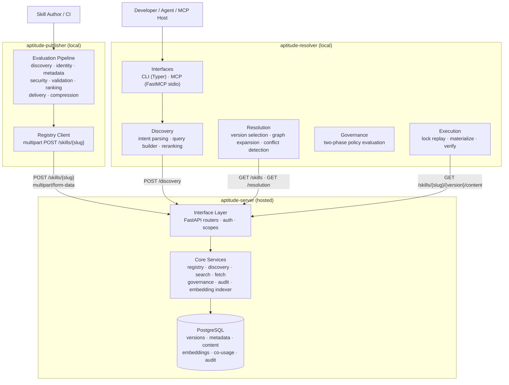
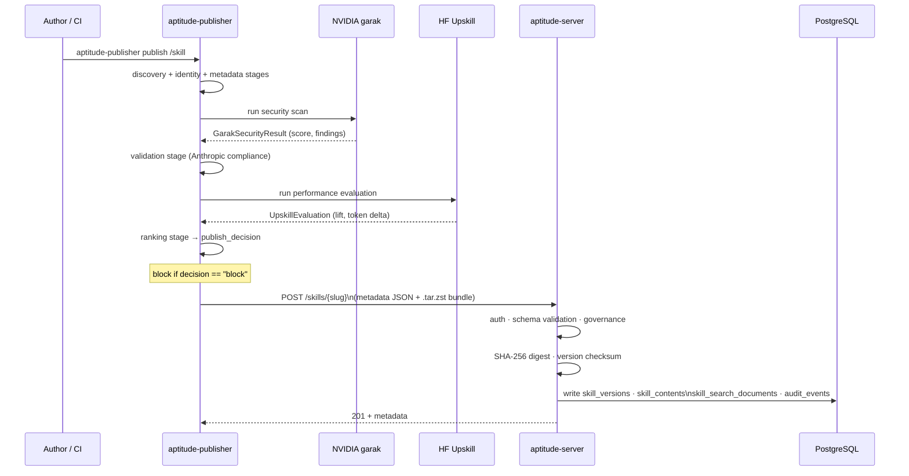
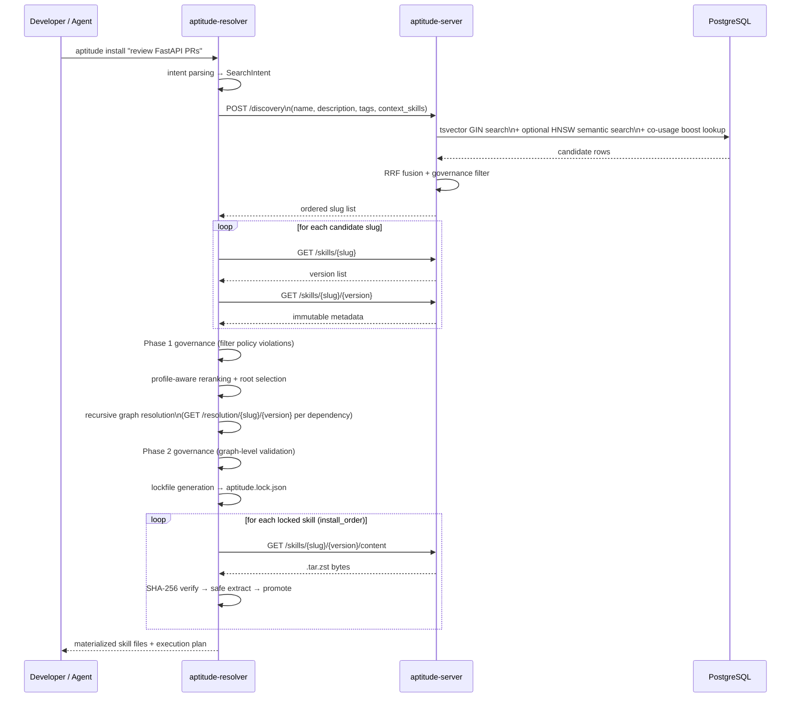
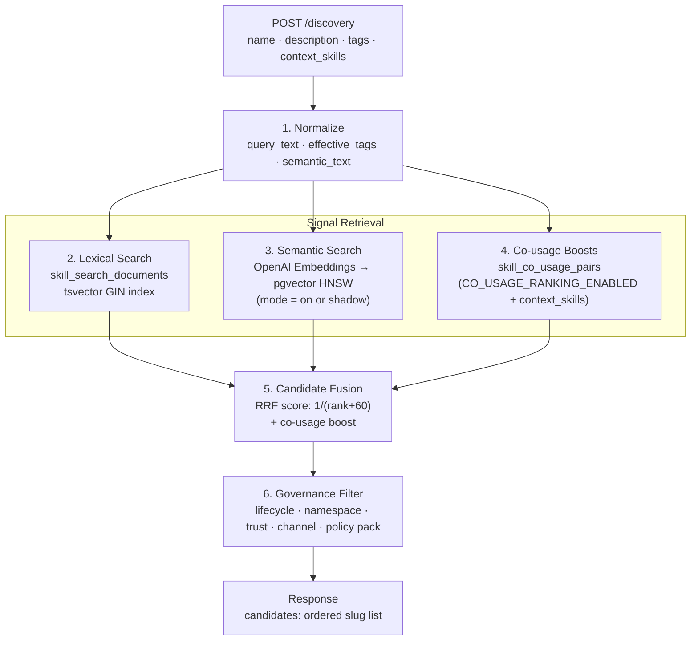

# Aptitude — System Architecture

> Component map, data flows, and integration boundaries across the full Aptitude system.

## System Overview

Aptitude is a three-surface system built around a strict separation of concerns. Each component owns exactly one domain and delegates everything else across a well-defined contract.

---

## Component Breakdown

### Publisher

The publisher is a local Python CLI process (`aptitude-publisher`). It has no server component and no persistent state. Each run executes a fixed 9-stage pipeline: **discovery → identity → metadata → security → validation → performance exam → ranking → delivery → compression**.

Five gates intercept the pipeline between critical stages. A gate failure halts execution immediately and prevents upload.

External evaluators:
- **NVIDIA garak** — security scanning. Mandatory; no fallback. Unconfigured or unscored → publish blocked.
- **Hugging Face Upskill** — performance measurement. Optional; if unavailable, performance score defaults to 0.

The publisher writes a numbered JSON artifact per stage to `.publisher_artifacts/` inside the skill folder, giving a full local audit trail of every evaluation run.

### Registry

The registry is a stateless FastAPI service backed by PostgreSQL. It is the only component that writes to the database. It is the authoritative source for:

- Immutable skill artifacts (`.tar.zst` bytes, SHA-256 content digest)
- Skill metadata, tags, schemas, token estimates
- Governance state: trust tier, namespace, lifecycle status, review state, promotion channel
- Discovery indexes: PostgreSQL `tsvector` GIN index + pgvector HNSW index (`halfvec(1536)`) for semantic search
- Co-usage signals: pre-computed lift scores from `skill_co_usage_pairs`
- Audit events for every publish, lifecycle change, and discovery query

### Resolver

The resolver is a local Python process (`aptitude-resolver`). It has no server component. All state it writes is the `aptitude.lock.json` lockfile and materialized skill files in the target directory.

The resolver has four functional layers that never overlap:

| Layer | Does |
| --- | --- |
| Discovery | Parses intent, builds registry query, shapes and reranks the candidate list |
| Resolution | Selects one version per slug, expands dependency graph recursively, detects conflicts |
| Governance | Filters policy-violating candidates before selection; validates the full graph before lock |
| Execution | Reads install order from lockfile, downloads, verifies checksums, extracts safely, promotes workspace |

---

## Data Flows

### Publish Flow

### Discovery and Resolution Flow

### Lock Replay Flow

Discovery, intent parsing, candidate selection, and dependency solving do not run during lock replay. The lock is the sole execution source of truth.

---

## Discovery Pipeline (Registry Detail)

The registry's `POST /discovery` endpoint runs a hybrid signal pipeline before returning candidates.

Three semantic discovery modes are supported: `off` (default, lexical only), `shadow` (semantic runs but results are discarded — used for A/B validation), and `on` (lexical + semantic fused).

---

## Governance Boundary

Each component enforces governance at a different layer. The responsibilities do not overlap.

```mermaid
flowchart LR
    subgraph PublisherGov["Publisher Governance"]
        PG1["Security: NVIDIA garak\n(must score, blocking)"]
        PG2["Compliance: Anthropic SKILL.md rules\n(errors = block)"]
        PG3["Governance inputs declared\ntrust_tier · namespace · artifact_origin"]
    end

    subgraph RegistryGov["Registry Governance"]
        RG1["Auth: scoped token checks\n(read · publish · review · admin)"]
        RG2["Trust tier rules per namespace"]
        RG3["Lifecycle enforcement\npublished → deprecated → archived"]
        RG4["Policy packs · promotion channels\nreview state"]
        RG5["Audit events on every mutating operation"]
    end

    subgraph ResolverGov["Resolver Governance (two-phase)"]
        RV1["Phase 1: candidate filtering\n(pre-selection policy check)"]
        RV2["Phase 2: graph validation\n(pre-lock aggregate check)"]
        RV3["Checksum verification\n(SHA-256 on compressed bytes)"]
        RV4["Policy config layers\naptitude.toml: system · user · workspace · request"]
    end

    PublisherGov --> RegistryGov --> ResolverGov
```

No component can grant permissions that another component is designed to enforce. A skill passing all publisher gates may still be rejected by the registry if the caller's token lacks the required scope.

---

## Technology Stack Summary

| Component | Language | Key Dependencies |
| --- | --- | --- |
| Publisher | Python 3.10+ | argparse, zstandard, garak (optional), upskill (optional) |
| Registry | Python 3.10+ | FastAPI, SQLAlchemy, pgvector, OpenAI Embeddings API (optional) |
| Resolver | Python 3.10+ | Typer, Rich, FastMCP (stdio), Pydantic |
| Storage | — | PostgreSQL 15+ with pgvector extension |

---

## Deployment Model

**Current MVP:**
- Registry deployed as a long-running service (Cloud Run or GKE + Cloud SQL).
- Publisher runs locally or in CI pipelines; no server required.
- Resolver runs locally or in CI pipelines; no server required.

**Future:**
- Optional async worker tier for post-commit side effects (embedding indexing, notifications).
- Web UI as a presentation layer over the same registry APIs — no new sources of truth.

All three components communicate only through the registry's public HTTP API. No component reads or writes the PostgreSQL database directly except the registry.
