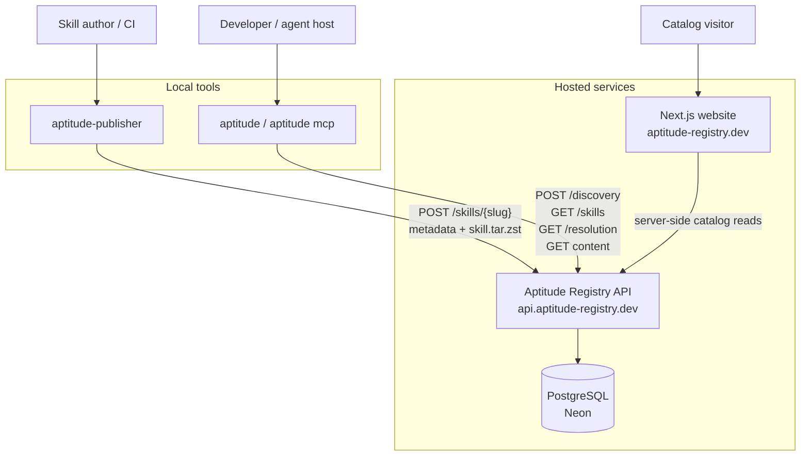
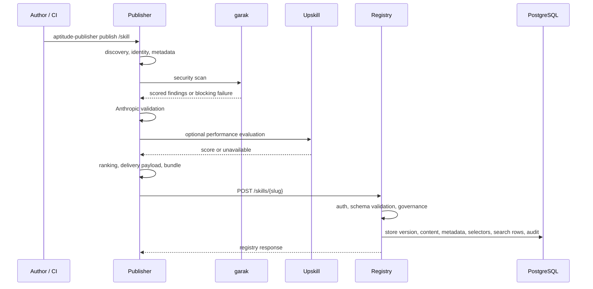
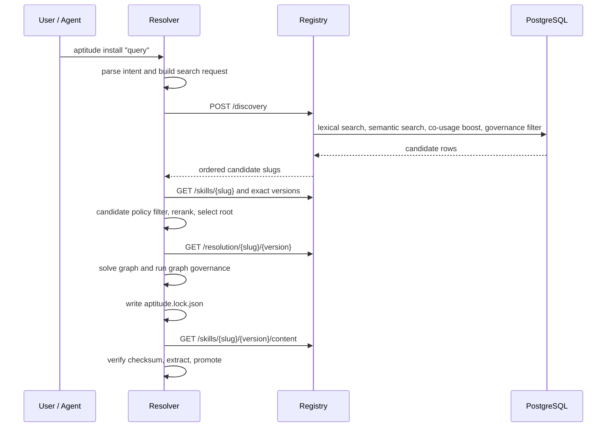
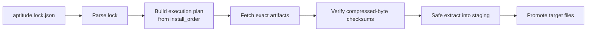

# Aptitude - System Architecture

This document explains the cross-component design. Component-level details live
in the publisher, registry, and resolver docs.

## Design Principle

Aptitude is built around a strict ownership boundary:

| Component | Owns | Does not own |
| --- | --- | --- |
| Publisher | Local skill evaluation, payload assembly, bundle creation, registry upload | Registry authorization, lifecycle decisions, dependency solving |
| Registry | Immutable facts, governance state, discovery indexes, exact reads, catalog feeds, audit | Prompt interpretation, final selection, transitive solving, lock generation |
| Resolver | Intent handling, candidate reranking, final selection, solving, local policy, locks, materialization | Publication, authoritative metadata storage, registry governance |

## System Context



## Main Data Flows

### Publish



### Discovery and Resolution



### Lock Replay



Lock replay skips discovery, ranking, and dependency solving. The lockfile is
the execution source of truth.

## Storage Model

The registry is the only component with a database. PostgreSQL stores:

- Skills and immutable versions.
- Opaque `.tar.zst` bundle bytes and SHA-256 content digests.
- Canonical version checksums.
- Metadata, tags, schemas, token/content estimates, and provenance.
- Direct authored dependency selectors.
- Search projections for lexical, semantic, and co-usage discovery.
- Governance state: namespace, trust tier, lifecycle, review state, promotion
  channel, ownership, policy packs, and trust evidence.
- Audit events for mutating operations and discovery/search activity.

Resolver lockfiles and execution plans are local outputs. Publisher artifacts
are local audit traces under `.publisher_artifacts/` in the skill folder.

## API Surface By Consumer

| Consumer | Registry routes |
| --- | --- |
| Publisher | `POST /skills/{slug}` |
| Resolver | `POST /discovery`, `GET /skills/{slug}`, `GET /skills/{slug}/{version}`, `GET /resolution/{slug}/{version}`, `GET /skills/{slug}/{version}/content` |
| Website | `GET /catalog/skills`, `GET /catalog/top-skills`, `GET /catalog/skill-graph`, `POST /catalog/search` |
| Telemetry bridge | `POST /catalog/star-events`, `GET /catalog/user-stars` |
| Operators | `GET /healthz`, `GET /readyz` |
| Admin/review | organization, namespace, ownership, governance, policy-pack, lifecycle, and trust-evidence endpoints |

All protected registry calls use service tokens of the form:

```text
Authorization: Bearer <token_id>.<token_secret>
```

## Operations Model

- Registry runs on Render and stores production data in Neon PostgreSQL.
- Migrations are Alembic-driven and use `MIGRATION_DATABASE_URL` when present.
- Semantic embeddings are indexed asynchronously by operator/workflow scripts.
- Registry observability uses structured logs plus OpenTelemetry export to
  Grafana Cloud when enabled.
- Website calls the registry server-side; browsers do not call registry APIs
  directly.

## Design Files

- [High-Level Design](high-level-design.md)
- [Publisher Architecture](publisher/architecture.md)
- [Registry Architecture](registry/architecture.md)
- [Resolver Architecture](resolver/architecture.md)
