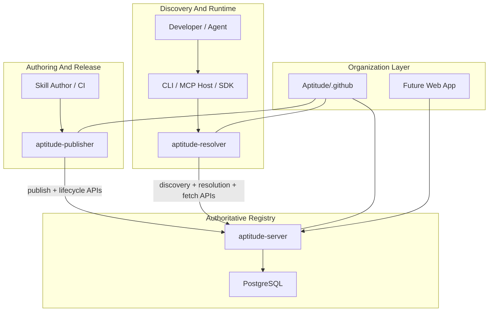
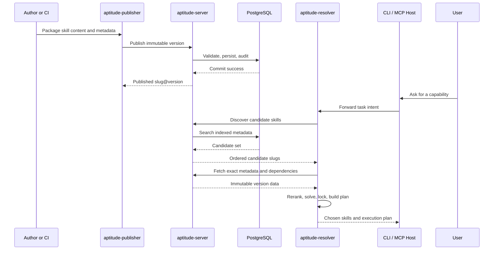

# Aptitude Stack Overview

Aptitude is a package-manager-style ecosystem for AI skills. It gives teams a
clean way to publish skills, govern them through a registry, discover candidate
skills quickly, and resolve reproducible execution plans in agent runtimes.

The stack is intentionally split so each surface owns one kind of work:

- `aptitude-publisher` owns authoring and CI publishing flows.
- `aptitude-server` owns the authoritative registry contract.
- `aptitude-resolver` owns runtime search interpretation, solving, and locking.
- PostgreSQL stores canonical metadata, content digests, lifecycle state, and
  audit records.
- A future web app can present the catalog and operations UX on top of the same
  APIs.

## System Map



## Product Surfaces

| Surface | Primary Role | Owns | Does Not Own |
| --- | --- | --- | --- |
| `aptitude-publisher` | Authoring and CI release client | Packaging, request assembly, optional prechecks, publisher UX | Canonical validation, persistence, runtime solving |
| `aptitude-server` | Registry backend | Auth, validation, immutability, governance, discovery, exact fetch, audit | Prompt interpretation, final selection, dependency solving, execution planning |
| `aptitude-resolver` | Runtime and agent integration client | Query construction, reranking, solving, lock generation, execution planning, CLI and MCP surfaces | Publish packaging, registry policy ownership, canonical storage |
| `Aptitude/.github` | Org admin and documentation repo | Org landing page, project docs, architecture references, shared guidance | Runtime authority, registry persistence, release enforcement |
| Future web app | Presentation layer | Browser UX for catalog browsing and operations | Source-of-truth business logic |

## End-To-End Flow



## Architectural Rules

- Server owns data-local work: publish validation, immutable storage, search,
  exact fetch, lifecycle policy, and audit.
- Resolver owns decision-local work: prompt interpretation, reranking, final
  selection, dependency solving, lock generation, and execution planning.
- Publisher is a dedicated authoring surface, not a wrapper around resolver
  internals.
- PostgreSQL is the canonical source of truth for published skill state.
- Async processing is optional and only for post-commit side effects, not for
  authoritative publication.

## Current Product Shape

- Aptitude is CLI-first and MCP-first today.
- The registry contract is HTTP-based and intentionally small: publish,
  discovery, exact resolution metadata, exact metadata fetch, exact content
  fetch, and lifecycle status changes.
- Discovery returns candidate slugs only. Final choice happens in the resolver.
- Published versions are immutable and meant to support deterministic client
  locks.
- A browser UI is a future convenience layer, not an architectural dependency.

## Repository Layout

The project boundary is publisher, server, and resolver even if repo packaging
changes over time.

Recommended steady-state organization:

```text
Aptitude/
  .github/
  aptitude-server/
  aptitude-resolver/
  aptitude-publisher/
```

Possible near-term packaging if publisher stays bundled with the client repo:

```text
Aptitude/
  .github/
  aptitude-server/
  aptitude-client/
    packages/
      resolver/
      publisher/
```

## Detailed References

- [Repository Map](./repository-map.md)
- [Scope and Ownership Boundary](./scope.md)
- [Publisher, Server, Resolver Architecture](./publisher-server-resolver-architecture.md)
- [Server API Contract](./api-contract.md)
- [High-Level Design](../high-level-design.md)
