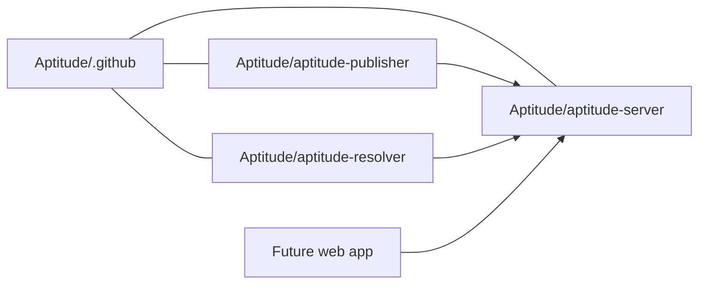

# Aptitude Repository Map

This page describes how the Aptitude organization is split across repositories
and how those repositories relate to the product surfaces.

## Recommended Organization Layout



## Repository Roles

| Repository | Purpose | Main Consumers | Notes |
| --- | --- | --- | --- |
| `Aptitude/.github` | Org landing page, shared docs, architecture references, admin material | Anyone entering the org | Keeps high-level docs centralized without mixing them into product repos |
| `Aptitude/aptitude-server` | Authoritative registry backend and public HTTP API | Publisher, resolver, operators | Owns validation, immutability, governance, discovery, fetch, and audit |
| `Aptitude/aptitude-resolver` | Consumer-side runtime for CLI, MCP, SDK integration, solving, and lock generation | Agents, developers, platform teams | Owns decision-local logic and execution planning |
| `Aptitude/aptitude-publisher` | Authoring and CI publishing surface | Skill authors, release pipelines | Owns packaging, request assembly, and publish UX |
| Future web app | Browser catalog and operations UX | Operators, reviewers, discoverability users | Presentation layer over the same server contracts |

## Dependency Direction

- `aptitude-publisher` depends on the public server contract.
- `aptitude-resolver` depends on the public server contract.
- `aptitude-server` depends on PostgreSQL as the canonical store.
- `.github` documents the system but does not participate in runtime behavior.
- The future web app should depend on the same documented APIs rather than
  introducing a second source of truth.

## Boundary Rules By Repository

- `aptitude-server` must not own prompt interpretation, final selection, or
  dependency solving.
- `aptitude-resolver` must not own canonical publish validation or persistence.
- `aptitude-publisher` must not be coupled to resolver runtime modules.
- `.github` should stay lightweight and link outward to detailed docs rather
  than becoming a long-form architecture dump on the org landing page.

## Packaging Note

The product boundary is stable even if repo packaging changes.

If the near-term implementation keeps publisher and resolver together, the
recommended internal structure is:

```text
aptitude-client/
  packages/
    resolver/
    publisher/
```

That layout is acceptable as long as:

- publisher and resolver keep separate modules and tests
- server remains the only authority for publish and governance behavior
- runtime solving does not leak into publishing code

## Related Docs

- [Aptitude Stack Overview](./overview.md)
- [Scope and Ownership Boundary](./scope.md)
- [Publisher, Server, Resolver Architecture](./publisher-server-resolver-architecture.md)
- [Server API Contract](./api-contract.md)
