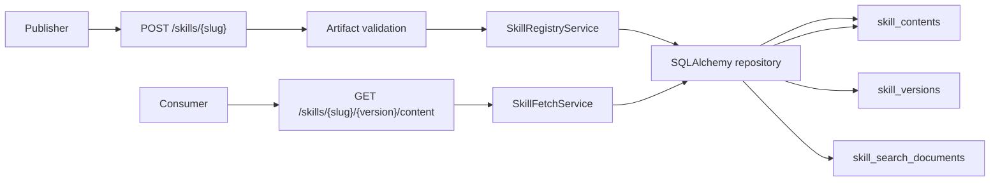
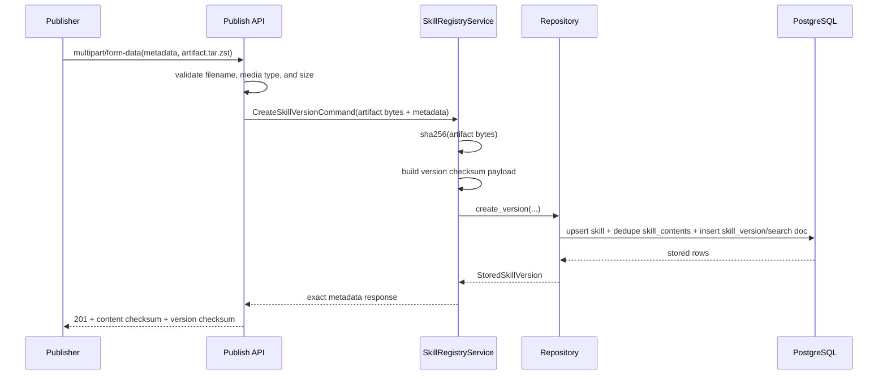

# Milestone 12 Changelog - Full Skill Directory Bundle Support

This changelog documents implementation of [.agents/plans/12-full-skill-directory-bundle-support.md](../../.agents/plans/12-full-skill-directory-bundle-support.md).

The milestone replaces the registry's markdown-body artifact model with structured metadata publishing plus one immutable stored artifact per version. The current contract is a hard cut to opaque `.tar.zst` uploads and exact `.tar.zst` fetches. Metadata, governance, provenance, and authored relationships stay normalized in PostgreSQL, while the exact artifact becomes one immutable digest-addressed blob per published version.

## Scope Delivered

- Publish now accepts `multipart/form-data` with structured JSON metadata plus one opaque `.tar.zst` artifact upload, instead of JSON `content.raw_markdown`: [app/interface/api/skills.py](../../app/interface/api/skills.py), [app/interface/api/skill_api_support_publish.py](../../app/interface/api/skill_api_support_publish.py), [app/interface/dto/skills_publish.py](../../app/interface/dto/skills_publish.py), [app/interface/validation/skill_bundle.py](../../app/interface/validation/skill_bundle.py), [tests/unit/test_skill_bundle_validation.py](../../tests/unit/test_skill_bundle_validation.py), [tests/integration/test_skill_registry_endpoints.py](../../tests/integration/test_skill_registry_endpoints.py).
- Exact content fetch now returns the stored `application/zstd` artifact with immutable cache headers, while exact metadata stays JSON and exposes checksum, media type, and size fields: [app/interface/api/fetch.py](../../app/interface/api/fetch.py), [app/interface/api/skill_api_support_fetch.py](../../app/interface/api/skill_api_support_fetch.py), [app/core/skills/fetch.py](../../app/core/skills/fetch.py), [tests/unit/test_skill_fetch_service.py](../../tests/unit/test_skill_fetch_service.py), [tests/integration/test_skill_registry_endpoints.py](../../tests/integration/test_skill_registry_endpoints.py).
- Core publish orchestration now computes content checksums from stored artifact bytes and version checksums from the canonical version payload built around the artifact digest plus metadata, governance, and relationships: [app/core/skills/registry.py](../../app/core/skills/registry.py), [tests/unit/test_skill_registry_service.py](../../tests/unit/test_skill_registry_service.py).
- Persistence now stores canonical artifact bytes in `skill_contents.payload`, deduplicates identical artifacts by digest, and projects stored artifact size into discovery search documents: [app/persistence/models/skill_content.py](../../app/persistence/models/skill_content.py), [app/persistence/skill_registry_repository_base.py](../../app/persistence/skill_registry_repository_base.py), [app/persistence/skill_registry_repository_writes.py](../../app/persistence/skill_registry_repository_writes.py), [app/persistence/skill_registry_repository_support.py](../../app/persistence/skill_registry_repository_support.py), [alembic/versions/0003_skill_bundle_storage.py](../../alembic/versions/0003_skill_bundle_storage.py).
- Public reference docs now describe the live `.tar.zst` contract, enforced upload limit, artifact-oriented checksum semantics, and the migration path away from markdown-only clients: [docs/reference/api-contract.md](../reference/api-contract.md), [docs/reference/publish-request-schema.md](../reference/publish-request-schema.md), [docs/reference/publish-bundle-migration.md](../reference/publish-bundle-migration.md), [docs/reference/storage-strategy.md](../reference/storage-strategy.md), [docs/reference/schema.md](../reference/schema.md), [tests/unit/test_public_contract_docs.py](../../tests/unit/test_public_contract_docs.py).

## Architecture Snapshot

Why this shape:

- Artifact validation sits at the interface boundary so the core service receives one already-validated immutable artifact instead of mixing transport and domain rules: [app/interface/validation/skill_bundle.py](../../app/interface/validation/skill_bundle.py), [app/interface/api/skill_api_support_publish.py](../../app/interface/api/skill_api_support_publish.py).
- Queryable metadata stays relational while the exact artifact stays opaque. That preserves fast discovery and governance filters without pretending the server should index or unpack publisher-owned archive contents at read time: [app/persistence/skill_registry_repository_search.py](../../app/persistence/skill_registry_repository_search.py), [app/persistence/skill_registry_repository_support.py](../../app/persistence/skill_registry_repository_support.py), [docs/reference/storage-strategy.md](../reference/storage-strategy.md).

## Runtime Flow

## Design Notes

- The branch makes the contract break explicit instead of carrying a fake compatibility layer. That is the right tradeoff here because `content.raw_markdown` and `text/markdown` no longer match the stored artifact shape: [docs/reference/publish-bundle-migration.md](../reference/publish-bundle-migration.md), [docs/reference/api-contract.md](../reference/api-contract.md).
- `content.checksum.digest` is now the digest of the exact stored artifact bytes, and `version_checksum.digest` is a broader identity digest over content checksum plus structured version data. That separation prevents checksum ambiguity once metadata and governance can change independently of artifact reuse: [app/core/skills/registry.py](../../app/core/skills/registry.py), [tests/unit/test_skill_registry_service.py](../../tests/unit/test_skill_registry_service.py).
- Discovery keeps using `skill_search_documents.content_size_bytes` as a body-free ranking and filtering signal, but it now reflects stored artifact size rather than raw markdown length. That is correct, even if it changes older test assumptions: [app/persistence/skill_registry_repository_support.py](../../app/persistence/skill_registry_repository_support.py), [alembic/versions/0003_skill_bundle_storage.py](../../alembic/versions/0003_skill_bundle_storage.py), [tests/integration/test_skill_registry_endpoints.py](../../tests/integration/test_skill_registry_endpoints.py).
- The current fetch path emits the stored content digest as the response `ETag`; it does not recompute a fresh hash on every read. That keeps exact reads cheap, but it also means corruption detection is publish-time and migration-time today rather than per-fetch: [app/core/skills/fetch.py](../../app/core/skills/fetch.py), [app/interface/api/fetch.py](../../app/interface/api/fetch.py).
- Upload limits stay intentionally strict at the interface boundary: one `.tar.zst` file, `application/zstd`, and `5 MiB`. That keeps PostgreSQL blob storage from quietly turning into an unbounded artifact-hosting surface while leaving archive structure to the publisher: [app/interface/validation/skill_bundle.py](../../app/interface/validation/skill_bundle.py), [docs/reference/publish-request-schema.md](../reference/publish-request-schema.md).

## Schema Reference

Source: [alembic/versions/0003_skill_bundle_storage.py](../../alembic/versions/0003_skill_bundle_storage.py), [app/persistence/models/skill_content.py](../../app/persistence/models/skill_content.py), [docs/reference/schema.md](../reference/schema.md).

### `skill_contents`

| Field | Type | Nullable | Default / Constraint | Role |
| --- | --- | --- | --- | --- |
| `payload` | `bytea` | No | Required | Stores the exact immutable artifact bytes that exact content fetch returns verbatim. |
| `media_type` | `text` | No | Required | Pins the artifact representation, currently `application/zstd`, so content metadata and HTTP responses stay explicit. |
| `storage_size_bytes` | `bigint` | No | Required | Records stored artifact size for exact metadata responses and search-document projection. |
| `checksum_digest` | `varchar(64)` | No | Unique | Deduplicates identical artifacts and supplies the digest used in content metadata and exact-content `ETag` headers. |

### `skill_versions`

| Field | Type | Nullable | Default / Constraint | Role |
| --- | --- | --- | --- | --- |
| `content_fk` | `bigint` | No | FK to `skill_contents.id` | Binds one immutable version to one canonical stored artifact row. |
| `metadata_fk` | `bigint` | No | FK to `skill_metadata.id` | Keeps queryable metadata independent from artifact bytes so discovery stays relational. |
| `checksum_digest` | `varchar(64)` | No | Required | Carries the version-level identity digest returned in exact metadata reads. |
| `trust_tier` | `text` | No | Default `untrusted` | Makes governance state part of the immutable version surface instead of a detached policy mirror. |
| `published_at` | `timestamptz` | No | Server default | Preserves publish ordering for listing and search ranking. |

### `skill_search_documents`

| Field | Type | Nullable | Default / Constraint | Role |
| --- | --- | --- | --- | --- |
| `skill_version_fk` | `bigint` | No | PK and FK to `skill_versions.id` | Keeps one search document aligned to one immutable version row. |
| `content_size_bytes` | `bigint` | No | Required | Gives discovery a body-free footprint signal based on stored artifact size. |
| `lifecycle_status` | `text` | No | Required | Lets discovery filter visibility without re-running policy logic from mutable service state. |
| `trust_tier` | `text` | No | Required | Supports trust-aware search filtering without joining back to publish-time governance code. |
| `search_vector` | `tsvector` | No | Indexed | Keeps lexical ranking derived from structured fields rather than artifact inspection. |

## Verification Notes

- Artifact validation coverage exercises valid `.tar.zst` uploads, wrong filenames, wrong media types, and upload size rejection: [tests/unit/test_skill_bundle_validation.py](../../tests/unit/test_skill_bundle_validation.py).
- Core service coverage verifies publish-time checksum generation, version/content checksum distinction, and artifact-sized content metadata: [tests/unit/test_skill_registry_service.py](../../tests/unit/test_skill_registry_service.py), [tests/unit/test_skill_fetch_service.py](../../tests/unit/test_skill_fetch_service.py), [tests/unit/test_skill_version_projections.py](../../tests/unit/test_skill_version_projections.py).
- Integration coverage exercises multipart artifact publish, exact `.tar.zst` fetch, cache headers, digest reuse, distinct-artifact storage behavior, governance projection, and the artifact-size search-document expectation: [tests/integration/test_skill_registry_endpoints.py](../../tests/integration/test_skill_registry_endpoints.py), [tests/integration/test_operability.py](../../tests/integration/test_operability.py).
- Documentation coverage now asserts the live `.tar.zst` contract, migration guide presence, checksum terminology, and the documented `5 MiB` upload limit: [tests/unit/test_public_contract_docs.py](../../tests/unit/test_public_contract_docs.py).
