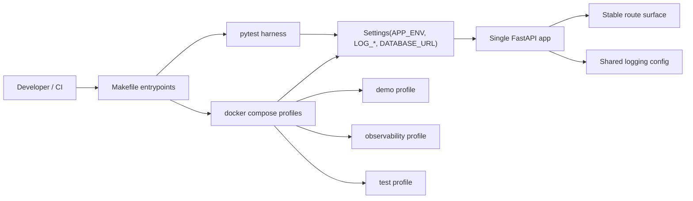
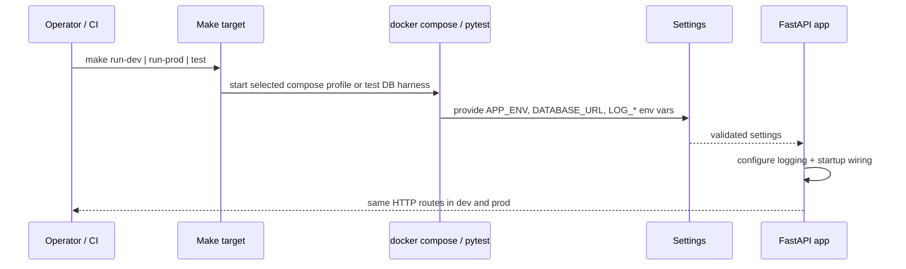

# Milestone 13 Changelog - Environment Profiles and Runtime Separation

This changelog documents implementation of [.agents/plans/13-environment-profiles-and-runtime-separation.md](../../.agents/plans/13-environment-profiles-and-runtime-separation.md).

The milestone standardizes `APP_ENV=dev|prod` as the only application runtime profile, keeps Docker Compose profiles strictly orchestration-scoped, and removes any lingering suggestion that tests or CI are separate app environments. The public HTTP contract stays fixed: runtime selection changes startup posture, logging behavior, and runner wiring, not route shape or response semantics.

## Scope Delivered

- Runtime settings now validate `APP_ENV` as `dev | prod` inside one shared settings model, with `dev` as the default and no third runtime profile for tests or containers: [app/core/settings.py](../../app/core/settings.py), [tests/unit/test_settings.py](../../tests/unit/test_settings.py).
- Application startup and local runner wiring now carry runtime posture explicitly into logging and server bootstrap, so local development can stay human-readable while production-like runs stay structured without forking the FastAPI app: [app/main.py](../../app/main.py), [app/observability/logging.py](../../app/observability/logging.py), [tests/unit/test_main.py](../../tests/unit/test_main.py), [tests/unit/test_logging.py](../../tests/unit/test_logging.py).
- The public route surface is explicitly locked to be identical across `dev` and `prod`, including OpenAPI shape and fetch/publish routes, which prevents environment-specific endpoint drift: [app/main.py](../../app/main.py), [tests/unit/test_registry_api_boundary.py](../../tests/unit/test_registry_api_boundary.py).
- Checked-in Docker Compose services now default to `APP_ENV=prod` unless overridden, while the Compose `demo`, `observability`, and `test` profiles remain container selectors rather than new runtime modes: [docker-compose.yml](../../docker-compose.yml), [docs/reference/runtime-profiles.md](../../docs/reference/runtime-profiles.md).
- The user-facing command surface is now reduced to `run-dev`, `run-prod`, `quality`, `test`, `format`, `build`, and `help`, with CI-specific orchestration hidden behind `_...` targets and both PR workflows aligned to that private CI surface: [Makefile](../../Makefile), [.github/workflows/dev-ci.yml](../../.github/workflows/dev-ci.yml), [.github/workflows/main-ci.yml](../../.github/workflows/main-ci.yml), [tests/unit/test_makefile_docker_targets.py](../../tests/unit/test_makefile_docker_targets.py), [tests/unit/test_ci_workflows.py](../../tests/unit/test_ci_workflows.py).
- Contributor docs now describe the same runtime split: `run-dev` means `APP_ENV=dev` plus demo seed and observability, `run-prod` means `APP_ENV=prod` plus observability, and `make test` owns the dedicated test database lifecycle instead of pretending there is a `test` app profile: [README.md](../../README.md), [docs/contributors/development-setup.md](../../docs/contributors/development-setup.md), [docs/reference/runtime-profiles.md](../../docs/reference/runtime-profiles.md), [docs/contributors/testing-and-verification.md](../../docs/contributors/testing-and-verification.md).

## Architecture Snapshot

Why this shape:
- The repo keeps one settings model and one FastAPI app, which is the right seam for environment differences. Splitting runtime posture into separate apps or environment-specific route families would add complexity without buying clearer behavior: [app/core/settings.py](../../app/core/settings.py), [app/main.py](../../app/main.py), [tests/unit/test_registry_api_boundary.py](../../tests/unit/test_registry_api_boundary.py).
- Compose profiles remain orchestration-only on purpose. `demo`, `observability`, and `test` decide which containers run, while `APP_ENV` decides how the app behaves once it starts: [docker-compose.yml](../../docker-compose.yml), [docs/reference/runtime-profiles.md](../../docs/reference/runtime-profiles.md), [Makefile](../../Makefile).
- CI consumes the same private helper surface instead of re-encoding Docker or test orchestration in GitHub Actions YAML. That keeps command drift contained in one place: [Makefile](../../Makefile), [.github/workflows/dev-ci.yml](../../.github/workflows/dev-ci.yml), [.github/workflows/main-ci.yml](../../.github/workflows/main-ci.yml).

## Runtime Flow

## Design Notes

- `APP_ENV=test` was correctly rejected rather than preserved for convenience. Test execution is a harness concern, so the test suite now selects `TEST_DATABASE_URL` and, when needed, a deliberate runtime posture instead of inventing a third application mode: [app/core/settings.py](../../app/core/settings.py), [docs/reference/runtime-profiles.md](../../docs/reference/runtime-profiles.md), [tests/unit/test_settings.py](../../tests/unit/test_settings.py), [Makefile](../../Makefile).
- Logging posture is environment-aware but still centralized. `LOG_FORMAT=auto` chooses pretty output for local interactive `dev` runs and JSON for `prod` or non-interactive contexts, which is enough here without introducing parallel logging stacks: [app/observability/logging.py](../../app/observability/logging.py), [tests/unit/test_logging.py](../../tests/unit/test_logging.py).
- Compose defaults to `APP_ENV=prod` for checked-in services, which keeps container runs production-like unless an explicit runner overrides them. That is a safer default than silently treating all container execution as a special local environment: [docker-compose.yml](../../docker-compose.yml), [docs/contributors/development-setup.md](../../docs/contributors/development-setup.md).
- The visible `make` surface was deliberately collapsed. Exposing every internal combination would just leak CI wiring into normal usage; the private `_...` targets keep the repo automation composable without making the user-facing contract noisy: [Makefile](../../Makefile), [tests/unit/test_makefile_docker_targets.py](../../tests/unit/test_makefile_docker_targets.py), [tests/unit/test_ci_workflows.py](../../tests/unit/test_ci_workflows.py).
- The milestone does not add auth-specific routes or environment-only helpers. That is the correct boundary because Plan 13 was supposed to normalize runtime structure before any auth-boundary refactor in Plan 14: [.agents/plans/13-environment-profiles-and-runtime-separation.md](../../.agents/plans/13-environment-profiles-and-runtime-separation.md), [app/main.py](../../app/main.py), [tests/unit/test_registry_api_boundary.py](../../tests/unit/test_registry_api_boundary.py).
- No database schema or Alembic migration changes were required. This milestone changes configuration vocabulary and runner behavior, not persistence shape: [app/core/settings.py](../../app/core/settings.py), [docker-compose.yml](../../docker-compose.yml).

## Schema Reference

Source: [app/core/settings.py](../../app/core/settings.py), [docker-compose.yml](../../docker-compose.yml), [Makefile](../../Makefile).

### `Runtime Settings Surface`

| Field | Type | Source | Role |
| --- | --- | --- | --- |
| `APP_ENV` | `Literal["dev", "prod"]` | `Settings.app_env` | Selects application runtime posture. It is the only validated app-environment switch and intentionally excludes `test`, `container`, and `staging`. |
| `DATABASE_URL` | `str` | `Settings.database_url` | Points the running app at its primary PostgreSQL database. It remains required regardless of runtime profile. |
| `LOG_LEVEL` | `str` | `Settings.log_level` | Controls log verbosity without changing route behavior or service wiring. |
| `LOG_FORMAT` | `Literal["auto", "json", "pretty"]` | `Settings.log_format` | Chooses log rendering strategy; `auto` delegates to runtime context so local and production-like runs can share one logging stack. |
| `LOG_FILE_PATH` | `str \| None` | `Settings.log_file_path` | Enables optional structured file sink output for containerized observability flows without changing stdout logging. |

### `Compose Profile Surface`

| Profile / Env | Location | Role |
| --- | --- | --- |
| `APP_ENV=${APP_ENV:-prod}` | `server`, `migrate`, `demo-seed` services | Makes checked-in Compose services production-like by default while still allowing `make run-dev` to override the runtime profile explicitly. |
| `demo` | `demo-seed` service profile | Adds the one-shot catalog seeding job only when a runner asks for realistic sample data. |
| `observability` | `observability` service profile | Adds Grafana, Loki, Prometheus, and related tooling without redefining application runtime semantics. |
| `test` | `test-db` service profile | Adds the dedicated PostgreSQL container used by test harness flows; it is not an app runtime mode. |

### `Public Make Surface`

| Target | Internal Expansion | Role |
| --- | --- | --- |
| `run-dev` | `_run-stack` with `RUN_APP_ENV=dev`, `RUN_DEMO=1` | Starts the Docker stack in development posture, with demo seed and observability enabled. |
| `run-prod` | `_run-stack` with `RUN_APP_ENV=prod`, `RUN_DEMO=0` | Starts the production-like local stack with observability but without demo seeding. |
| `quality` | `_format-check`, `_lint`, `_typecheck` | Runs the static gate that CI also consumes through `_ci-quality`. |
| `test` | `_test` | Runs the full suite against the dedicated test database lifecycle managed inside Make. |
| `format` | `_format` | Applies Ruff formatting without exposing the underlying tool invocation. |
| `build` | `_image-push` | Builds and pushes the multi-platform image while keeping builder bootstrap private. |

## Verification Notes

- Settings coverage validates that `APP_ENV=dev` and `APP_ENV=prod` load successfully, that invalid values fail fast, and that dotenv-based settings loading still works with the new runtime split: [tests/unit/test_settings.py](../../tests/unit/test_settings.py).
- Startup and logging coverage verifies that the local runner passes `APP_ENV` into centralized logging config and that automatic formatting stays pretty for interactive `dev` but structured for `prod` and non-interactive runs: [tests/unit/test_main.py](../../tests/unit/test_main.py), [tests/unit/test_logging.py](../../tests/unit/test_logging.py).
- Route-surface regression coverage asserts that `dev` and `prod` expose the same routes and OpenAPI contract, including the exact publish/fetch endpoints and no reintroduction of removed route families: [tests/unit/test_registry_api_boundary.py](../../tests/unit/test_registry_api_boundary.py).
- Makefile and workflow regression coverage verifies the new user-facing targets, the `run-dev` vs `run-prod` compose expansion, the dedicated test database harness, and the private `_ci-*` workflow contract: [tests/unit/test_makefile_docker_targets.py](../../tests/unit/test_makefile_docker_targets.py), [tests/unit/test_ci_workflows.py](../../tests/unit/test_ci_workflows.py), [.github/workflows/dev-ci.yml](../../.github/workflows/dev-ci.yml), [.github/workflows/main-ci.yml](../../.github/workflows/main-ci.yml).
