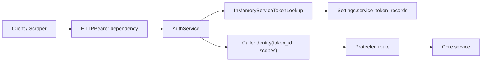
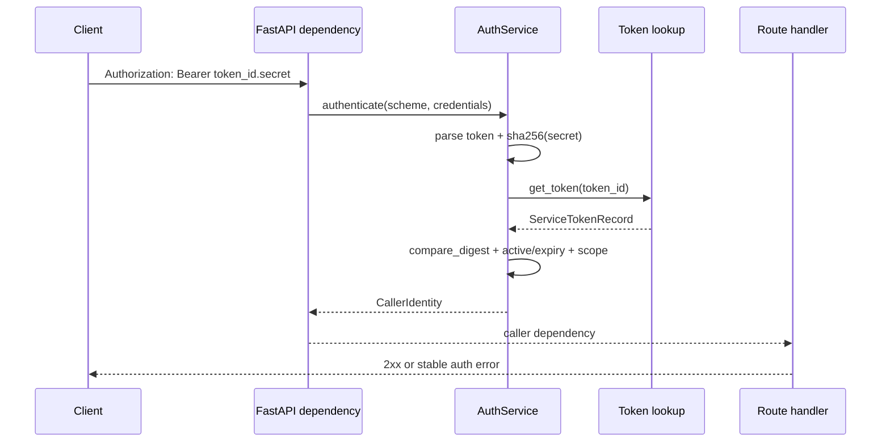

# Milestone 14 Changelog - Production Security Baseline And Service Token Governance

This changelog documents implementation of [.agents/plans/14-minimal-auth-boundary-and-token-governance.md](../../.agents/plans/14-minimal-auth-boundary-and-token-governance.md).

The milestone hardens the registry’s HTTP boundary without widening the route surface. Auth is now a dedicated core concern built around governed service tokens, `prod` posture is explicit at app startup, and local observability keeps working with dev-only fixture credentials instead of the old raw bearer-token map.

## Scope Delivered

- Protected-route auth moved out of FastAPI dependency-local token lookup and into a dedicated auth service plus token-lookup port: [app/core/auth.py](../../app/core/auth.py), [app/core/ports.py](../../app/core/ports.py), [app/core/dependencies.py](../../app/core/dependencies.py), [app/service_container.py](../../app/service_container.py), [tests/unit/test_auth.py](../../tests/unit/test_auth.py).
- Runtime settings now use governed token records and explicit prod host allowlists instead of `AUTH_TOKENS_JSON`: [app/core/settings.py](../../app/core/settings.py), [docs/reference/runtime-profiles.md](../reference/runtime-profiles.md), [docs/reference/service-token-governance.md](../reference/service-token-governance.md), [tests/unit/test_settings.py](../../tests/unit/test_settings.py).
- `prod` app wiring now disables `/docs`, `/redoc`, and `/openapi.json`, and rejects unexpected `Host` headers through `TrustedHostMiddleware`: [app/main.py](../../app/main.py), [docs/reference/api-contract.md](../reference/api-contract.md), [tests/unit/test_registry_api_boundary.py](../../tests/unit/test_registry_api_boundary.py).
- `/metrics` now requires `admin` scope in-app, and the checked-in local stack was updated so Prometheus and smoke checks continue to scrape with explicit dev-only credentials: [app/interface/api/operability.py](../../app/interface/api/operability.py), [docker-compose.yml](../../docker-compose.yml), [ops/monitoring/prometheus/prometheus.yml](../../ops/monitoring/prometheus/prometheus.yml), [Makefile](../../Makefile), [tests/integration/test_operability.py](../../tests/integration/test_operability.py), [tests/unit/test_operability_assets.py](../../tests/unit/test_operability_assets.py).
- Audit payloads now record `actor_token_id` and scopes instead of fingerprinting the full presented token, keeping auth metadata useful without retaining secret material: [app/core/governance.py](../../app/core/governance.py), [app/core/audit_events.py](../../app/core/audit_events.py), [tests/unit/test_audit_events.py](../../tests/unit/test_audit_events.py).
- Publish now hard-caps multipart bundle reads before archive inspection, so oversized requests fail before expensive processing or persistence work starts: [app/interface/api/skill_api_support_publish.py](../../app/interface/api/skill_api_support_publish.py), [app/interface/api/skills.py](../../app/interface/api/skills.py), [tests/integration/test_skill_registry_endpoints.py](../../tests/integration/test_skill_registry_endpoints.py).
- Canonical docs now describe the live service-token contract, prod posture, and local-development implications in the same change: [docs/reference/api-contract.md](../reference/api-contract.md), [docs/reference/publish-request-schema.md](../reference/publish-request-schema.md), [docs/reference/runtime-profiles.md](../reference/runtime-profiles.md), [docs/reference/operations/metrics-scrape-failures.md](../reference/operations/metrics-scrape-failures.md), [docs/contributors/development-setup.md](../contributors/development-setup.md), [docs/architecture/system-overview.md](../architecture/system-overview.md), [tests/unit/test_public_contract_docs.py](../../tests/unit/test_public_contract_docs.py).

## Architecture Snapshot

Why this shape:

- The FastAPI boundary now only extracts credentials and translates auth failures into stable API responses; token parsing, digest verification, expiry, and scope checks live in a reusable core service instead of being repeated inside route dependencies: [app/core/dependencies.py](../../app/core/dependencies.py), [app/core/auth.py](../../app/core/auth.py), [tests/unit/test_auth.py](../../tests/unit/test_auth.py).
- The initial token registry stays settings-backed on purpose. That keeps the milestone small, avoids a DB or secret-manager dependency for auth bootstrap, and still preserves a clear adapter seam for later replacement: [app/core/ports.py](../../app/core/ports.py), [app/core/settings.py](../../app/core/settings.py), [app/service_container.py](../../app/service_container.py).

## Runtime Flow

## Design Notes

- The milestone makes the auth contract break explicit instead of preserving `AUTH_TOKENS_JSON` as a shim. That is the right tradeoff here because the old map keyed by full presented bearer values conflicts with governed token ids, secret digests, and redacted audit behavior: [app/core/settings.py](../../app/core/settings.py), [docs/reference/service-token-governance.md](../reference/service-token-governance.md), [docs/reference/api-contract.md](../reference/api-contract.md).
- `prod` posture is enforced in application wiring, not just documentation. Docs are disabled through FastAPI configuration, and host validation is middleware-backed, so prod hardening is part of startup behavior rather than an operator convention: [app/main.py](../../app/main.py), [tests/unit/test_registry_api_boundary.py](../../tests/unit/test_registry_api_boundary.py).
- `/metrics` was protected in-app with `admin` scope instead of leaving it edge-only. That keeps local and test behavior explicit and lets the checked-in observability profile prove the intended production posture with the same auth boundary: [app/interface/api/operability.py](../../app/interface/api/operability.py), [ops/monitoring/prometheus/prometheus.yml](../../ops/monitoring/prometheus/prometheus.yml), [tests/integration/test_operability.py](../../tests/integration/test_operability.py).
- Publish-size hardening happens before archive inspection, but the milestone intentionally does not introduce streaming multipart processing or proxy-header trust middleware. Those remain follow-on concerns once there is a concrete deployment/runtime need: [app/interface/api/skill_api_support_publish.py](../../app/interface/api/skill_api_support_publish.py), [docs/reference/operations/metrics-scrape-failures.md](../reference/operations/metrics-scrape-failures.md), [docs/reference/runtime-profiles.md](../reference/runtime-profiles.md).
- No database migration was added. Token governance remains a runtime/settings concern in this milestone, which keeps auth bootstrap simple but means token storage durability and rotation workflows are still external concerns for now: [app/core/settings.py](../../app/core/settings.py), [docs/reference/service-token-governance.md](../reference/service-token-governance.md).

## Schema Reference

Source: [app/core/settings.py](../../app/core/settings.py), [app/core/ports.py](../../app/core/ports.py), [app/core/governance.py](../../app/core/governance.py).

### `AUTH_SERVICE_TOKENS_JSON` record

| Field | Type | Nullable | Default / Constraint | Role |
| --- | --- | --- | --- | --- |
| `token_id` | `string` | No | non-blank, must not contain `.` | Stable public identifier used to locate the governed token record before digest verification. |
| `secret_digest` | `string` | No | 64-char lowercase sha256 hex | Stores only the digest of the raw secret so presented bearer secrets are never configuration keys or persisted in plain text. |
| `scopes` | `array[string]` | No | values from `read`, `publish`, `admin` | Declares the route families the caller can access once the token is authenticated. |
| `active` | `boolean` | No | default `true` | Lets operators revoke a token without removing its record or changing route code. |
| `expires_at` | `datetime` | Yes | timezone-aware when present | Supports time-bounded service tokens with runtime expiry rejection in the auth layer. |

### Runtime security settings

| Field | Type | Nullable | Default / Constraint | Role |
| --- | --- | --- | --- | --- |
| `APP_ENV` | `string` | No | `dev` or `prod` | Selects the runtime posture that controls docs exposure and host validation behavior. |
| `ALLOWED_HOSTS_JSON` | `array[string]` | No in `prod` | deduplicated, trimmed, non-empty in `prod` | Supplies the accepted host-header allowlist for `TrustedHostMiddleware` in deployed posture. |

### `CallerIdentity`

| Field | Type | Nullable | Default / Constraint | Role |
| --- | --- | --- | --- | --- |
| `token_id` | `string` | No | derived from authenticated token record | Carries non-secret caller identity into route handlers, governance, and audit payloads. |
| `scopes` | `frozenset[CallerScope]` | No | populated from governed token record | Gives the core layer a stable, reusable authorization input without re-reading HTTP headers or raw tokens. |

## Verification Notes

- Auth unit coverage exercises valid service tokens plus malformed format, wrong scheme, unknown token id, wrong secret, inactive token, expired token, and missing-scope behavior: [tests/unit/test_auth.py](../../tests/unit/test_auth.py).
- Settings and app-wiring tests verify `AUTH_SERVICE_TOKENS_JSON`, `ALLOWED_HOSTS_JSON`, docs disabling in `prod`, host rejection, and `/metrics` admin enforcement: [tests/unit/test_settings.py](../../tests/unit/test_settings.py), [tests/unit/test_registry_api_boundary.py](../../tests/unit/test_registry_api_boundary.py), [tests/unit/test_dependencies.py](../../tests/unit/test_dependencies.py).
- Integration coverage verifies metrics auth, request-id propagation, prod host rejection, and oversized publish rejection before persistence work: [tests/integration/test_operability.py](../../tests/integration/test_operability.py), [tests/integration/test_skill_registry_endpoints.py](../../tests/integration/test_skill_registry_endpoints.py).
- Observability and documentation checks now assert the local Prometheus bearer configuration, the compose defaults, and the canonical auth/runtime docs: [tests/unit/test_operability_assets.py](../../tests/unit/test_operability_assets.py), [tests/unit/test_public_contract_docs.py](../../tests/unit/test_public_contract_docs.py).
- Full repo verification after the change passed with `ruff format --check .`, `ruff check .`, `python -m mypy app`, and `pytest -q`; PostgreSQL-backed integration tests remain intentionally skipped when `TEST_DATABASE_URL` is not reachable in the current environment, which matches the repo’s existing test harness behavior: [Makefile](../../Makefile), [tests/conftest.py](../../tests/conftest.py).
