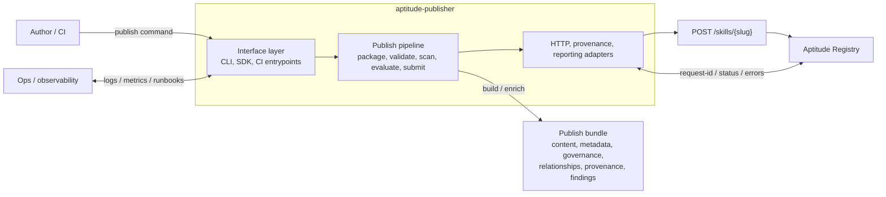

# aptitude-publisher


`aptitude-publisher` is the publication client in the Aptitude ecosystem. It packages
skill content, runs preflight validations, evaluations, security checks, provenance
capture, and audit-oriented evidence collection so authors and CI pipelines can publish
immutable skill versions to `Aptitude Registry` with deterministic behavior and clear
failure modes.

## Overview

`aptitude-publisher` is the authoritative client for Aptitude publish workflows.

- It owns packaging, local validation, evaluation hooks, security scanning,
  provenance capture, request assembly, and CI-facing publish UX.
- It does not own canonical admission, persistence, lifecycle authority, or
  registry state. Those stay in `Aptitude Registry`.
- It uses a modular pipeline so validation, audit, security, and policy checks
  can evolve independently without changing the publish contract.

The design target is publish-first and resolver-independent: keep authoring and
release workflows fast, deterministic, and inspectable, while the server stays
responsible for final admission and the resolver stays responsible for runtime
decisions.

## System Design



Design rules:

- Publisher owns client-local work; server owns registry-local work.
- Pipeline stages run before submission and fail fast on blocking issues.
- Advisory checks may run in the publisher, but canonical enforcement stays on
  the server.
- Publish stays synchronous from the caller's perspective.
- Historical drafts may describe future route shapes; the live publish contract
  is the server contract.

### Why Publisher, Server, and Resolver Are Separate

The split is deliberate. These are different workloads, and collapsing them
into one client or one generic API would mix authoring workflows with runtime
consumption and registry authority.

| Surface | Request Shape | Response Shape | Primary Responsibility | Load Profile | Why It Stays Separate |
| --- | --- | --- | --- | --- | --- |
| Publisher | Local source files, metadata, CI context | Preflight reports and publish result | Package and submit a version safely | CI-bound, validation-heavy, write-oriented | Keeps authoring, policy UX, and release checks out of resolver flows. |
| Server | HTTP publish/read requests | Registry contract responses | Admit, persist, govern, and audit immutable versions | Mixed write/read, authority-centered | Preserves one authoritative backend and one canonical source of truth. |
| Resolver | Discovery and exact-fetch requests | Candidates, selectors, metadata, content | Discover, resolve, fetch, and plan execution | Read-heavy, runtime-oriented | Prevents publish-time concerns from leaking into runtime selection logic. |

This separation gives clear responsibility boundaries:

- Publisher can optimize for fast feedback, evidence collection, and CI
  ergonomics without owning registry truth.
- Server can enforce immutability, governance, and audit without embedding
  authoring workflows.
- Resolver can stay focused on discovery, solving, and execution without
  carrying release-time validation logic.

In practice, this means one concern does not distort the others. Publish-time
scans do not bloat runtime paths, and runtime heuristics do not weaken registry
admission.

## Route Surface

The public HTTP baseline used by the publisher is:

- `POST /skills/{slug}`

Administrative lifecycle flows may also use:

- `PATCH /skills/{slug}/{version}/status`

Use the live server publish contract as the canonical schema. Historical draft
docs may mention future or alternative route names; treat those as design
history only.

## Boundary

- Publisher owns client-local work: package assembly, preflight validation,
  security scans, evaluation hooks, provenance capture, request assembly, retry
  behavior, and CI-facing reporting.
- Server owns registry-local work: auth enforcement, canonical validation,
  immutability checks, trust-tier governance, persistence, audit, and read
  surfaces.
- Resolver owns decision-local work: discovery input construction, reranking,
  dependency solving, lock generation, and execution planning.

In practice, `aptitude-publisher` behaves like a release client, while the
server behaves like the package registry authority.

## Publish Schema

The publish schema intentionally mirrors the server contract so client and
backend do not drift.

| Schema Area | Purpose | Sent By Publisher | Authoritatively Enforced By |
| --- | --- | --- | --- |
| Intent | Distinguishes new-skill publish from new-version publish | Yes | Server |
| Content | Carries canonical markdown body | Yes | Server |
| Metadata | Carries structured discovery and exact-fetch fields | Yes | Server |
| Governance | Carries trust-tier and provenance inputs | Yes | Server |
| Relationships | Carries authored dependency and related-skill selectors | Yes | Server |
| Findings | Local validation / scan / eval results for UX and reporting | Client-local | Not canonical unless server rechecks |

### Publish Fields

| Field | Role |
| --- | --- |
| `intent` | Declares whether the request creates a new skill or publishes a new version. |
| `version` | Immutable semver identity for the version being published. |
| `content.raw_markdown` | Canonical markdown body to be stored by the registry. |
| `metadata.name` | Human-readable skill name. |
| `metadata.description` | Discovery-facing summary for authors and consumers. |
| `metadata.tags` | Categorical labels used for filtering and discovery. |
| `metadata.inputs_schema` / `metadata.outputs_schema` | Structured interface contract fragments. |
| `metadata.token_estimate` / `maturity_score` / `security_score` | Publish-time metadata values or evaluated signals. |
| `governance.trust_tier` | Requested trust level for policy enforcement. |
| `governance.provenance` | Source traceability such as repo URL, commit SHA, tree path, and publisher identity. |
| `relationships.*` | Authored selectors such as dependencies, extensions, conflicts, and overlaps. |

## Quick Start

Requirements:

- Python `3.12+`
- [`uv`](https://docs.astral.sh/uv/)
- access to an `Aptitude Registry` instance
- a bearer token with `publish` scope

Local dev:

```bash
uv venv
source .venv/bin/activate
uv sync --extra dev
export APTITUDE_SERVER_URL="http://127.0.0.1:8000"
export APTITUDE_PUBLISH_TOKEN="publisher-token"
uv run aptitude-publisher publish path/to/skill
```

Example CI-style publish:

```bash
uv run aptitude-publisher publish skills/python.lint \
  --slug python.lint \
  --version 1.2.3 \
  --trust-tier internal \
  --repo-url https://github.com/example/skills \
  --commit-sha "$GIT_COMMIT"
```

For the full setup flow, environment options, pipeline configuration, and CI
integration guidance, use `docs/contributors/development-setup.md`.

## Operability

- The publisher must surface the server `X-Request-ID` so failed publishes can
  be traced across logs, metrics, and audit rows.
- The client should emit structured stage results for validation, security,
  evaluation, and submission steps.
- CI output should distinguish blocking failures from advisory warnings.
- Publish failures should map cleanly to server outcomes such as `401`, `403`,
  `409`, and `5xx`.

## Documentation

- `docs/README.md`: documentation hub
- `docs/architecture.md`: publisher, server, resolver boundary
- `docs/reference/publish-request-schema.md`: canonical publish request shape
- `docs/drafts/publisher-server-resolver-architecture.md`: architecture draft and rationale
- `docs/reference/operations/publish-failures.md`: publish failure triage
- `docs/pipeline.md`: plugin pipeline contract
- `docs/security.md`: validation and scan policy
