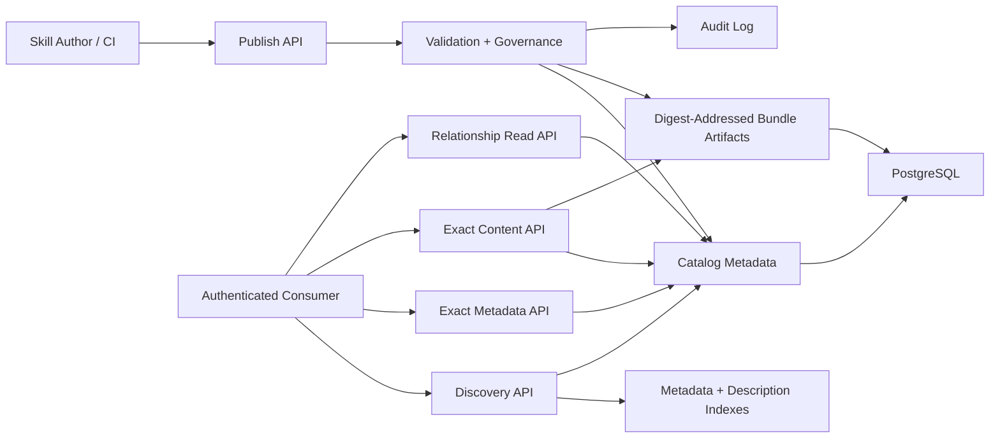

# Aptitude Registry PRD

> Status: canonical current product requirements for `Aptitude Registry`.
> This is the only registry PRD under `docs/`.
> Use [`../reference/api-contract.md`](../reference/api-contract.md) for the canonical HTTP contract.

## 1. Executive Summary

- **Problem Statement**: Platform teams need a governed registry for publishing, discovering, and retrieving skills, but the server becomes harder to scale, cache, and reason about when it also owns prompt interpretation, dependency solving, or runtime planning. The registry must stay focused on fast data-local operations over immutable artifacts and searchable metadata.
- **Proposed Solution**: Define `Aptitude Registry` as a package-registry-style service responsible for immutable publish, candidate discovery, direct authored dependency reads, exact metadata fetch, exact bundle fetch, lifecycle governance, and audit. Keep PostgreSQL authoritative for normalized metadata, digest mappings, and immutable `.tar.zst` bundle artifacts, and treat Git only as optional publish-time provenance rather than a runtime storage backend.
- **Success Criteria**:
  - 100% of metadata and artifact writes happen through server APIs.
  - Immutable overwrite attempts for existing `(slug, version)` are rejected 100% of the time.
  - Identical artifact content published under different versions is deduplicated by `sha256` digest mapping in PostgreSQL and reused from a single immutable artifact row.
  - Target discovery API p95 <= 250 ms for top-20 candidate retrieval on a 10,000-skill catalog with indexed filters.
  - Target exact metadata fetch API p95 <= 150 ms and exact content fetch API p95 <= 150 ms on the same catalog assumption.
  - Exact content fetch returns the immutable stored artifact with digest-backed `ETag` and immutable cache semantics.
  - Exact fetches do not require access to a Git repository or working tree.
  - 100% of publish, deprecate, archive, and admin-policy actions emit auditable events.
- **In Scope**: publish, discovery, public resolution, exact metadata fetch, exact bundle fetch, immutable versioning, metadata and discovery indexes, content-addressed artifact references, advisory provenance and integrity controls, lifecycle governance, audit logging, and authorization on registry operations.
- **Out of Scope**: prompt interpretation, personalized reranking, final candidate selection, dependency solving, lock generation, runtime execution planning, and direct database access by consumers.

## 2. User Experience & Functionality

- **User Personas**:
  - Skill author or CI pipeline publishing immutable bundle-based releases.
  - Platform engineer operating registry availability and search quality.
  - Security or governance reviewer validating provenance, trust, and lifecycle policy.
  - Service operator monitoring publish, search, and fetch paths.
- **User Stories**:
  - As a skill author, I want to publish immutable `skill@version` artifacts so consumers can retrieve exact releases reliably.
  - As a platform engineer, I want fast indexed search over metadata and descriptions so consumers can discover candidate skills without crawling the full catalog.
  - As a security reviewer, I want provenance, integrity metadata, and lifecycle policy controls so risky artifacts can be governed at publish and read boundaries.
  - As a service operator, I want audit trails and operational telemetry so incidents are diagnosable and policy violations are traceable.
- **Acceptance Criteria**:
  - `POST /skills/{slug}` accepts `multipart/form-data` with required `metadata` JSON and required `bundle` binary parts.
  - The publish capability validates publish intent, metadata schema, artifact structure, integrity fields, direct relationship selectors, trust-tier rules, and lifecycle requirements before accepting a new immutable version.
  - Publishing an existing `(slug, version)` returns a conflict and does not mutate stored metadata or artifacts.
  - `intent=create_skill` rejects existing slugs and `intent=publish_version` rejects missing slugs.
  - Published versions persist direct dependency declarations exactly as authored; the server does not compute resolved dependency closures.
  - The discovery capability accepts `name`, optional `description`, and optional `tags`, and returns ordered candidate slugs only.
  - Discovery ordering remains deterministic, but explanation fields and final candidate choice stay outside the public server contract.
  - `GET /skills/{slug}/{version}` returns immutable exact-coordinate metadata including checksums, lifecycle status, trust tier, and optional advisory provenance.
  - `GET /skills/{slug}/{version}/content` returns the immutable stored `application/zstd` artifact with `ETag`, `Cache-Control: public, immutable`, and `Content-Length`.
  - Published versions map immutably to a single `sha256` content digest, and identical payloads reuse existing digest-backed PostgreSQL artifact rows.
  - Exact fetch and search behavior do not depend on a live Git checkout.
  - Protected routes require governed service tokens with `read`, `publish`, or `admin` scope.
  - Deprecation and archive state are enforced consistently in discovery visibility and exact-read policy.
- **Non-Goals**:
  - Choosing the best skill for a user prompt.
  - Returning canonical solved bundles, dependency closures, or lock files.
  - Executing plugins, workflows, or runtime plans.
  - Running LLM inference in the request path.

## 3. AI System Requirements (If Applicable)

- **Tool Requirements**:
  - Not applicable for the server control plane. `Aptitude Registry` performs indexed retrieval and policy enforcement, not model inference or agent orchestration.
  - Required service primitives remain standard registry capabilities: publish, discovery, public resolution, exact fetch, governance, and audit endpoints.
- **Evaluation Strategy**:
  - No model-quality evaluation is required because the server does not interpret prompts or generate answers.
  - Discovery quality is evaluated as retrieval quality: request-shape correctness, deterministic slug ordering, and latency and SLO compliance.
  - Contract quality is evaluated through integration and contract tests covering publish, fetch, discovery, relationship reads, lifecycle transitions, auth, and governance policy.

## 4. Technical Specifications

- **Architecture Overview**:
  - `Publish API` -> `Validation + Governance` -> `Metadata Rows + Digest-Addressed Artifact Rows`
  - `Discovery API` -> `Metadata + Description Indexes` -> `Stable Candidate Response`
  - `Exact Metadata API` -> `Immutable Version Record` -> `Digest-Addressed Artifact Summary`
  - `Exact Content API` -> `Immutable Version Record` -> `Digest-Addressed Artifact Row`
  - `Relationship Read API` -> `Exact Version Coordinates` -> `Direct Authored Selectors`
  - Aptitude Registry is authoritative for published metadata, digest mappings, bundle artifacts, lifecycle state, and audit events in PostgreSQL. Optional Git provenance is captured only as publish metadata. The server is not authoritative for runtime selection or dependency resolution outcomes.

- **Integration Points**:
  - Primary DB: PostgreSQL for skills, versions, metadata, bundle artifact payloads, digest mappings, lifecycle state, trust metadata, provenance metadata, and audit indexes.
  - Search and indexing: PostgreSQL full-text and structured indexes, with optional derived read models for query performance.
  - Artifact persistence: digest-addressed immutable `.tar.zst` payloads stored in PostgreSQL split tables, with discovery and fetch optimized through separate query paths.
  - Git integration: optional publish-time provenance source (`repo_url`, `commit_sha`, `tree_path`); Git is not a required runtime storage backend.
  - Auth: scoped service tokens for `publish`, `read`, and `admin` permissions.
  - External integrations: CI publishers, admin tooling, and consumer-facing SDK or CLI layers through public HTTP APIs only.
- **Technology Stack**:

| Status | Technology | Used For |
| --- | --- | --- |
| Current | Python + FastAPI + Swagger UI | Registry API boundary for publish, discovery, public resolution, exact fetch, and governance contracts. |
| Current | Pydantic v2 | Request and response validation for registry contracts. |
| Current | Uvicorn via FastAPI CLI in development | ASGI serving in local development. |
| Current | PostgreSQL | Canonical storage for versions, metadata, bundle artifact payloads, lifecycle state, digest mappings, and audit records. |
| Current | SQLAlchemy 2.0 + Alembic + `psycopg` | Data access, schema migrations, and PostgreSQL driver stack. |
| Current | PostgreSQL full-text and metadata indexes | Low-latency search over descriptions, tags, and structured fields. |
| Current | PostgreSQL split artifact tables | Immutable bundle artifact persistence with digest-addressed deduplication and separate discovery and fetch query paths. |
| Current | Digest-addressed artifact mapping (`sha256`) | Immutable artifact identity, deduplication, and version-to-digest binding. |
| Current | Bearer-token scope enforcement | `read`, `publish`, and `admin` authorization gates on public APIs. |
| Current | Digest-backed `ETag` + immutable cache headers | Exact content-read cache validation primitives. |
| Current | Structured application logging | Auditable operational and lifecycle logs. |
| Planned | Full conditional GET support | `If-None-Match` handling with `304 Not Modified` for immutable reads. |
| Planned | Prometheus instrumentation + OpenTelemetry (optional) | Metrics and tracing for SLO monitoring and diagnostics. |
| Planned | Meilisearch (optional) | Future discovery capability beyond PostgreSQL-native indexing if needed. |
- **Security & Privacy**:
  - Immutable `sha256` checksum per stored artifact and per published version binding.
  - Provenance metadata may be captured on publish, including source repository, commit identity, and publisher-supplied publisher identity, while trust context remains server-derived.
  - Authorization and lifecycle policy gates on publication and privileged admin operations.
  - Audit retention supports compliance, incident response, and forensic traceability.
  - Git metadata is stored as normalized provenance fields only; read paths do not require repository access.
  - No prompt content, workspace context, or execution traces are stored by default; the service stores registry metadata and operational telemetry only.

## 5. Risks & Roadmap

- **Phased Rollout**:
  - **MVP**: immutable artifact catalog, publish, discovery, public-resolution, exact-fetch APIs, digest deduplication in PostgreSQL, scoped auth, and minimal audit trail.
  - **v1.0 hardening**: finalized public contract language, stronger conditional caching semantics, contract test expansion, and clearer backward-compatibility guarantees.
  - **v1.1**: richer discovery internals, deprecate and archive governance controls, optional Git provenance capture, and observability improvements inside the frozen route set.
  - **v2.0**: signatures and attestations, multi-tenant governance policy packs, and optional dedicated search engine support.
- **Technical Risks**:
  - Search index drift from canonical metadata can return stale or inconsistent candidate sets.
  - If artifact payloads grow materially beyond current assumptions, PostgreSQL storage, backup size, and replication traffic could become a bottleneck.
  - Weak tie-break rules can make search ordering unstable and harder to debug or cache.
  - Incorrect lifecycle enforcement can leak deprecated or restricted artifacts through discovery or fetch paths.
  - Git provenance can become an accidental second source of truth if publish and fetch semantics start depending on repository state.
  - Incomplete conditional caching behavior can cause unnecessary bandwidth usage even when immutable digests already exist.

## 6. Boundary And Assumptions

- **Server Boundary**:
  - Public API surface is limited to publish, discovery, exact immutable fetch, direct relationship reads, and governance operations.
  - Search is candidate generation over indexed registry data; the server does not interpret prompts or choose final results.
  - Exact `(slug, version)` reads are immutable and content-addressed through PostgreSQL-backed digest mappings to PostgreSQL artifact rows.
  - Git provenance is advisory metadata only and is never a required runtime dependency for publish, discovery, resolution, or exact fetch behavior.
  - Derived search indexes are allowed for performance, but canonical truth remains the published version record and digest mapping.
- **Assumptions**:
  - MVP catalog scale is up to 10,000 skills with metadata and description search served from PostgreSQL indexes.
  - MVP authentication is service-token based; end-user interactive auth flows are out of scope.
  - Artifact payloads remain small enough that PostgreSQL-only split-table storage is operationally acceptable for MVP and near-term scale.
  - Git is an optional publish-time provenance source, not a runtime registry storage dependency.
