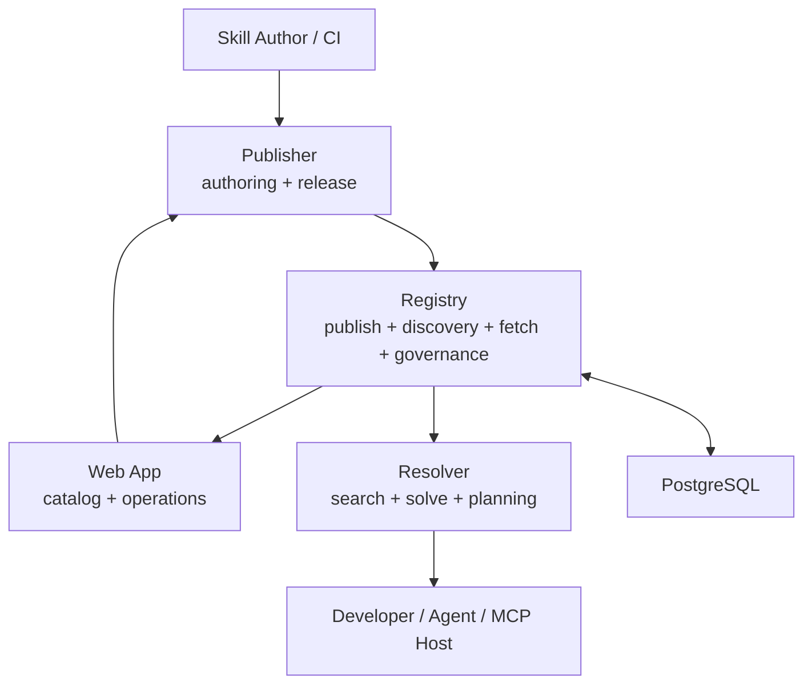

# Aptitude Overview

Aptitude is a **governed skill infrastructure for AI systems**. 
It treats Skills as **structured, versioned, composable assets**, similar to how package managers treat software libraries.

Instead of scattered prompts, scripts, and tools, Aptitude provides a system where skills can be:

- Published as validated artifacts
- Discovered through structured metadata
- Resolved into safe, reproducible bundles
- Consumed by both humans and AI agents

---

## **2. What are the main issues in skill governance?**

The current AI ecosystem lacks structure, making skills difficult to discover, trust, govern, and compose reliably at scale.

### **1. Accessibility**

- Skills are scattered across repos, docs, prompts
- No standard discovery mechanism
- Agents rely on heuristics instead of structured access

→ Result: low reuse, duplication, brittle agent behavior

### **2. Quality and Security**

- No standardized validation or benchmarking
- No provenance or trust tracking
- Skills can change silently

→ Result: unsafe, unreliable capability usage

### **3. Governance and Control**

- No closed, policy-controlled registries
- No lifecycle management (published / deprecated / archived)
- No enforcement layer between “available” and “allowed”

→ Result: enterprises cannot safely adopt AI skills

### **4. Dependency Management and Atomicity**

- Skills are not designed as atomic, reusable units
- No explicit dependency model between skills
- Composition requires manual orchestration or non-deterministic agent decisions

→ Result: non-deterministic systems, hard to evolve

---

## **3. What solution does Aptitude provide?**

Aptitude introduces a structured system that transforms skills into governed, versioned assets that can be safely discovered, resolved, and reused.

Aptitude introduces a **three-layer system**:

### **1. Publish ⇒ Govern ⇒ Store**

- Skills go through a **publish pipeline**
- Validated, benchmarked, audited
- Stored as **immutable, versioned artifacts**

### **2. Discover ⇒ Retrieve**

- Structured metadata + indexing
- Exact version fetch + dependency declarations
- Policy-controlled visibility

### **3. Decide ⇒ Resolve ⇒ Execute**

- Selects best candidate skill
- Resolves dependencies
- Applies governance rules
- Produces a **deterministic lock + execution plan**

### **Key outcome**

Aptitude turns:

- “loose capabilities” → into **governed assets**
- “trial-and-error usage” → into **deterministic execution**
- “prompt chaos” → into **structured infrastructure**

---

## **4. Who is this built for?**

Aptitude is designed for organizations where both humans and AI agents actively perform work, and where that work must remain controlled, reproducible, and compliant.

### **Teams and knowledge workers (agent-assisted work)**

Aptitude serves developers, product managers, analysts, HR, finance, and more who rely on agents to execute tasks. Users can install, use, and compose skills through a simple interface (CLI, MCP, or integrated tools), enabling rapid adoption of new capabilities without custom integration. They can also publish and improve skills, allowing teams to evolve the organization’s capability layer based on real needs. Agents operate on top of the same system, ensuring consistent and reusable execution across workflows.

---

### **Platform, infrastructure, and governance teams**

Aptitude acts as a configurable platform layer that integrates into the company’s infrastructure. DevOps, platform, and security teams define policies, control skill availability, and enforce lifecycle and trust rules. This ensures all skill usage remains auditable, compliant, and aligned with organizational standards. The system centralizes governance without limiting how teams and agents consume capabilities.

---

### **AI agents (first-class consumers via MCP)**

Aptitude is accessible to agents through MCP/ CLI, enabling them to discover and select skills dynamically based on task requirements. Agents can retrieve, resolve, and execute capabilities in a deterministic and policy-compliant way. This allows autonomous decision-making while ensuring all actions remain within governed boundaries. The result is optimized execution without sacrificing control.

---

## **5. Architecture and system composition**

Aptitude is built as a three-surface system that separates enforcement, storage, and decision-making.

> Publisher enforces → Registry stores → Resolver decides
> 

Each component owns a single responsibility, ensuring deterministic behavior and preventing overlap between publishing, governance, and execution.

### **Components**

**Publisher (aptitude-publisher)**

Enforces skill quality and governance before publication.

Handles packaging, validation, benchmarking, security checks, and provenance capture, and submits compliant artifacts to the registry.

**Registry (Aptitude Registry)**

Stores and serves skills as immutable, versioned artifacts.

Handles technical validation, persistence, lifecycle states, access control, and exposes discovery and exact-fetch APIs.

**Resolver (aptitude-resolver)**

Turns intent into executable capability.

Selects skills, resolves dependencies, applies policy constraints, generates lockfiles, and materializes skills locally.

### **Interaction Model**

- Publisher → Registry: publish validated artifacts
- Resolver → Registry: discover and fetch exact versions
- Resolver → Local: install and execute

Core flows are synchronous and deterministic. Async processing is optional and non-authoritative.

### **Contracts**

- **Publish contract**: content + metadata + governance + relationships
- **Discovery contract**: query → candidate skills
- **Execution contract**: lockfile → reproducible environment

This separation ensures that storage, decision-making, and enforcement remain independent.

### **Boundaries**

- Publisher enforces policy, not storage
- Registry stores data, not decisions
- Resolver decides usage, not persistence

This separation ensures simplicity, determinism, and scalability.

### **Responsibilities**

| **Component** | **Core Responsibility** | **Owns** | **Does NOT Own** |
| --- | --- | --- | --- |
| **Publisher (aptitude-publisher)** | Skill authoring, validation, and publication enforcement | Packaging, authoritative validation, benchmarking, security checks, provenance capture, publish requests, CI integration | Persistence, catalog storage, dependency resolution, runtime execution, global state |
| **Registry (Aptitude Registry)** | Immutable storage, access control, and technical validation | Schema validation, immutability enforcement, lifecycle states, persistence (PostgreSQL), discovery APIs, exact fetch APIs, audit logs | Governance policy enforcement, dependency resolution, skill selection, execution planning |
| **Resolver (aptitude-resolver)** | Skill selection, dependency resolution, and execution planning | Query interpretation, candidate selection, dependency graph resolution, policy-aware filtering, lockfile generation, local materialization, integrity verification | Publishing, persistence, lifecycle management, canonical validation, global governance enforcement |

---

## **6. Features and justification (by component)**

### **Publisher**

| **Feature** | **Explanation** | **Justification** |
| --- | --- | --- |
| Validation pipeline | Validates structure and required fields before publish | Prevents invalid artifacts from entering the system |
| Benchmarking & scoring | Evaluates skill quality and performance | Enables better selection and ecosystem quality |
| Security audit | Detects unsafe or non-compliant behavior | Protects against malicious or risky skills |
| Metadata tagging | Adds structured metadata and schemas | Enables scalable discovery and agent usability |
| Versioning enforcement | Publishes immutable versions | Guarantees reproducibility |

### **Registry**

| **Feature** | **Explanation** | **Justification** |
| --- | --- | --- |
| Immutable storage | Stores versioned, non-editable skills | Prevents silent changes and ensures trust |
| Metadata indexing | Indexes structured metadata | Enables fast and accurate discovery |
| Discovery API | Returns candidate skills | Makes system usable programmatically |
| Exact fetch | Returns specific versions | Enables deterministic execution |
| Dependency storage | Stores declared relationships | Preserves modularity without solving |
| Lifecycle management | Controls visibility (published/deprecated) | Enables safe evolution of skills |
| Provenance & audit | Tracks origin and activity | Supports trust and compliance |

### **Resolver**

| **Feature** | **Explanation** | **Justification** |
| --- | --- | --- |
| Query-based selection | Retrieves candidates from intent | Removes need for exact identifiers |
| Dependency resolution | Builds full dependency graph | Ensures consistent composition |
| Policy filtering | Applies governance rules | Prevents unsafe usage |
| Lockfile generation | Stores resolved state | Enables reproducibility |
| Materialization | Installs skills locally | Makes capabilities usable |
| Integrity verification | Validates checksums | Ensures content correctness |
| CLI / agent interface | Unified human + agent access | Enables automation and integration |

---

## **7. Flows and User Experience**

### **1. Publish Flow (Author → Registry)**

This flow turns a raw skill into a governed, immutable artifact.

1. Author defines a skill (content + metadata + dependencies)
2. Publisher runs validation, benchmarking, and security checks
3. Skill is submitted to the registry
4. Registry stores it as an immutable version

Outcome:

A trusted, versioned skill becomes available for discovery.

---

### **2. Discovery Flow (Consumer → Registry)**

This flow allows humans or agents to explore available capabilities without requiring exact identifiers.

1. User or agent expresses intent (natural language or structured query)
2. Registry returns candidate skills based on metadata and indexing
3. Results include versions, metadata, and governance signals

Outcome:

A filtered set of valid candidates, without making execution decisions.

---

### **3. Resolution Flow (Resolver → Registry)**

This flow turns already-discovered candidates into a deterministic, policy-compliant install plan.

1. Resolver pins one concrete version for each candidate
2. Governance removes candidates that fail policy checks
3. The client reranks the remaining candidates by query fit and selection preferences
4. Resolver selects the final root skill
5. Resolver expands and validates the full dependency graph
6. Governance evaluates the resolved graph as a whole
7. The client generates the lockfile and derives the execution plan

Outcome:

A complete, reproducible, policy-compliant definition of what will be installed.

If you want, I can also give you a slightly more executive/product-style version for slides.

---

### **4. Materialization Flow (Resolver → Local Environment)**

This flow turns the plan into actual usable capability.

1. Resolver fetches exact versions from the registry
2. Verifies integrity (checksums)
3. Installs skills locally
4. Prepares execution-ready environment

Outcome:

Capabilities are available locally in a consistent state.

---

### **5. Lock Replay Flow (Deterministic Execution)**

This flow guarantees reproducibility.

1. Load existing lockfile
2. Skip discovery and resolution
3. Fetch exact versions
4. Recreate environment

Outcome:

Identical execution across runs, users, and systems.

---

### **6. Governance Flow (Platform Control Layer)**

This flow ensures all usage remains compliant.

1. Organization defines policies (trust, lifecycle, constraints)
2. Registry enforces visibility and access
3. Resolver enforces usage during resolution

Outcome:

Clear separation between:

- what exists
- what is visible
- what is allowed