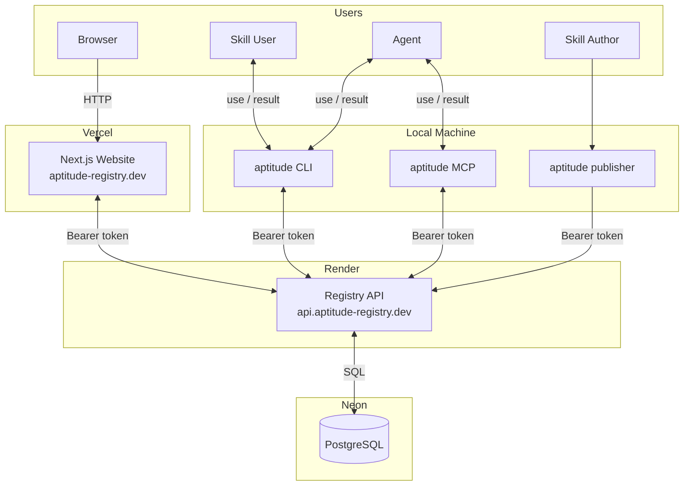
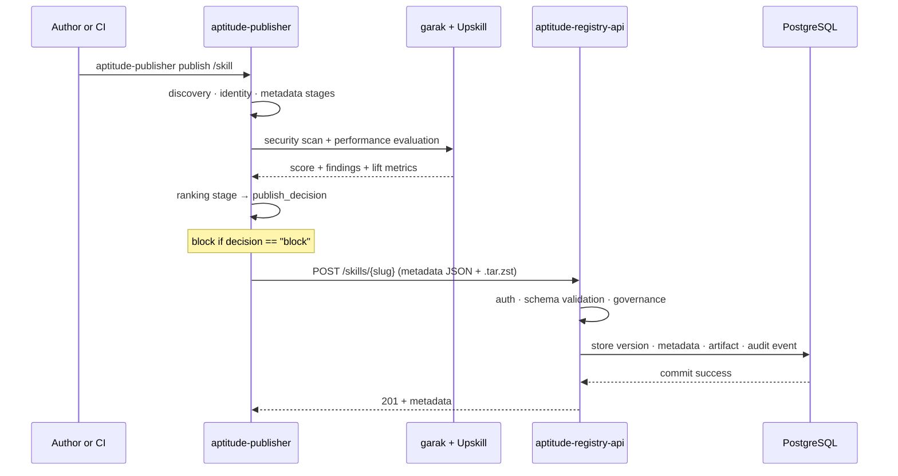
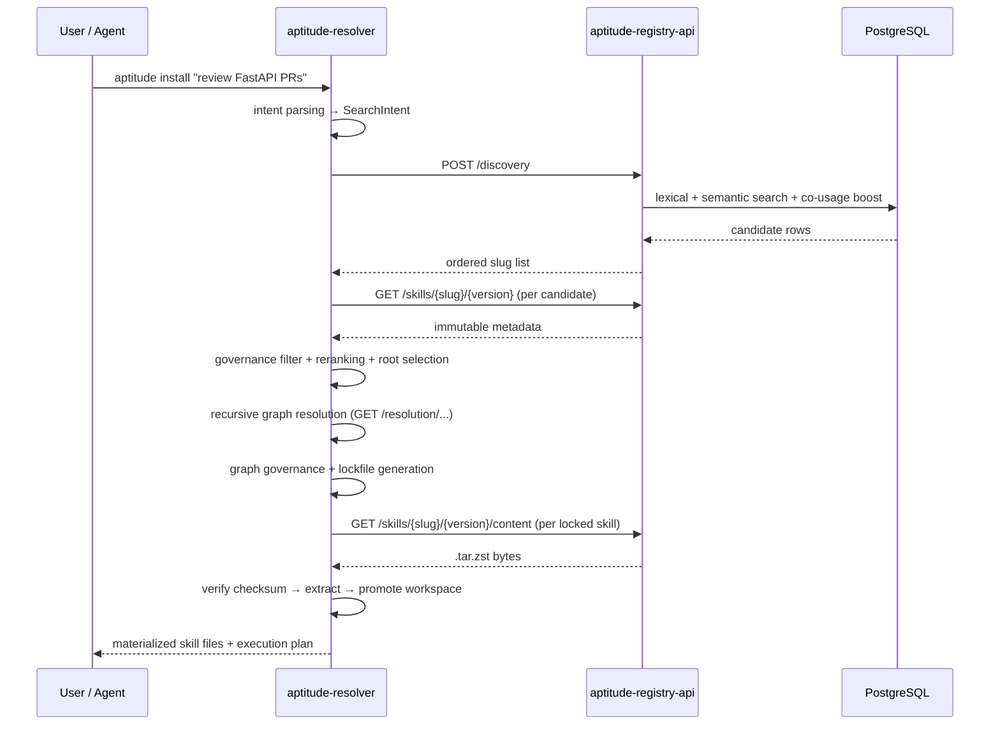

# Aptitude: High Level Design

**Team:** Aptitude
**Members:** Ela Shaul, Aviel Adika, Yonatan Csasnik

---

## Executive Summary

- **Problem Statement:** The current AI skill ecosystem lacks the structure needed to govern, discover, and compose skills reliably at scale. Four specific gaps drive this:
  - **Accessibility** — skills are scattered across repos, docs, and prompts; discovery depends on GitHub crawling or source installs; agents rely on heuristics instead of structured access.
  - **Quality and security** — no strict publish pipeline, no standardized validation or benchmarking, no provenance or trust tracking; skills can change silently.
  - **Governance and control** — no closed, policy-controlled publication model for enterprises, no lifecycle management, no enforcement layer between "available" and "allowed."
  - **Monolithic skills** — skills bloat into all-in-one prompts as logic accumulates, degrading performance; no dependency model to factor shared logic out, no lockfile to keep behavior consistent across environments.

- **Proposed Solution:** Aptitude is a three-surface product — `aptitude-publisher` for authoring and CI release flows, `aptitude-registry-api` as the authoritative registry backend, and `aptitude-resolver` as the consumer-side discovery, solving, locking, and execution-planning client. Interaction surfaces are CLI + MCP for developers and agents, and a Next.js website (aptitude-registry.dev) for catalog browsing.

- **Success Criteria:**
  - Discovery returns accurate, relevant candidates with low latency.
  - Publish pipeline completes end-to-end reliably under CI load.
  - CLI and MCP integration flows succeed consistently without custom per-agent server behavior.

---

## System Architecture

Aptitude is a three-surface system built around a strict separation of concerns. Each component owns exactly one domain and delegates everything else across a well-defined contract.

> Publisher enforces → Registry stores → Resolver decides

### Component Breakdown

| Component            | Primary Role         | Owns                                                                                           | Does Not Own                                                                   |
| -------------------- | -------------------- | ---------------------------------------------------------------------------------------------- | ------------------------------------------------------------------------------ |
| `aptitude-publisher` | Publish client       | Packaging, evaluation pipeline, security scan, request assembly, CI and author CLI             | Canonical validation, persistence, runtime solving                             |
| `aptitude-registry`  | Registry backend     | Auth, validation, immutability, governance, persistence, search, audit                         | Prompt interpretation, final selection, dependency solving, execution planning |
| `aptitude-resolver`  | Runtime client       | Discovery query construction, reranking, solve, lock, execution planning, MCP and CLI surfaces | Publish packaging, canonical registry policy                                   |
| `PostgreSQL` (Neon)  | Canonical data store | Skill metadata, versions, content digests, lifecycle state, vectors, audit records             | Client-side runtime decision logic                                             |
| `Website` (Vercel)   | Presentation layer   | Catalog browsing, skill inspection, install instructions                                       | Registry source of truth, solving logic                                        |

Full component detail: [publisher/product-overview.md](publisher/product-overview.md) · [registry/product-overview.md](registry/product-overview.md) · [resolver/product-overview.md](resolver/product-overview.md)

---

## API Surface

Who talks to whom and over what endpoints:

| Caller               | Registry Endpoint                        | Method | Purpose                              |
| -------------------- | ---------------------------------------- | ------ | ------------------------------------ |
| `aptitude-publisher` | `/skills/{slug}`                         | POST   | Publish new skill version            |
| `aptitude-resolver`  | `/discovery`                             | POST   | Search for candidate skill slugs     |
| `aptitude-resolver`  | `/skills/{slug}/{version}`               | GET    | Fetch immutable version metadata     |
| `aptitude-resolver`  | `/resolution/{slug}/{version}`           | GET    | Recursive dependency graph expansion |
| `aptitude-resolver`  | `/skills/{slug}/{version}/content`       | GET    | Download `.tar.zst` artifact         |
| Website (server)     | `/discovery`, `/skills/{slug}/{version}` | GET    | Catalog browsing and skill detail    |

All calls are authenticated with a scoped Bearer token. The browser never calls the registry directly — the website proxies all registry reads server-side.

---

## Main Users

### User Personas

- **Skill Author** — publishes skills from local development or CI pipelines.
- **Skill User / Agent** — installs and uses skills through CLI, MCP, or the website.
- **Operator / Security Reviewer** — manages lifecycle controls, provenance, and auditability.

### Publish Flow

### Discovery and Resolution Flow

Full flow detail: [architecture.md](architecture.md) · [resolver/architecture.md](resolver/architecture.md)

---

## User Interface

### CLI + MCP (Primary)

The primary interaction surfaces for developers and agents:

- **CLI** (`aptitude-resolver`) — `aptitude install`, `sync --lock`, `resolve`, `policy show`. See [resolver/product-overview.md](resolver/product-overview.md).
- **MCP** (`aptitude mcp`) — stdio MCP server for Claude and other agent hosts. Exposes search, inspect, resolve, install, and sync tools.

### Website (aptitude-registry.dev)

A Next.js application deployed on Vercel. Presentation layer only — no business logic lives here.

---

## Data Model and Storage

Registry-centric model backed by PostgreSQL on Neon:

- Skills are identified by `slug`; each published version is immutable at `(slug, version)`.
- Artifact content is stored as SHA-256 digest-addressed records.
- Search uses a `tsvector` GIN index (lexical) + pgvector HNSW index (semantic, `halfvec(1536)`).
- Co-usage signals are stored in `skill_co_usage_pairs` and used to boost discovery results.
- Audit records capture every publish, lifecycle change, and governance action.
- Resolver-generated locks and execution plans are client-side outputs — never stored by the registry.

Full schema: [registry/tables.md](registry/tables.md)

---

## Governance

Aptitude enforces governance at two boundaries: the publish gate (publisher) and the read boundary (registry). Neither agents nor users can bypass either layer.

### Roles and Access Tokens

All registry access requires a scoped Bearer token. Four scopes exist:

| Scope     | Permitted operations                                             |
| --------- | ---------------------------------------------------------------- |
| `read`    | Discovery, metadata fetch, content download                      |
| `publish` | All read operations + publish new skill versions                 |
| `review`  | All read operations + lifecycle transitions (deprecate, archive) |
| `admin`   | All operations including namespace and token management          |

Tokens are issued per environment and per principal. An agent runtime holds a `read` token; a CI pipeline holds a `publish` token; a security reviewer holds a `review` token.

### Namespaces

Skills are organized into namespaces (e.g. `public`, `internal`, `org/team`). Namespaces control visibility and publication scope:

- A skill published to `internal` is not discoverable or fetchable by holders of a `public`-scoped read token.
- Namespace assignment is set at publish time via CLI flag and cannot be changed after publication without an `admin` token.
- Enterprises can isolate their skill catalog entirely within a private namespace while still consuming public skills.

---

## Security Measures

- All registry access requires scoped Bearer tokens (`read`, `publish`, `review`, `admin`).
- Publisher security gate: garak must produce a scored result — unscored, unconfigured, or disabled → publish blocked with no fallback.
- Immutable artifacts are tied to SHA-256 digests; any tampered download is rejected before extraction.
- Provenance (`repo_url`, `commit_sha`) is captured at publish time and stored immutably for auditability.
- Resolver archive extraction rejects any `.tar.zst` member whose path escapes the target directory.
- Website Bearer token is server-side only and never exposed to the browser.

---

## Deployment & Infrastructure

### Hosted Components

| Component               | Host   | URL                                                     |
| ----------------------- | ------ | ------------------------------------------------------- |
| `aptitude-registry-api` | Render | `api.aptitude-registry.dev`                             |
| Website                 | Vercel | `aptitude-registry.dev`                                 |
| PostgreSQL              | Neon   | serverless managed                                      |
| `aptitude-publisher`    | PyPI   | [pypi.org/org/Aptitude](https://pypi.org/org/Aptitude/) |
| `aptitude-resolver`     | PyPI   | [pypi.org/org/Aptitude](https://pypi.org/org/Aptitude/) |

### External Dependencies

| Service               | Used by      | Purpose                                   |
| --------------------- | ------------ | ----------------------------------------- |
| PostgreSQL (Neon)     | Registry     | Canonical storage + vector search         |
| OpenAI Embeddings API | Registry     | Semantic skill embeddings at publish time |
| NVIDIA garak          | Publisher    | Security scanning (mandatory gate)        |
| Hugging Face Upskill  | Publisher    | Performance evaluation (optional)         |
| Render                | Registry API | Hosting                                   |
| Vercel                | Website      | Hosting                                   |
