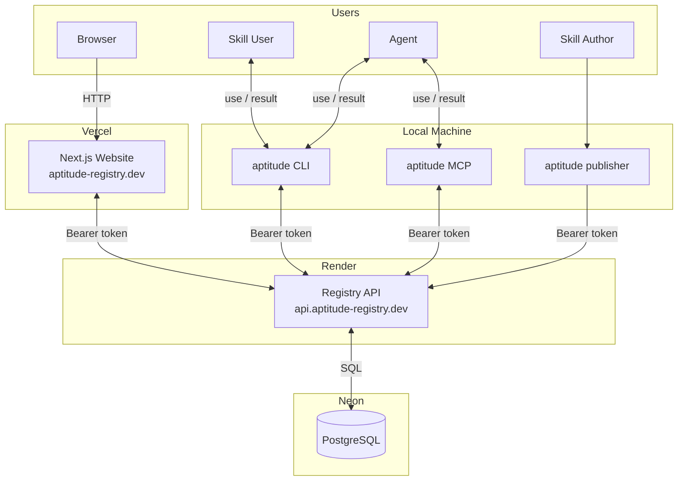
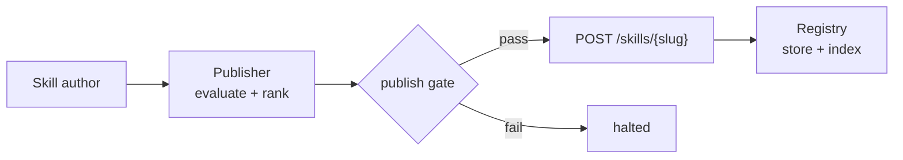
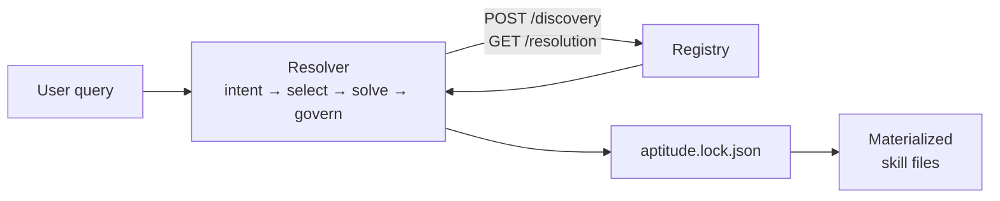
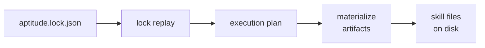

# Aptitude — Product Overview

Aptitude is a three-surface system that manages AI skills the same way a package manager manages software libraries: skills are published as validated artifacts, stored in a governed registry, discovered through structured queries, and resolved into deterministic, reproducible execution.

## **What are the main issues in skill governance?**

The current AI ecosystem lacks structure, making skills difficult to discover, trust, govern, and compose reliably at scale.

### **Accessibility**

- Skills are scattered across repos, docs, prompts
- Discovery often depends on crawling GitHub or installing directly from source
- No standard discovery mechanism
- Agents rely on heuristics instead of structured access

→ Result: low reuse, duplication, brittle agent behavior

### **Quality and Security**

- No strict publish pipeline before a skill becomes available
- No standardized validation or benchmarking
- No provenance or trust tracking
- Skills can change silently

→ Result: unsafe, unreliable capability usage

### **Governance and Control**

- No closed, policy-controlled publication model for enterprise environments
- No configurable organizational policy layer for agent behavior
- No lifecycle management (published / deprecated / archived)
- No enforcement layer between “available” and “allowed”

→ Result: enterprises cannot safely adopt AI skills

### **Monolithic Skills**

- Skills bloat into all-in-one prompts as logic accumulates, degrading performance
- No dependency model to factor shared logic out into atomic, reusable units
- Composition requires manual orchestration or non-deterministic agent decisions
- No shared lockfile to keep behavior consistent across environments

→ Result: bloated, slow, non-deterministic systems that are hard to evolve

---

## The Three Surfaces

### Publisher

The publisher is the entry point for skill authors and CI pipelines. It takes a skill folder on disk, runs it through a multi-stage evaluation pipeline — security scanning with NVIDIA garak, performance measurement with Hugging Face Upskill, Anthropic compliance validation, and quality ranking — and submits a signed, validated `.tar.zst` artifact to the registry.

### Registry

The registry is the authoritative backend. It stores skills as immutable, versioned artifacts and serves them through stable HTTP APIs. It handles technical validation on receive, lifecycle management, access control via scoped tokens, hybrid discovery search (lexical + semantic + co-usage signals), and complete audit trails.

### Resolver

The resolver is the local decision-making engine. It parses user intent, queries the registry for candidates, applies client-side policy filtering and ranking, resolves the full dependency graph, enforces governance rules, generates a deterministic lockfile, and materializes skills to the local filesystem.

---

## How Aptitude Treats Skills

Aptitude treats skills as building blocks — modular, versioned, and composable artifacts with explicit boundaries. Keeping each skill focused and atomic makes them easier to evaluate, govern, and reuse. Complex capabilities are expressed by composing smaller skills rather than packing everything into a single monolithic prompt.

---

## Who Aptitude Is For

**Skill authors** — developers and content creators who define AI capabilities and publish them through CI or local tools.

**End users** — developers, product managers, designers, DevOps, and anyone whose workflow benefits from AI skills. They consume skills through agents or tooling without needing to manage the underlying registry or resolver infrastructure.

**Agents** — first-class consumers via the MCP interface. Agents can discover, resolve, and install skills autonomously within defined policy boundaries.

**Operators and security teams** — platform and governance teams that define lifecycle rules, namespace grants, trust tiers, and policy packs that control what agents are allowed to use.

---

## Competitive Landscape

Most existing tools address only one slice of the skill problem — distribution, runtime tooling, or research — but not the full lifecycle.

| Tool | What it does | Where it stops |
| --- | --- | --- |
| **Skills.sh**, **OpenClaw / ClawHub** | Treat skills as distributable artifacts | No strong governance, strict validation, or reproducible resolution |
| **LangChain**, **OpenAI Tools / Functions** | Enable capability use at runtime | Not a packaging, registry, or lifecycle system |
| **SkillNet**, **EvoSkills** | Skill research and generation | Aimed at experimentation, not production control |

Aptitude is positioned differently:

- Skills are governed, versioned infrastructure assets — not GitHub snippets or runtime plugins
- Stored as structured, enriched artifacts in a purpose-built registry
- Modeled as atomic building blocks with explicit dependencies
- Consumed through versions, lockfiles, and configurable policy controls
- Makes agentic collaboration reproducible and compliant

---

## Core Flows

### Publish

A skill author runs `aptitude-publisher publish /path/to/skill`. The publisher evaluates the skill, verifies security and compliance, builds the registry payload, and uploads the artifact. The registry validates the request, stores the immutable version, and indexes it for discovery.

### Discover and Resolve

An agent or developer calls `aptitude install "find a skill for FastAPI code review"`. The resolver parses the intent, queries `POST /discovery` on the registry, fetches version metadata, applies policy filtering and ranking, selects the root skill, expands the dependency graph, validates the full graph against policy, writes a lockfile, and materializes the skill files locally.

### Lock Replay

Running `aptitude sync --lock aptitude.lock.json` replays an existing lockfile. Discovery, intent parsing, and dependency solving are skipped entirely. The lockfile is the sole execution source of truth, guaranteeing identical results across runs, machines, and environments.

---

## Interfaces

| Interface                              | Used by               | Description                                      |
| -------------------------------------- | --------------------- | ------------------------------------------------ |
| `aptitude-publisher inspect`           | Skill authors         | Run evaluation pipeline, print report, no upload |
| `aptitude-publisher publish`           | Skill authors, CI     | Full evaluation + registry upload                |
| `aptitude install`                     | Developers, CI        | Fresh planning and materialization from a query  |
| `aptitude sync --lock`                 | Developers, CI        | Replay an existing lockfile                      |
| `aptitude policy show`                 | Developers, operators | Inspect effective policy and config layers       |
| `aptitude mcp`                         | Agent hosts           | Start the local stdio MCP server                 |
| `POST /discovery`                      | Resolver, Web         | Search for candidate skill slugs                 |
| `GET /skills/{slug}/{version}`         | Resolver, Web         | Exact immutable metadata                         |
| `GET /skills/{slug}/{version}/content` | Resolver              | Immutable `.tar.zst` artifact bytes              |

