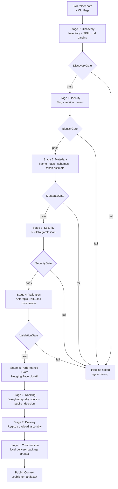

# Aptitude Publisher — Evaluation Pipeline

> Stage-by-stage breakdown of what runs, what each gate checks, and how the publish decision is reached.

## Overview

The evaluation pipeline transforms a skill folder into a publish decision and a registry-ready artifact. It runs nine sequential stages interleaved with five gates. A gate failure halts the pipeline immediately; no subsequent stage runs.



---

## Stage 0 — Discovery

**Module:** `stages/discovery.py`  
**Artifact:** `00_inventory.json`

Reads the skill folder, inventories all files, and parses `SKILL.md` into frontmatter and body.

What it does:

- Resolves the skill root directory from the provided path (accepting a folder path, a `SKILL.md` path, or any file inside the skill folder).
- Classifies every file under the root into: `SKILL.md` (primary), `scripts/`, `references/`, `assets/`, companion markdown files, and uncategorized other files.
- Discovers git provenance: `repo_root`, `repo_url`, `commit_sha`, `tree_path` (via `git` subprocess calls).
- Parses `SKILL.md` frontmatter (YAML subset) and body into `context.source.parsed_content`.
- Writes `00_inventory.json` with the full file catalog.

**DiscoveryGate** blocks if:
- Skill root does not exist or is not a directory.
- `SKILL.md` was not found.
- `parsed_content` is missing, frontmatter is not a dict, or body is not a string.
- Inventory artifact was not written.

---

## Stage 1 — Identity

**Module:** `stages/identity.py`  
**Artifact:** `01_identity.json`

Extracts the three registry identity fields: `slug`, `version`, and `intent`.

Sources, in order of precedence:
- CLI overrides (`--slug`, `--version`, `--intent`).
- `SKILL.md` frontmatter: `name` (→ slug), `metadata.version`, `metadata.intent`.

**IdentityGate** blocks if any of `slug`, `version`, or `intent` is absent.

---

## Stage 2 — Metadata

**Module:** `stages/metadata.py`  
**Artifact:** `02_metadata.json`

Extracts the registry metadata block from `SKILL.md` frontmatter and computes publisher-side fields.

Fields extracted from frontmatter:

| Field | Source |
| --- | --- |
| `name` | `frontmatter.name` |
| `description` | `frontmatter.description` |
| `tags` | `frontmatter.metadata.tags` |
| `inputs_schema` | `frontmatter.metadata.inputs_schema` |
| `outputs_schema` | `frontmatter.metadata.outputs_schema` |
| `maturity_score` | `frontmatter.metadata.maturity_score` |
| `security_score` | `frontmatter.metadata.security_score` |

Publisher-computed fields (not from frontmatter):

- **`token_estimate`** — content heuristic:
  `max(1, int(round(max(len(text) / 4, word_count * 1.3))))`. This is a
  provisional estimate only; it is replaced by
  `performance_exam.skilled_avg_tokens` when Upskill runs successfully.
- **`word_count`** — counted from the SKILL.md body plus companion markdown files.

Optional enrichment: GitHub repository signals (star count, forks, etc.) are fetched via `github_api.fetch_repository_signals` and stored in `metadata.extra.repo_signals` if a repo URL was discovered.

**MetadataGate** blocks if `name`, `description`, `tags`, `inputs_schema`, or
`outputs_schema` is absent. It also blocks if `maturity_score` or
`security_score` is present but outside `0.0` to `1.0`.

---

## Stage 3 — Security

**Module:** `stages/security.py`  
**Artifact:** `04_security.json`  
**Integration:** `integrations/garak_security.py`

NVIDIA garak is the sole authoritative security source. Local heuristic checks exist in the code as implementation helpers but do not contribute to the security score or the publish decision.

### Garak execution

The garak command is built from:
1. `PUBLISHER_GARAK_COMMAND` environment variable (a template supporting `{skill_path}`, `{skill_file}`, `{artifact_dir}`).
2. Auto-constructed command using `GARAK_TARGET_TYPE`, `GARAK_TARGET_NAME`, and optionally `GARAK_PROBES` (default `promptinject`) and `GARAK_DETECTORS`.

Timeout: `PUBLISHER_GARAK_TIMEOUT_SECONDS` (default 180 seconds).

### Garak result normalization

Garak artifacts (JSON/JSONL files in `garak/`) are parsed into a flat finding list. Each finding has `check`, `severity` (`low` / `medium` / `high` / `critical`), `field`, `reason`, and `evidence`.

Score is computed from findings using the penalty table:

| Severity | Penalty |
| --- | --- |
| `low` | −0.05 |
| `medium` | −0.15 |
| `high` | −0.30 |
| `critical` | −0.50 |

Starting score is `1.0`; penalties are summed and clamped to `[0.0, 1.0]`. If garak returns an authoritative numeric score, that value overrides the penalty-derived score.

### Security decision

| Condition | Decision |
| --- | --- |
| Any `critical` finding | `block` |
| Any `high` finding | `review_required` |
| No high/critical findings | `allow` |

If garak is not configured or does not produce a scored result, `decision = block` with a synthetic critical finding (`garak:required_scan`).

**SecurityGate** blocks if:
- `security.scanned` is false (garak did not run or did not score).
- `security.score` is `None`.
- `security.decision` is `block`.

---

## Stage 4 — Validation

**Module:** `stages/validation.py`  
**Artifact:** `05_validation.json`

Validates the skill folder and `SKILL.md` against the Anthropic skill-writing contract. Produces blocking errors and non-blocking warnings.

### Checks run

| Check | Type | Rule |
| --- | --- | --- |
| `skill_root_exists` | error | Skill root exists and is a directory |
| `skill_folder_kebab_case` | error | Folder name matches `[a-z0-9]+(-[a-z0-9]+)*` |
| `skill_md_present` | error | `SKILL.md` exists in the skill root |
| `readme_absent_in_skill_folder` | error | `README.md` must not appear inside the skill folder |
| `yaml_frontmatter_present` | error | `SKILL.md` starts with `---` YAML block |
| `frontmatter_name_present` | error | `name` field is non-empty |
| `frontmatter_name_kebab_case` | error | `name` is kebab-case, lowercase and hyphens only |
| `frontmatter_name_matches_folder` | error | `name` matches the skill folder name |
| `frontmatter_name_reserved_words` | error | `name` does not contain `"claude"` or `"anthropic"` |
| `frontmatter_description_present` | error | `description` is non-empty |
| `frontmatter_description_length` | error | Description is under 1024 characters |
| `frontmatter_description_trigger_guidance` | error | Description includes action markers + trigger markers (heuristic for use-when guidance) |
| `frontmatter_no_xml_angle_brackets` | error | No `<` or `>` in any frontmatter string field |
| `compatibility_length_if_present` | error | `compatibility` is 1–500 characters if present |
| `body_present` | error | Body is non-empty after frontmatter |
| `body_instructions_heading` | warning | Body contains `# Instructions` heading |
| `body_examples_presence` | warning | Body contains the word "example" |
| `body_troubleshooting_presence` | warning | Body contains the word "troubleshooting" |

Errors set `validation.passed = False`. Warnings are informational and do not block.

**ValidationGate** blocks if `validation.errors` is non-empty.

---

## Stage 5 — Performance Exam

**Module:** `stages/performance_exam.py`  
**Artifact:** `05_performance_exam.json`  
**Integration:** `integrations/upskill_eval.py`

Hugging Face Upskill is the sole performance measurement source. The publisher does not produce its own performance estimate if Upskill is unavailable.

### Upskill execution modes

1. **Direct Python API** — used when `UPSKILL_BASE_URL` + `UPSKILL_API_KEY` + `UPSKILL_TESTS_PATH` are all set. Calls `evaluate_skill()` from the `upskill` package with a custom OpenAI-compatible provider.
2. **Subprocess CLI** — builds an `upskill eval <skill_path>` command from `PUBLISHER_UPSKILL_COMMAND` template or from auto-detected executable + environment variables.

Timeout: `PUBLISHER_UPSKILL_TIMEOUT_SECONDS` (default 600 seconds).

### Metrics captured

| Field | Description |
| --- | --- |
| `score` | Composite score: `(skilled_success_rate × 0.70) + (lift × 0.20) + (token_score × 0.10)` |
| `passed` | Whether the skill is beneficial (skilled success ≥ baseline) |
| `test_case_count` | Number of test cases run |
| `baseline_success_rate` | Fraction of test cases passing without the skill |
| `skilled_success_rate` | Fraction of test cases passing with the skill |
| `skill_lift` | `skilled_success_rate - baseline_success_rate` |
| `baseline_avg_tokens` | Average tokens per test case without the skill |
| `skilled_avg_tokens` | Average tokens per test case with the skill |
| `token_delta` | `skilled_avg_tokens - baseline_avg_tokens` (negative = improvement) |
| `efficiency_label` | `"improved"` if `token_delta < 0`, else `"neutral"` |

When Upskill produces a positive `skilled_avg_tokens`, that value replaces the content-heuristic `metadata.token_estimate` for the remainder of the pipeline.

If Upskill is unavailable or produces no score, `performance_exam.score = None` and the performance criterion contributes `0.0` to ranking.

---

## Stage 6 — Ranking

**Module:** `stages/ranking.py`  
**Artifact:** `03_ranking.json`

Combines all upstream evaluation signals into a single weighted quality score and a final `publish_decision`.

### Scoring rubric

| Criterion | Weight | Source |
| --- | --- | --- |
| `security` | 0.30 | `security.score` (from garak) |
| `performance_exam` | 0.25 | `performance_exam.score` (from Upskill) |
| `anthropic_compliance` | 0.20 | Validation errors/warnings (see below) |
| `token_efficiency` | 0.15 | Upskill token delta (preferred) or metadata token estimate |
| `metadata_completeness` | 0.10 | Fraction of required metadata fields present |
| `instruction_quality` | 0.00 | SKILL.md body structure (currently zero-weighted) |

### Criterion scoring details

**`anthropic_compliance`:** `1.0` if no errors and no warnings, `0.8` if warnings only, `0.0` if any errors.

**`token_efficiency`** — two paths:

If Upskill ran and produced token data:
| `skilled_avg_tokens` vs baseline | Score |
| --- | --- |
| ≤ 70% of baseline | 1.0 |
| ≤ 85% of baseline | 0.8 |
| ≤ 100% of baseline | 0.65 |
| > baseline | 0.3 |

If only the content-heuristic `token_estimate` is available:
| Token estimate | Score |
| --- | --- |
| ≤ 200 | 1.0 |
| ≤ 500 | 0.8 |
| ≤ 1000 | 0.6 |
| ≤ 2000 | 0.4 |
| > 2000 | 0.2 |
| `None` | 0.4 |

**`metadata_completeness`:** Fraction of `[name, description, tags, inputs_schema, outputs_schema]` that are present (0.0 – 1.0).

### Total score and label

```
total_score = Σ (weight × criterion_score)
```

| Range | Label |
| --- | --- |
| ≥ 0.85 | `excellent` |
| ≥ 0.70 | `good` |
| ≥ 0.55 | `review` |
| < 0.55 | `poor` |

### Publish decision

The `publish_decision` is determined independently of the label, using gate results:

| Condition | Decision |
| --- | --- |
| `security.decision == "block"` | `block` (security overrides everything) |
| `not validation.passed` or `security.decision == "review_required"` | `review_required` |
| Otherwise | `allow` |

A `block` decision always prevents upload regardless of total score.

---

## Stage 7 — Delivery

**Module:** `stages/delivery.py`  
**Artifact:** none (in-memory only)

Assembles the `DeliveryPayload` — the registry-ready JSON structure that becomes the `metadata` part of the multipart upload.

Payload shape:

```json
{
  "intent": "create_skill",
  "version": "1.0.0",
  "metadata": {
    "name": "...",
    "description": "...",
    "tags": [...],
    "inputs_schema": {...},
    "outputs_schema": {...},
    "token_estimate": 420,
    "maturity_score": null,
    "security_score": 0.95
  },
  "governance": {
    "trust_tier": "untrusted",
    "namespace": "public",
    "artifact_origin": "internal",
    "policy_pack_slug": null,
    "provenance": {
      "repo_url": "https://github.com/...",
      "commit_sha": "abc123",
      "tree_path": "skills/my-skill",
      "publisher_identity": null
    }
  },
  "relationships": {
    "depends_on": [],
    "extends": [],
    "conflicts_with": [],
    "overlaps_with": []
  }
}
```

Provenance is included only if `repo_url` and `commit_sha` were discovered during inventory.

---

## Stage 8 — Compression

**Module:** `stages/compression.py`  
**Artifacts:** `07_delivery_package.zst`, `07_compression.json`

Serializes the delivery payload to deterministic JSON bytes (sorted keys, ASCII-safe) and compresses them using Zstandard (level 3). If the `zstandard` Python package is unavailable, falls back to the system `zstd` binary.

The compressed artifact written here (`.publisher_artifacts/07_delivery_package.zst`) represents the delivery payload JSON. The actual skill bundle uploaded to the registry is built separately by `artifacts/bundle.py` from the raw skill folder files.

---

## Artifact Directory Layout

After a complete pipeline run, `.publisher_artifacts/` inside the skill folder contains:

```
.publisher_artifacts/
  00_inventory.json          # Stage 0 — file catalog + git provenance
  01_identity.json           # Stage 1 — slug, version, intent
  02_metadata.json           # Stage 2 — metadata fields + token estimate
  03_ranking.json            # Stage 6 — weighted scores + publish decision
  04_security.json           # Stage 3 — garak findings + decision
  05_validation.json         # Stage 4 — errors, warnings, checks run
  05_performance_exam.json   # Stage 5 — Upskill metrics
  07_compression.json        # Stage 8 — compression stats
  07_delivery_package.zst    # Stage 8 — compressed delivery payload
  garak/
    stdout.txt
    stderr.txt
    garak.report.json        # (if garak ran)
  upskill/
    stdout.txt
    stderr.txt
    runs/                    # (if Upskill ran)
```
