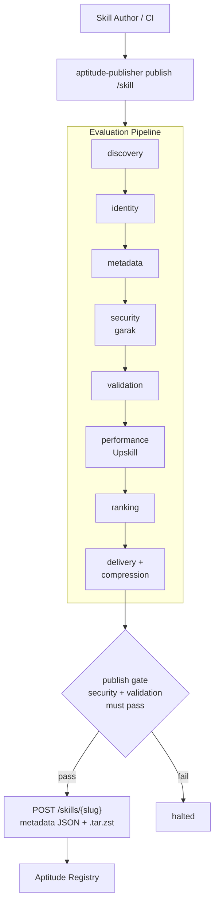

# Aptitude Publisher — Product Overview

> Canonical product description for the Aptitude Publisher.

## What It Is

Aptitude Publisher is the local evaluation and publication tool for Aptitude skills. It takes a skill folder on disk, runs it through a multi-stage evaluation pipeline, and — when all gates pass — uploads a deterministic `.tar.zst` bundle to an Aptitude Registry instance.

The publisher sits between the skill author and the registry. It is the only component that writes to the registry on behalf of a skill; the registry itself never pulls or discovers skill content independently.



## What the Publisher Owns

- **Skill inventory.** Reads the skill folder, resolves `SKILL.md`, and catalogs scripts, references, assets, and companion markdown files.
- **Identity extraction.** Derives `slug`, `version`, and `intent` from frontmatter, with optional CLI overrides.
- **Metadata extraction.** Extracts `name`, `description`, `tags`, `inputs_schema`, `outputs_schema`, and a content-heuristic token estimate from `SKILL.md`.
- **Security scanning.** Runs NVIDIA garak as the authoritative security source. If garak is not configured or does not produce a score, publishing is blocked.
- **Anthropic compliance validation.** Validates the skill folder structure and `SKILL.md` contract against Anthropic publishing guidelines.
- **Performance evaluation.** Runs Hugging Face Upskill to measure skill lift, success rates, and token efficiency against a baseline. Upskill results, when available, replace the publisher's content-heuristic token estimate.
- **Quality ranking.** Combines garak score, Upskill performance, token efficiency, Anthropic compliance, and metadata completeness into a weighted total score and a `publish_decision` (`allow`, `review_required`, or `block`).
- **Payload assembly.** Builds the registry-ready metadata and governance payload from all upstream stage outputs.
- **Bundle compression.** Compresses the delivery payload and skill files into a `.tar.zst` artifact using Zstandard.
- **Registry upload.** POSTs the metadata JSON and the compressed bundle to the registry as `multipart/form-data`.
- **Governance inputs.** Attaches `trust_tier`, `namespace`, `artifact_origin`, `policy_pack_slug`, and `publisher_identity` to the registry payload. These values come from CLI flags and are never derived from skill content.

## What the Publisher Does Not Own

| Concern | Owned by |
| --- | --- |
| Registry governance enforcement | Registry server |
| Checksum verification on receive | Registry server |
| Discovery indexing | Registry server |
| Dependency resolution | Aptitude Resolver |
| Skill execution | Agent host |

## Technology Stack

| Component | Choice |
| --- | --- |
| Language | Python 3.10+ |
| CLI framework | argparse |
| Security evaluator | NVIDIA garak (external, optional install) |
| Performance evaluator | Hugging Face upskill (external, optional install) |
| Compression | Zstandard (`zstandard` package or `zstd` binary) |
| Registry transport | stdlib `urllib` (no extra HTTP client) |
| Package manager | uv |
| Evaluator extra | `uv pip install -e ".[evaluators]"` |

## CLI Commands

```bash
# Evaluate a skill without uploading
aptitude-publisher inspect /path/to/skill

# Evaluate and upload to the registry
APTITUDE_PUBLISH_TOKEN=<token> \
aptitude-publisher publish /path/to/skill

# Evaluate and stop before upload (dry run)
aptitude-publisher publish /path/to/skill --dry-run
```

### Shared CLI Flags

| Flag | Description |
| --- | --- |
| `--slug` | Override the skill slug derived from frontmatter |
| `--version` | Override the semantic version |
| `--intent` | Override publish intent (`create_skill` or `publish_version`) |
| `--trust-tier` | Governance trust tier (`untrusted`, `internal`, `verified`) — default `untrusted` |
| `--namespace` | Target registry namespace — default `public` |
| `--artifact-origin` | Artifact origin (`internal`, `imported`, `verified`, `restricted`) — default `internal` |
| `--policy-pack-slug` | Optional governance policy-pack slug |
| `--publisher-identity` | Optional provenance publisher identity |

### Publish-Only Flags

| Flag | Description |
| --- | --- |
| `--registry-url` | Registry base URL (falls back to `APTITUDE_REGISTRY_URL`, `APTITUDE_SERVER_BASE_URL`, or `APP_PORT`) |
| `--token` | Registry publish token (falls back to `APTITUDE_PUBLISH_TOKEN`, `APTITUDE_INTEGRATION_PUBLISH_TOKEN`, `PUBLISH_TOKEN`) |
| `--dry-run` | Run the full local pipeline but skip the API upload |

## Quick Start

Install without evaluator tools:

```bash
uv venv
uv pip install -e .
```

Install with full evaluator support:

```bash
uv pip install -e ".[evaluators]"
```

Configure garak:

```bash
export GARAK_TARGET_TYPE="openai"
export GARAK_TARGET_NAME="gpt-4o-mini"
export OPENAI_API_KEY="..."
```

Configure Upskill:

```bash
export UPSKILL_MODELS="haiku,sonnet"
```

Inspect a skill (evaluate without uploading):

```bash
aptitude-publisher inspect /path/to/my-skill
```

Publish to a local registry:

```bash
APTITUDE_PUBLISH_TOKEN=publisher-token \
aptitude-publisher publish /path/to/my-skill --version 1.0.0
```

## Key Reading Order

1. This document — product scope and what the publisher owns.
2. [`architecture.md`](architecture.md) — package map, pipeline stages, data flows.
3. [`evaluation-pipeline.md`](evaluation-pipeline.md) — detailed stage and gate breakdown.
4. [`audit-pipeline.md`](audit-pipeline.md) — artifact trail and trace system.
5. [`policies.md`](policies.md) — governance inputs, security gate rules, validation contract.
