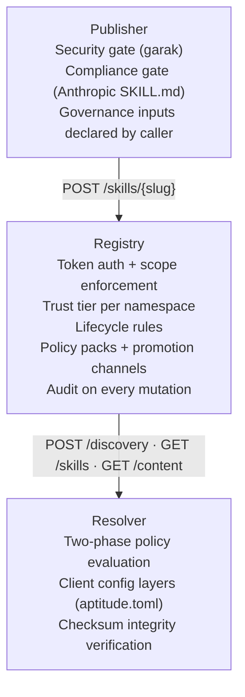
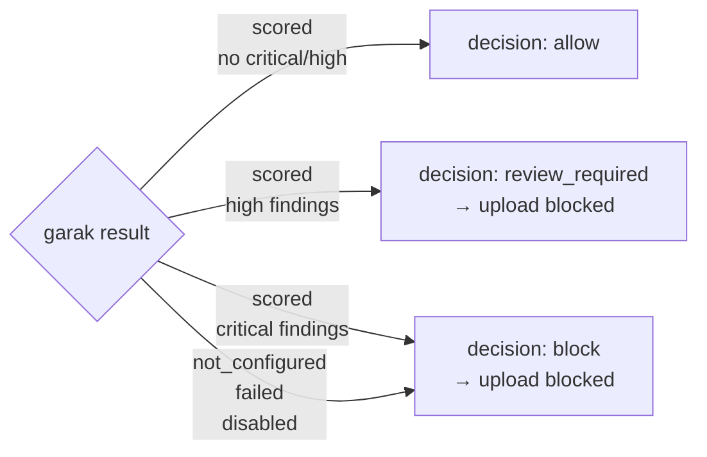
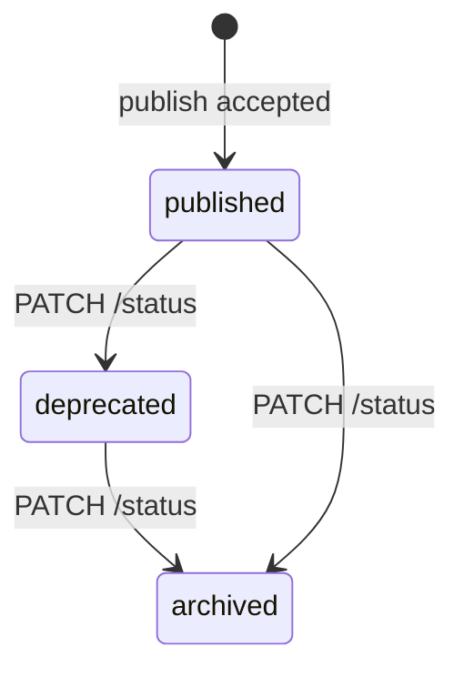
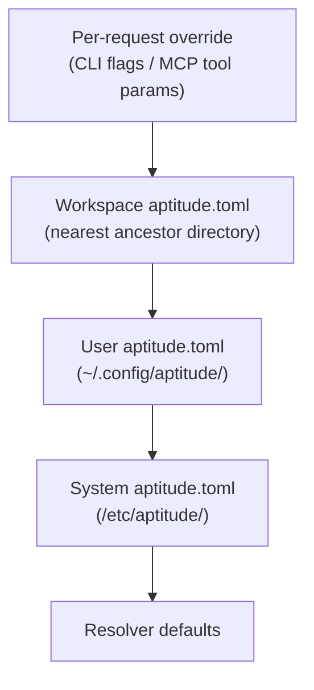
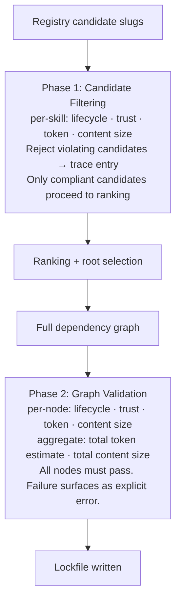

# Aptitude — System Policies

> How governance, security, and access control work across the full Aptitude system.

## Overview

Policy in Aptitude is enforced in layers. Each component owns a distinct slice of the policy surface, and the layers compose in sequence — the publisher evaluates before the registry receives, the registry enforces before the resolver selects, and the resolver applies client-side policy before materializing to disk.

No component can grant permissions that another is designed to enforce. Policy is always **restrictive**: lower-priority layers may tighten constraints, never relax them.



---

## Publisher Policies

### Security Policy (garak — mandatory)

NVIDIA garak is the sole authoritative security source for the publisher. There is no local fallback. If garak is not configured or does not return a scored result, publishing is blocked regardless of any other evaluation signal.



Severity thresholds: `critical` → block (−0.50 score penalty), `high` → review_required (−0.30), `medium` (−0.15) and `low` (−0.05) reduce score but do not block.

### Compliance Policy (Anthropic SKILL.md contract)

The validation stage enforces Anthropic's skill-writing requirements. Errors block publishing; warnings reduce the quality score but do not block.

**Blocking errors include:** skill folder must be kebab-case, `SKILL.md` must exist, YAML frontmatter must be present and parseable, `name` must be kebab-case and match the folder name, `name` must not contain `"claude"` or `"anthropic"`, `description` must be under 1024 characters and include trigger guidance, no XML angle brackets in frontmatter, `README.md` must not be inside the skill folder, body must be non-empty.

**Advisory warnings:** body should include `# Instructions` heading, an example section, and a troubleshooting section.

### Governance Input Declaration

Governance metadata is declared by the caller via CLI flags and is not validated by the publisher — it is passed to the registry, which enforces it.

| Field | CLI Flag | Default |
| --- | --- | --- |
| `trust_tier` | `--trust-tier` | `untrusted` |
| `namespace` | `--namespace` | `public` |
| `artifact_origin` | `--artifact-origin` | `internal` |
| `policy_pack_slug` | `--policy-pack-slug` | `null` |
| `publisher_identity` | `--publisher-identity` | `null` |

---

## Registry Policies

### Authentication

All registry API calls (except liveness and readiness probes) require a bearer token:

```
Authorization: Bearer <token_id>.<token_secret>
```

Tokens carry one or more scopes assigned at creation time. A request without a token or with insufficient scope is rejected with `401` or `403`.

| Scope | Grants |
| --- | --- |
| `read` | Discovery, resolution, exact fetch, version listing, catalog |
| `publish` | Skill publication (subject to trust-tier and namespace rules) |
| `review` | Governance review and promotion workflow updates |
| `admin` | Lifecycle transitions, enterprise admin, all of the above |
| `telemetry` | Star event submission and user-star listing |

### Trust Tiers

Trust tier controls the level of assurance attached to a skill version. It affects ranking (higher trust is preferred) and can be constrained by namespace policy.

| Tier | Meaning | Rank |
| --- | --- | --- |
| `verified` | Externally reviewed and attested | 2 |
| `internal` | Published by a known internal publisher | 1 |
| `untrusted` | No explicit attestation | 0 |

A publisher token must be authorized for the trust tier it is requesting. Publishing `verified` skills requires a token with the appropriate trust-tier grant for the target namespace.

### Lifecycle

Every skill version progresses through a lifecycle. Transitions are one-way and require `admin` scope.



Discovery and read APIs default to returning only `published` versions. Callers with appropriate scope can request `deprecated` or `archived` versions explicitly.

### Namespaces and Namespace Grants

Namespaces scope skill ownership and visibility. A publisher token may be granted access to specific namespaces with specific trust tiers. Attempting to publish to a namespace without the corresponding grant is rejected.

### Policy Packs

A policy pack is a named set of additional governance rules attached to a namespace or a specific skill version. If a skill version is subject to a policy pack, callers must satisfy the pack's rules to view or fetch it.

### Governance Filtering

Discovery results and exact reads are filtered by:

1. Lifecycle status — only visible statuses for the caller's allowed set.
2. Namespace — only namespaces the caller's token is authorized to read.
3. Review state — `approved` required unless the caller holds a `review` grant.
4. Promotion channel — must be in the caller's allowed channels.
5. Policy pack rules — caller must satisfy all attached policy pack conditions.

### Audit

A `search.performed` event is recorded after every discovery call (query shape only — no raw text stored). Publish, lifecycle transition, review, and administrative actions each record a typed audit event with actor identity, timestamp, and the state change applied.

---

## Resolver Policies

### Policy Context (Hard Limits)

`PolicyContext` is the resolved hard-policy structure built by merging all active configuration layers. It can only block — it never allows something that a higher-priority layer has restricted.

| Field | Default | Description |
| --- | --- | --- |
| `allowed_lifecycle_statuses` | `["published", "deprecated", "archived"]` | Which lifecycle states may be selected |
| `allowed_trust_tiers` | `["verified", "internal", "untrusted"]` | Which trust tiers may be selected |
| `max_token_estimate` | `None` (no limit) | Per-skill token ceiling |
| `max_content_size_bytes` | `None` (no limit) | Per-skill content size ceiling |
| `max_total_token_estimate` | `None` (no limit) | Aggregate graph token ceiling |
| `max_total_content_size_bytes` | `None` (no limit) | Aggregate graph content size ceiling |

When a ceiling is configured and a skill's value is `None` (unknown), the check **fails closed** — the skill is rejected.

### Config Layers (Precedence Order)



Merging is **restrictive only**: list fields take the intersection of all active layers; numeric ceilings take the minimum across all active layers. A lower-priority layer can never relax a restriction set by a higher-priority layer.

### Two-Phase Governance

Governance runs in two sequential phases during every fresh planning cycle.



Phase 1 runs **before** final root selection. Ranking and selection operate only on policy-compliant candidates.

Phase 2 runs **after** the full dependency graph is resolved, **before** the lockfile is written. A failure at Phase 2 does not silently fall through — it surfaces as an explicit error.

### Selection Preferences (Soft)

`SelectionPreferences` shapes ranking but cannot block operations.

| Profile | Ranking emphasis |
| --- | --- |
| `balanced` (default) | Equal weight across trust, lifecycle freshness, and size |
| `low-cost` | Prefer smaller token estimate and content size |
| `high-trust` | Strongly prefer `verified` → `internal` → `untrusted` |

Interaction mode controls whether the resolver prompts on ambiguity:

| Mode | Behavior |
| --- | --- |
| `auto` (default) | Prompts when ambiguous and the session supports interactive input |
| `always` | Must prompt; fails clearly if unavailable (MCP, CI) |
| `never` | Always selects the top-ranked candidate deterministically |

Prompting is permitted only for root candidate selection. Recursive dependency resolution never prompts.

### Checksum Policy

Checksum verification runs on **compressed artifact bytes** before archive extraction. The SHA-256 digest is read from the lockfile (written at planning time from registry metadata). A mismatch raises `ContentChecksumMismatchError` and aborts the install — no partial installs are permitted.

---

## Cross-Component Policy Summary

| Policy question | Enforced by |
| --- | --- |
| Is the skill content free of injection attacks? | Publisher (garak — mandatory) |
| Does `SKILL.md` follow Anthropic's structure rules? | Publisher (validation stage) |
| Is the publisher's `trust_tier` allowed for this namespace? | Registry |
| Does the caller's token have `publish` scope? | Registry |
| Is the requested lifecycle transition valid? | Registry |
| Is the bundle checksum correct? | Registry (on receive) + Resolver (before extraction) |
| Are policy pack rules satisfied for this skill? | Registry |
| Are per-skill token and size limits respected? | Resolver (Phase 1 + Phase 2) |
| Is the full dependency graph compliant? | Resolver (Phase 2) |
| What is the effective policy for this workspace? | Resolver (config layer merge) |
