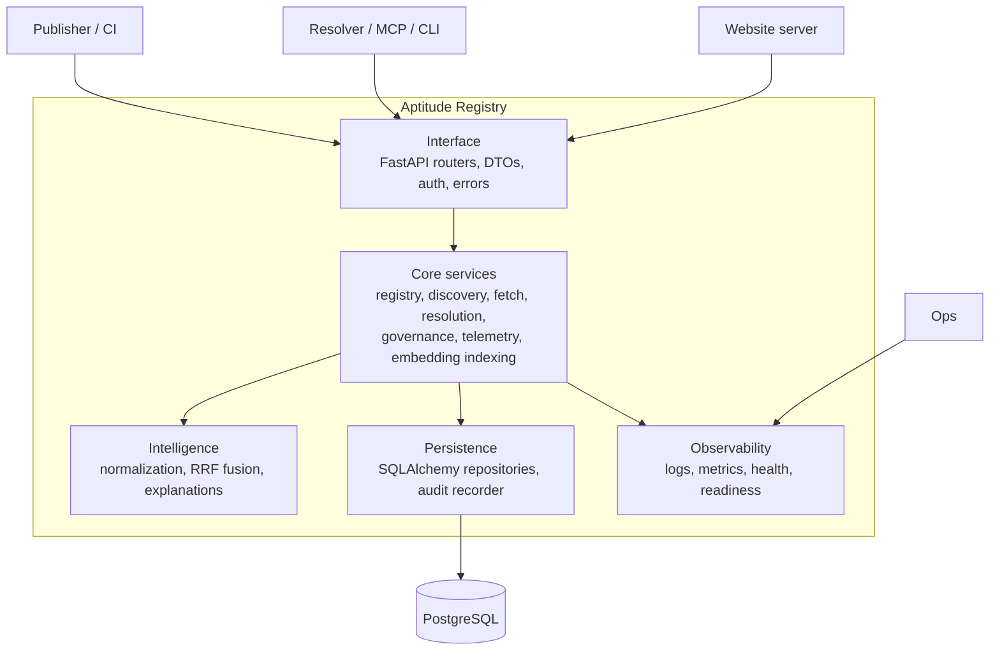

# Aptitude Registry - Architecture

The registry is a layered FastAPI service backed by PostgreSQL. PostgreSQL is
the sole authoritative runtime store. Semantic search and observability are
external integrations, not additional sources of truth.

## Runtime Shape



## Interface Layer

FastAPI routers parse requests, authenticate service tokens, enforce route
scopes, translate DTOs, attach request IDs, and return stable error envelopes.

Important route modules:

- `skills.py` - publish, version listing, exact metadata, lifecycle.
- `discovery.py` - resolver discovery.
- `fetch.py` - exact content fetch and catalog surfaces.
- `resolution.py` - direct dependency selector reads.
- `enterprise.py` - organization, namespace, policy, review, and trust evidence.
- `telemetry.py` - star events and user-star reads.
- `health.py` and `root.py` - status and root UI.

## Core Services

The core layer owns domain behavior:

| Service/module | Responsibility |
| --- | --- |
| Skill registry | Immutable publish workflow, checksum calculation, storage coordination. |
| Discovery/search | Candidate generation using lexical, semantic, and co-usage signals. |
| Exact read/fetch | Visible metadata and exact `.tar.zst` content reads. |
| Resolution | Direct `depends_on` selector reads for one exact coordinate. |
| Governance | Scope, namespace, lifecycle, review, promotion, trust-tier, and policy-pack decisions. |
| Telemetry | Star/unstar aggregation and per-user star state. |
| Embedding indexing | Pending/stale semantic embedding backfill. |
| Audit | Structured audit events for important reads and all mutating operations. |

## Persistence Model

The registry persists:

- `skills` and `skill_versions` for identity and immutable version records.
- `skill_contents` for raw bundle bytes and content digest.
- `skill_metadata` for structured metadata.
- `skill_relationship_selectors` for direct authored dependency selectors.
- `skill_search_documents` for full-text and catalog search projection.
- `skill_search_embeddings` for pgvector-backed semantic search.
- co-usage tables for optional boost signals.
- governance tables for organizations, namespaces, policy packs, ownership, and
  trust evidence.
- audit tables for publish, governance, and discovery/search events.

## Discovery Design

Discovery is a candidate-generation API. It returns ordered slugs, not final
runtime decisions. The resolver is expected to fetch metadata, apply local
policy, rerank, select, solve, and lock.

The registry pipeline:

1. Normalize request text and tags.
2. Search `skill_search_documents` with PostgreSQL full-text search and
   SQL-level visibility predicates.
3. Optionally run semantic search over `skill_search_embeddings` with the same
   visibility predicates.
4. Optionally apply co-usage boosts from `skill_co_usage_pairs`.
5. Fuse ranked lists with RRF plus bounded boosts.
6. Apply final governance visibility checks to the fused list.
7. Record a redacted audit event.

See [Discovery Mechanism](discovery-mechanism.md).

## Governance Design

Every protected request is authenticated with:

```text
Authorization: Bearer <token_id>.<token_secret>
```

Scopes determine route access. Namespace grants, lifecycle state, review state,
promotion channel, trust tier, and policy packs determine whether a caller can
see, publish, review, or mutate a record.

## Operations

The registry exposes public liveness and readiness routes. Readiness checks
database connectivity and migration state. Metrics are exported through
OpenTelemetry when enabled; `/metrics` is not the current canonical monitoring
surface.

Migrations use Alembic and prefer `MIGRATION_DATABASE_URL` when configured. That
URL should target a direct database connection rather than a pooled connection.
