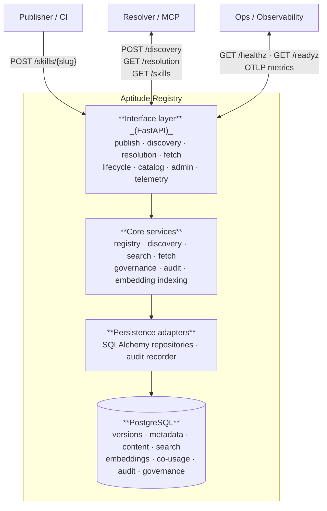

# Aptitude Registry — Architecture

> System design, layer breakdown, and API overview.

## System Overview

The registry is a small, layered service centred on PostgreSQL. It has no external state stores, caches, or message queues in its critical path — PostgreSQL is the sole authoritative runtime store. Optional semantic search adds an OpenAI Embeddings call at query time, but that path degrades gracefully to lexical-only on failure.



## Layer Breakdown

### Interface Layer

`app/interface/` — FastAPI routers and Pydantic DTOs.

Responsibilities:
- Authenticate every protected request using the service-token scheme (`Authorization: Bearer <id>.<secret>`).
- Parse and validate request shapes; translate to core domain commands/queries.
- Enforce route-level scope checks (`read`, `publish`, `review`, `admin`, `telemetry`) before forwarding to core services.
- Translate domain errors (`SkillNotFoundError`, `PolicyViolation`, etc.) into stable JSON error envelopes.
- Attach `X-Request-ID` correlation headers on all responses.

Key modules: `skills.py` (publish + exact reads), `discovery.py`, `resolution.py`, `fetch.py`, `health.py`, `enterprise.py`, `telemetry.py`.

### Core Services

`app/core/` — domain logic, pure and port-driven.

The core layer never imports from the interface or persistence layers. It depends only on abstract port interfaces defined in `app/core/ports.py`.

| Module | Responsibility |
| --- | --- |
| `skills/registry.py` | Immutable publish workflow — hash checking, governance evaluation, storage coordination |
| `skills/discovery.py` | Discovery facade — narrows search output to ordered slug lists |
| `skills/search.py` | `SkillSearchService` — hybrid lexical + semantic + co-usage candidate retrieval |
| `skills/exact_read.py` | Exact metadata and version-list reads with governance visibility checks |
| `skills/fetch.py` | Exact content fetch — returns immutable `.tar.zst` bytes |
| `skills/resolution.py` | Direct `depends_on` selector reads for one exact coordinate |
| `skills/embedding_indexing.py` | Background embedding backfill and index status management |
| `skills/bundle_archive.py` | Bundle structure validation at publish time |
| `governance.py` | `GovernancePolicy` — evaluates publish rules, lifecycle transitions, visibility, and namespace grants |
| `auth.py` | Token authentication and `CallerIdentity` construction |
| `settings.py` | Environment-driven configuration and `SemanticDiscoveryMode` |

### Intelligence Layer

`app/intelligence/` — pure ranking and signal helpers.

| Module | Responsibility |
| --- | --- |
| `discovery_signals.py` | RRF-based candidate fusion, embedding source/checksum building, co-usage boost application |
| `search_ranking.py` | Request normalization, explanation field construction, audit payload building |

### Integrations Layer

`app/integrations/` — thin wrappers around external services.

- `openai_embeddings.py` — calls the OpenAI Embeddings API to produce query vectors at search time. Only used when `SEMANTIC_DISCOVERY_MODE` is `on` or `shadow`.

### Persistence Adapters

`app/` persistence modules — SQLAlchemy ORM models and repository implementations that satisfy the port interfaces defined in core.

The main port contract is `SkillDiscoverySearchPort`, which exposes:
- `search_candidates` — lexical full-text search over `skill_search_documents`
- `search_semantic_candidates` — HNSW cosine search over `skill_search_embeddings`
- `get_co_usage_boosts` — co-usage lift scores from `skill_co_usage_pairs`

### Operations

`app/observability/` — metrics, structured logging, and health probes.

- Health: `GET /healthz` (liveness), `GET /readyz` (dependency check: DB connectivity + migration state).
- Metrics: OTLP/HTTP export to Grafana Cloud when `OTEL_ENABLED=true`. Legacy `/metrics` endpoint removed after migration 11.
- Logs: structured JSON via stdlib `logging`, shipped via Loki.

## Data Flow

### Publish

```
Publisher → POST /skills/{slug}   (multipart/form-data: metadata JSON + bundle bytes)
         → Auth middleware: token lookup, scope check
         → Interface: parse DTO, validate bundle structure
         → Core registry service:
             1. Evaluate publish governance (trust tier, namespace, provenance)
             2. Compute SHA-256 content digest
             3. Compute canonical version checksum (metadata + content digest + relationships)
             4. Write skill_contents, skill_metadata, skill_versions, skill_relationship_selectors
             5. Write skill_search_documents (lexical search projection)
             6. Enqueue skill_search_embeddings row (status = pending)
             7. Write audit_events row
         ← 201 with exact metadata JSON
```

### Discovery

```
Resolver → POST /discovery   (name, description, tags, context_skills)
         → Auth: read scope required
         → Core search service:
             1. Normalize request text and tags
             2. Apply governance filters (statuses, trust tiers, namespaces, channels)
             3. Run lexical search on skill_search_documents (tsvector GIN)
             4. Optionally run semantic search on skill_search_embeddings (HNSW cosine)
             5. Optionally fetch co-usage boosts from skill_co_usage_pairs
             6. Fuse candidates with RRF + co-usage boost
             7. Filter visibility per governance policy
             8. Write search audit event
         ← 200 with ordered slug list
```

### Exact Fetch

```
Resolver → GET /skills/{slug}/{version}/content
         → Auth: read scope required
         → Core fetch service:
             1. Load skill_versions + skill_contents by (slug, version)
             2. evaluate_exact_read_allowed (lifecycle, namespace, review state, channel, policy pack)
         ← 200 with raw .tar.zst bytes
              ETag: content checksum digest
              Cache-Control: public, immutable
```

## API Overview

### Authentication

All protected routes require:

```
Authorization: Bearer <token_id>.<token_secret>
```

Scopes are attached to tokens at creation time:

| Scope | Grants |
| --- | --- |
| `read` | Discovery, resolution, exact fetch, version listing, catalog |
| `publish` | Skill publication (subject to trust-tier rules) |
| `review` | Governance review and promotion workflow updates |
| `admin` | Lifecycle transitions, enterprise admin, all of the above |
| `telemetry` | Star event submission and user-star listing |

### Route Summary

| Method | Path | Scope | Notes |
| --- | --- | --- | --- |
| `GET` | `/healthz` | none | Liveness probe |
| `GET` | `/readyz` | none | DB + migration readiness |
| `POST` | `/skills/{slug}` | `publish` | Publish `slug@version` via `multipart/form-data` |
| `POST` | `/discovery` | `read` | Ordered candidate slugs |
| `GET` | `/skills/{slug}` | `read` | Visible version list for one identity |
| `GET` | `/resolution/{slug}/{version}` | `read` | Direct `depends_on` selectors |
| `GET` | `/skills/{slug}/{version}` | `read` | Exact immutable metadata |
| `GET` | `/skills/{slug}/{version}/content` | `read` | Exact immutable `.tar.zst` bytes |
| `PATCH` | `/skills/{slug}/{version}/status` | `admin` | Lifecycle transition |
| `GET` | `/catalog/top-skills` | `read` | Homepage feed (ordered by install count) |
| `GET` | `/catalog/skill-graph` | `read` | Homepage hero relation graph |
| `POST` | `/catalog/search` | `read` | Website search feed (card metadata) |
| `POST` | `/catalog/star-events` | `telemetry` | Record star/unstar batch |
| `GET` | `/catalog/user-stars` | `telemetry` | Slugs starred by a user subject |
| `POST` | `/admin/organizations` | `admin` | Create enterprise organization |
| `POST` | `/admin/namespaces` | `admin` | Create namespace |
| `PUT` | `/admin/policy-packs/{slug}` | `admin` | Upsert policy pack |
| `PATCH` | `/admin/skills/{slug}/ownership` | `admin` | Move skill to namespace |
| `PATCH` | `/admin/skills/{slug}/{version}/governance` | `review` | Update review/promotion/trust state |
| `POST` | `/admin/skills/{slug}/{version}/trust-evidence` | `review` | Append trust evidence |

### Bundle Format

Skills are published as `.tar.zst` archives (`application/zstd`). The server validates structure at publish time and enforces:

- Maximum upload size: 5 MiB
- Maximum file count: 200
- Maximum path length per entry: 240 bytes

Content is stored verbatim as binary bytes. The SHA-256 content digest is the stable identity for the artifact.

### Checksums

Two digests are stored per version:

- **Content digest** (`content.checksum.digest`): SHA-256 of the raw stored bundle bytes.
- **Version checksum** (`version_checksum.digest`): SHA-256 of a canonical JSON payload encoding the content digest, metadata, governance inputs, and relationships. This digest does not change when mutable enterprise workflow state is updated post-publish; audit rows carry that history instead.

### Error Envelope

All API errors share a stable shape:

```json
{
  "error": {
    "code": "POLICY_PUBLISH_FORBIDDEN",
    "message": "Caller is not allowed to publish with the requested trust tier.",
    "details": { "required_scope": "publish", "trust_tier": "verified" }
  }
}
```

## Registry vs Resolver Boundary

The registry answers these questions:
- Does this `slug@version` exist?
- What are its exact metadata, content, and direct `depends_on` selectors?
- Which slugs are candidates for a given intent description?
- Is this version visible to this caller under the active governance policy?

The registry never answers:
- Which candidate should be selected?
- What is the full transitive closure of dependencies?
- How should this version be executed?

See [`architecture/server-resolver-boundary.md`](architecture/server-resolver-boundary.md) for the detailed boundary specification.
