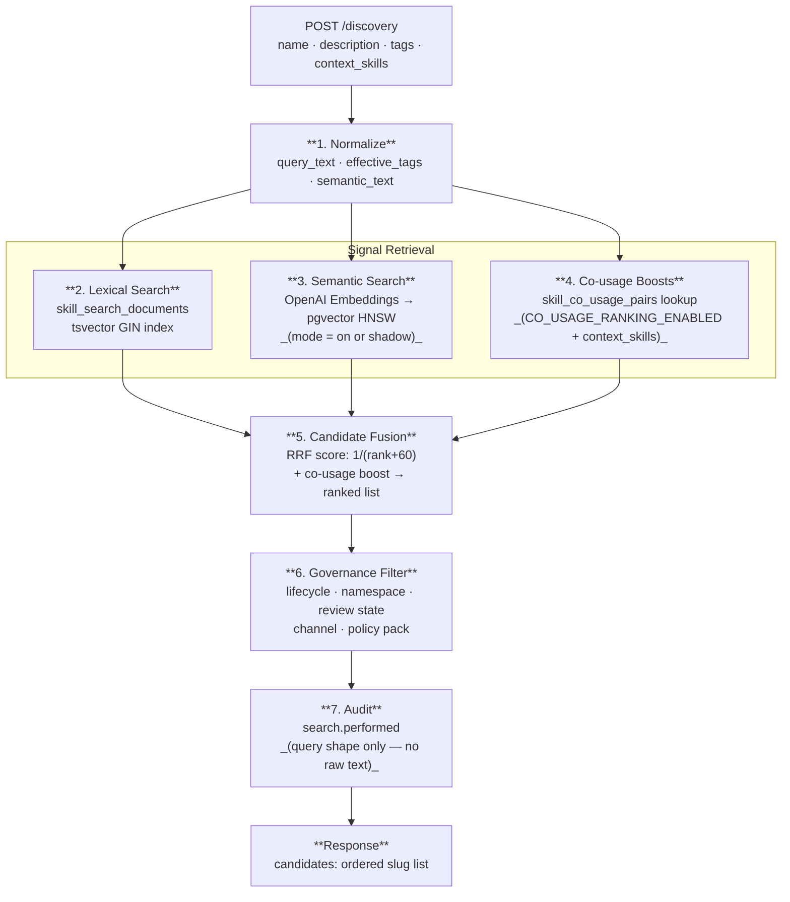

# Aptitude Registry — Discovery Mechanism

> How the hybrid search pipeline works: lexical search, semantic search, and co-usage signals.

## Overview

The `POST /discovery` endpoint returns an ordered list of candidate skill slugs for a given intent description. Internally it runs a hybrid pipeline that combines three independent signals:

1. **Lexical search** — PostgreSQL full-text search over a materialized search document table.
2. **Semantic search** — cosine similarity over OpenAI text embeddings stored in a pgvector HNSW index.
3. **Co-usage boosts** — bounded score boosts derived from observed skill co-installation patterns.

The signals are fused into a single ranked list before governance filtering is applied. Discovery always returns slugs only — card-ready metadata comes from `POST /catalog/search`, which reuses the same ranking pipeline.



## Semantic Discovery Modes

The `SEMANTIC_DISCOVERY_MODE` setting controls which signals are active:

| Mode | Lexical | Semantic | Co-usage |
| --- | --- | --- | --- |
| `off` (default) | ✓ | ✗ | optional |
| `shadow` | ✓ | runs but discarded | optional |
| `on` | ✓ | ✓ | optional |

`shadow` mode lets the semantic pipeline run and emit metrics without affecting results, useful for A/B validation before enabling it in production. Co-usage is independently toggled by `CO_USAGE_RANKING_ENABLED`.

## Step 1 — Request Normalization

Before any query is issued, the search request is normalized:

- The free-text query (`name` + optional `description`) is lowercased and stripped of punctuation to produce a canonical `query_text`.
- Tags are lowercased, deduplicated, and merged with any `language` filter into `effective_tags`.
- Query terms are split on whitespace for explanation construction.

The semantic query text is built separately from `description` + `tags` only (not `name`). This intentionally separates lexical identity matching (`name` → slug/name fields) from semantic meaning matching (`description + tags` → embedding space).

## Step 2 — Lexical Search

A `SearchCandidatesRequest` is issued against `skill_search_documents`, which holds a pre-materialized search projection for every current-default visible version.

The query uses PostgreSQL's full-text search (`tsvector` / `GIN` index) and combines several match signals:

- `search_vector @@ plainto_tsquery(query_text)` — full-text match across slug, name, and description.
- Exact slug equality check.
- Exact normalized name equality check.
- GIN array containment check for `normalized_tags @> effective_tags`.
- Recency, content size, and `usage_count` as secondary sort inputs.

The search document table also carries governance columns (`namespace`, `lifecycle_status`, `trust_tier`, `review_state`, `promotion_channel`, `policy_pack_slug`) so governance filters are applied as SQL predicates, not post-hoc.

## Step 3 — Semantic Search (when enabled)

When `SEMANTIC_DISCOVERY_MODE = on`, the service:

1. Calls the OpenAI Embeddings API with `semantic_text` (description + tags) using the configured model (default: `text-embedding-3-small`, 1536 dimensions).
2. Validates the returned vector — must be exactly 1536 finite floats.
3. Issues a nearest-neighbor query against `skill_search_embeddings` using pgvector's HNSW index (`halfvec_cosine_ops`).

The HNSW index parameters:

```
m = 16
ef_construction = 64
hnsw_ef_search  = 40  (runtime default, configurable)
```

The index is filtered to rows where `embedding_vector IS NOT NULL AND index_status = 'indexed'`. The same governance predicates (lifecycle, namespace, trust tier, etc.) are applied to limit the ANN search to visible candidates.

If the OpenAI call times out or fails, the semantic path is silently skipped and results fall back to lexical-only. A `semantic.discovery.failed` metric is emitted.

### Embedding Index Lifecycle

Embeddings are not computed at publish time. A background indexer reads rows with `index_status = 'pending'` or `'stale'`, generates the vector, and transitions the row to `indexed`. If the source text changes (description or tags updated via a re-publish), the `source_checksum_digest` changes, which marks the existing row `stale` before the next indexing pass.

## Step 4 — Co-usage Boosts (when enabled)

When `CO_USAGE_RANKING_ENABLED = true` and the request includes `context_skills`, the service looks up pre-computed co-usage lift scores from `skill_co_usage_pairs`.

The `context_skills` list represents skills already installed or selected in the current session (up to 10 are used, configurable via `CO_USAGE_CONTEXT_LIMIT`). For each `(context_skill, candidate_slug)` pair, the registry returns a normalized `co_usage_rate` score.

Boosts are bounded by a configurable cap (default `0.05`) to prevent co-usage from overwhelming text-match signals:

```python
boost = min(max(co_usage_rate, 0.0), CO_USAGE_BOOST_CAP)
```

Co-usage scores are computed offline from `skill_usage_observation_runs` and `skill_usage_observations` tables and stored in `skill_co_usage_pairs` as aggregated per-window statistics (observation count, distinct run count, co-usage rate, lift score, PMI score).

## Step 5 — Candidate Fusion

Lexical and semantic candidates are fused using a Reciprocal Rank Fusion (RRF) style score, then co-usage boosts are added on top:

```python
lexical_score  = 1 / (lexical_rank + 60)   if present else 0
semantic_score = 1 / (semantic_rank + 60)  if present else 0
fused_score    = lexical_score + semantic_score + co_usage_boost
```

The constant `60` follows the standard RRF formulation to smooth rank differences between the two result sets.

Final sort order applies these criteria in sequence (earlier criteria take priority):

1. Exact slug match (highest priority)
2. Exact name match
3. Descending fused score
4. Descending tag overlap count
5. Descending usage count
6. Descending `published_at` timestamp
7. Ascending content size bytes
8. Ascending slug (tie-breaker)
9. Descending internal version FK (tie-breaker)

In `shadow` mode, semantic candidates are computed but then discarded before fusion — lexical results determine final order, but semantic metrics are still recorded.

## Step 6 — Governance Filtering

After fusion, the final result list is filtered through `GovernancePolicy.is_visible_in_list`, which checks:

- Lifecycle status is in the caller's allowed set (default: `published` only for read-scope callers).
- Namespace is in the caller's allowed namespaces.
- Review state is `approved` unless the caller holds a `review` grant.
- Promotion channel is in the caller's allowed channels.
- Policy pack rules (if attached) permit the caller.

Only versions passing all checks are returned.

## Step 7 — Audit

A `search.performed` audit event is recorded after every discovery call. The payload is intentionally redacted — it records the query *shape* (term present/absent, tag count, limit, result count) without storing raw query text.

## Discovery Request Shape

```json
POST /discovery

{
  "name": "python lint",
  "description": "Lint FastAPI services",
  "tags": ["python", "fastapi"],
  "context_skills": ["python.test", "python.format"]
}
```

Response:

```json
{
  "candidates": ["python.lint", "python.ruff", "python.flake8"]
}
```

## Explanation Fields (catalog/search only)

`POST /catalog/search` uses the same pipeline but returns card-level metadata with explanation fields:

- `matched_fields`: which fields (`slug`, `name`, `description`, `tags`) contained a query term.
- `matched_tags`: the intersection of requested tags and skill tags.
- `reasons`: human-readable match reasons — `exact_slug_match`, `exact_name_match`, `text_match`, `tag_filter_match`, or `structured_filter_match`.

These fields are deterministically computed from the normalized request and stored candidate data — they are not probabilities or model outputs.

## Configuration Reference

| Setting | Default | Description |
| --- | --- | --- |
| `SEMANTIC_DISCOVERY_MODE` | `off` | `off`, `shadow`, or `on` |
| `SEMANTIC_EMBEDDING_MODEL` | `text-embedding-3-small` | OpenAI model name |
| `SEMANTIC_EMBEDDING_DIMENSIONS` | `1536` | Must match index dimensions |
| `SEMANTIC_CANDIDATE_LIMIT` | `20` | Max ANN neighbours to retrieve |
| `SEMANTIC_QUERY_TIMEOUT_MS` | `2000` | Embedding API call timeout |
| `SEMANTIC_HNSW_EF_SEARCH` | `40` | pgvector HNSW runtime search width |
| `CO_USAGE_RANKING_ENABLED` | `false` | Enable co-usage boost signals |
| `CO_USAGE_BOOST_CAP` | `0.05` | Maximum additive boost per candidate |
| `CO_USAGE_CONTEXT_LIMIT` | `10` | Max context skills used for boost lookup |
