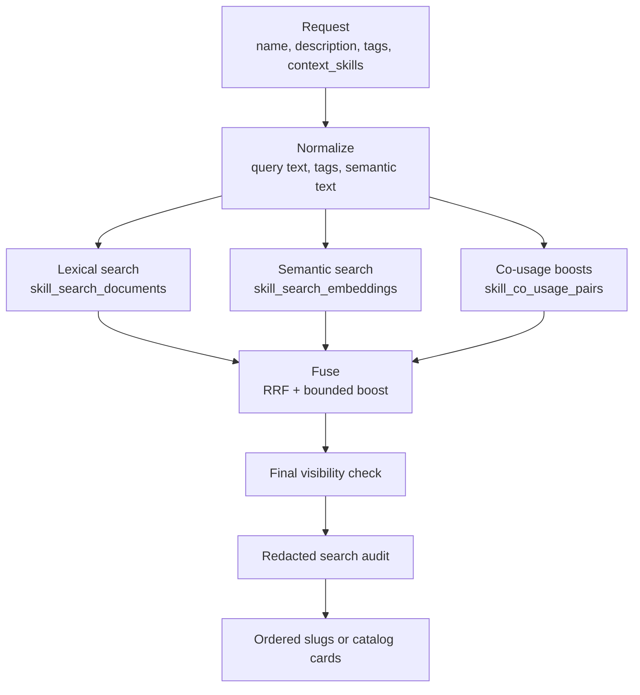

# Aptitude Registry - Discovery Mechanism

`POST /discovery` returns an ordered list of candidate skill slugs for a caller.
It is candidate generation only. The resolver performs final selection.

`POST /catalog/search` reuses the same search service but returns card-ready
catalog metadata for the website.

## Pipeline



## Modes

`SEMANTIC_DISCOVERY_MODE` supports:

| Mode | Behavior |
| --- | --- |
| `off` | Lexical search only. |
| `shadow` | Semantic search runs for measurement but is discarded before fusion. |
| `hybrid` | Lexical and semantic candidates are fused. |

The default mode is `hybrid`. If semantic search is enabled, `OPENAI_API_KEY`
must be configured. If an embedding call or semantic query fails, discovery
falls back to lexical results and records a semantic failure metric/log event.

Co-usage boosts are controlled independently by `CO_USAGE_RANKING_ENABLED` and
only apply when the request includes `context_skills`.

## Request Normalization

The registry normalizes:

- free text from `name` and `description`,
- tags and structured filters,
- semantic text from description/tags-oriented content,
- context skill slugs for optional co-usage lookup.

Normalization also creates deterministic explanation fields used by catalog
search cards.

## Lexical Search

Lexical search reads `skill_search_documents`, a projection of visible current
default versions. It uses PostgreSQL full-text search and exact-match signals:

- exact slug match,
- exact normalized name match,
- text match across slug/name/description,
- tag overlap/filter match,
- freshness, content size, and stable tie-breakers.

Governance columns are present in the search projection so lifecycle, namespace,
trust-tier, review-state, and promotion-channel predicates can be applied before
fusion.

## Semantic Search

Semantic search uses OpenAI `text-embedding-3-small` by default with 1536
dimensions. Embeddings are stored in pgvector `halfvec(1536)` rows with an HNSW
index. Semantic queries use the same visibility predicates as lexical search.

Embeddings are not computed during publish. An indexer processes pending or
stale rows and marks them indexed after successful embedding generation.

## Co-Usage Boosts

When enabled, co-usage reads precomputed skill-pair statistics and adds a small,
bounded score boost for candidates often used with the request's
`context_skills`. Co-usage is a ranking signal only; it is not dependency truth.

## Fusion

Lexical and semantic result lists are fused with Reciprocal Rank Fusion (RRF).
Co-usage is added as a bounded boost. Exact slug/name matches remain strong
ordering signals, and stable tie-breakers keep output deterministic.

## Governance Filter

Visibility is applied before fusion through repository predicates and again
after fusion through the governance policy. The checks cover:

- lifecycle status,
- namespace grants,
- trust tier visibility,
- review state,
- promotion channel,
- policy pack rules.

Only visible candidates are returned.

## Response Shapes

Discovery response:

```json
{
  "candidates": ["python.ruff", "python.pytest"]
}
```

Catalog search response includes card metadata and explanation fields such as
matched fields, matched tags, and reasons.

## Configuration

| Setting | Purpose |
| --- | --- |
| `SEMANTIC_DISCOVERY_MODE` | `off`, `shadow`, or `hybrid`. |
| `SEMANTIC_EMBEDDING_MODEL` | Embedding model name. |
| `SEMANTIC_EMBEDDING_DIMENSIONS` | Expected vector dimension. |
| `SEMANTIC_CANDIDATE_LIMIT` | Maximum semantic candidates. |
| `SEMANTIC_QUERY_TIMEOUT_MS` | Embedding call timeout. |
| `SEMANTIC_HNSW_EF_SEARCH` | pgvector HNSW search width. |
| `CO_USAGE_RANKING_ENABLED` | Enable co-usage boosts. |
| `CO_USAGE_BOOST_CAP` | Maximum boost per candidate. |
| `CO_USAGE_CONTEXT_LIMIT` | Maximum context skills used. |
