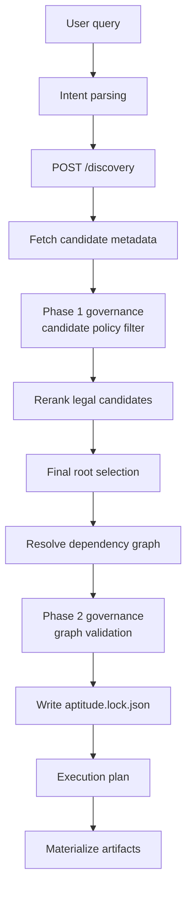
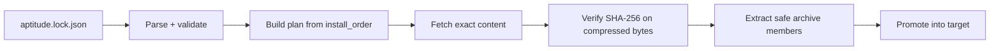

# Aptitude Resolver - Architecture

The resolver is a local Python process. It has no database and no server
component. Its durable outputs are lockfiles, execution plans, and materialized
skill files.

## Runtime Surfaces

| Surface | Purpose |
| --- | --- |
| CLI | Human and automation workflows. |
| Install-first wizard | No-argument guided install path. |
| MCP stdio server | Agent-host integration. |
| Hidden `resolve` command | Preview/debug flow for graph, lock, and plan without materialization. |

## Package Map

```text
aptitude_resolver/
  application/      # use cases, queries, DTOs, orchestration
  discovery/        # intent parsing, candidate discovery, reranking
  domain/           # shared domain models
  governance/       # policy context and graph/candidate evaluation
  interfaces/       # CLI, wizard, MCP, rendering
  lockfile/         # lock models and serialization
  registry/         # read-only HTTP client and response mapping
  resolution/       # version selection, dependency graph, conflict checks
  execution/        # archive fetch, checksum verify, safe extract, promote
  shared/config/    # settings and aptitude.toml loading
  telemetry/        # local metrics/events
```

## Fresh Planning Flow



The registry's discovery order is advisory. The resolver fetches metadata,
applies local policy, reranks, and makes final selection locally.

## Lock Replay Flow



Replay does not run intent parsing, discovery, ranking, or dependency solving.

## Registry Contract

The resolver uses read-only registry APIs:

| Route | Purpose |
| --- | --- |
| `POST /discovery` | Candidate slug generation. |
| `GET /skills/{slug}` | Visible versions for a slug. |
| `GET /skills/{slug}/{version}` | Exact immutable metadata. |
| `GET /resolution/{slug}/{version}` | Direct authored `depends_on` selectors. |
| `GET /skills/{slug}/{version}/content` | Exact `.tar.zst` bundle bytes. |

## Governance

Governance is local and two-phase:

1. Candidate filtering removes policy-violating candidates before ranking and
   root selection.
2. Graph governance validates every resolved node and aggregate graph limits
   before writing a lock.

Failures are explicit. The resolver does not silently choose another root after
graph governance fails.

## Materialization

Materialization is lock-driven:

- read install order from the lock,
- fetch exact artifact bytes,
- verify compressed-byte checksum,
- extract only safe archive members into staging,
- write `resolution/aptitude.lock.json` and `execution-plan.json`,
- promote only after all locked skills succeed.
