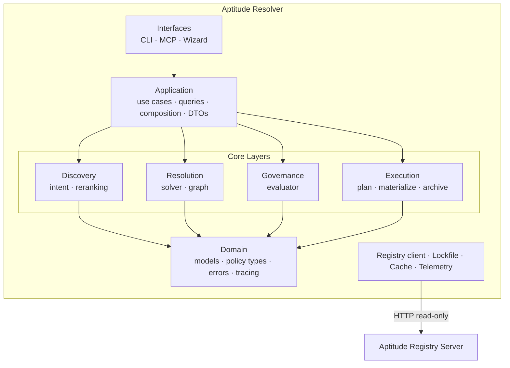

# Aptitude Resolver — Architecture

> Package map, layer breakdown, data flows, and registry contract.

## System Overview

The resolver is a local Python process. It has no server component, no persistent database, and no daemon. Every invocation is stateless at startup; the only durable output it writes is a `aptitude.lock.json` file and materialized skill files in the target directory.



## Layer Breakdown

### Interfaces

`interfaces/cli/` and `interfaces/mcp/` — entry points for humans and agents.

**Hard rules:**
- No business logic. Interfaces parse inputs, call application use cases, and render results.
- No solver logic. Interfaces may not call resolution, governance, or lockfile logic directly.
- Mutating operations (install, sync) require an explicit target path.

**CLI** uses Typer + Rich. The main entrypoints are `aptitude` and `aptitude-resolver` (both map to `interfaces/cli/main:main`). The wizard (`wizard.py`) handles the no-args interactive flow.

**MCP** uses FastMCP with stdio transport. The `AptitudeMcpAdapter` translates MCP input models to application DTOs and calls the same use cases the CLI uses. MCP tool annotations declare read-only vs. destructive status explicitly.

### Application

`application/` — orchestration only, no business logic.

| Module | Responsibility |
| --- | --- |
| `composition.py` | Wires use-case dependencies (registry client, config, policy, etc.) |
| `use_cases/install_skill.py` | Full fresh-planning + materialization flow |
| `use_cases/resolve_skill_query.py` | Fresh-planning up to lock generation (no materialization) |
| `use_cases/sync_from_lock.py` | Lock-replay + materialization |
| `use_cases/search_skills.py` | Discovery-only, no selection |
| `use_cases/inspect_skill.py` | Fetch and render one selected skill |
| `queries/plan_skill_resolution.py` | Planning query used by resolve + install |
| `queries/rank_skill_candidates.py` | Ranking query used during candidate selection |

### Discovery

`discovery/` — shaping registry candidates into resolver-ready form. Does **not** make final root selection decisions.

- **`intent/parsing.py`**: Parses a raw query string into a `SearchIntent` (name, description, tags). Handles natural-language queries like `"Postman Primary Skill"`.
- **`query_builder/build_query.py`**: Builds the `DiscoveryQuery` sent to the registry as `POST /discovery`.
- **`reranking/candidate_reranker.py`**: Optional client-side reranking of the registry candidate list. Does not perform final root selection.

### Resolution

`resolution/` — deterministic version choice and recursive graph expansion.

| Sub-package | Responsibility |
| --- | --- |
| `solver/candidate_selection.py` | Selects one candidate from the (filtered, ranked) list |
| `solver/version_selection.py` | Selects the best version for one slug |
| `solver/candidate_version_resolution.py` | Fetches metadata for candidate versions from registry |
| `graph/recursive_graph_resolver.py` | Recursively expands `depends_on` selectors into a full `ResolutionGraph` |
| `conflict/conflict_rules.py` | Detects version conflicts within the resolved graph |
| `normalizer/dependency_normalizer.py` | Normalizes authored relationship selectors |
| `validation/graph_validator.py` | Final graph integrity checks before lock generation |

The resolver never re-resolves during materialization. `execution/` consumes the lock only.

### Governance

`governance/evaluator.py` — two-phase policy enforcement.

**Phase 1 — Candidate filtering (pre-selection):**
Runs before final root selection. Rejects candidates that violate per-version policy rules (lifecycle, trust tier, token estimate, content size). Only policy-compliant candidates proceed to ranking and selection.

**Phase 2 — Graph validation (pre-lock):**
Runs after the full dependency graph is resolved, before the lock is written. Validates every node and checks aggregate limits. A governance failure at this stage does not silently fall through; it must be surfaced explicitly.

### Execution

`execution/` — lock-driven only. Never re-resolves or re-discovers.

- **`plan.py`**: Derives an ordered `ExecutionPlan` from a `Lockfile`. Install order is taken directly from `lockfile.install_order` — not computed from the graph.
- **`materialize.py`**: Parallel download + checksum verification + archive extraction + workspace promotion. Download concurrency and extraction concurrency are separate controls.
- **`archive.py`**: Safe `tar.zst` extraction. Rejects unsafe paths, symlinks, device files, and any member that could escape the target directory.

### Domain

`domain/` — pure types, no I/O dependencies.

- **`models/`**: `SkillCoordinate`, `ResolutionGraph`, `DiscoveryCandidate`, `SkillMetadata`, `DependencySpec`, etc.
- **`policy/models.py`**: `PolicyContext` (hard limits), `PolicyEvaluation` (one rule decision).
- **`policy/selection.py`**: `SelectionPreferences` (soft preferences: profile, interaction mode).
- **`policy/ranking.py`**: `TRUST_TIER_RANKS` and `LIFECYCLE_STATUS_RANKS` — deterministic rank helpers.
- **`errors/`**: All resolver-owned error types (`AptitudeResolverError` hierarchy).
- **`tracing/`**: `TraceEntry` — structured trace events emitted at each stage.

### Registry

`registry/` — the only module that talks to the Aptitude Registry server.

- **`client.py`**: HTTP client with advisory caching and bounded transient retry. All requests are read-only.
- **`mappers.py`**: Translates transport-layer Pydantic models into domain models. The resolver never uses transport models outside this boundary.
- **`transport_models.py`**: Pydantic models matching the exact JSON shapes returned by the registry API.

### Lockfile

`lockfile/` — lock schema, serialization, parsing, and replay.

The `Lockfile` model captures:
- `root`: original request + selected root node ID.
- `nodes`: list of `LockedSkill` — one per resolved `slug@version`, with checksum, metadata, and governance facts.
- `edges`: list of `LockedEdge` — explicit dependency relationships.
- `install_order`: deterministic list of `node_id` values defining materialization order.
- `selection`: `SelectionSnapshot` — selection preferences active during planning.
- `policy`: `PolicySnapshot` — policy context active during planning.
- `governance`: list of `GovernanceSnapshotEntry` — per-rule pass/fail from both governance phases.

Explainability fields (`selection`, `policy`, `governance`) are informational — they are not required for execution. Replay reads `nodes`, `edges`, and `install_order` only.

---

## Data Flows

### Fresh Planning (install / resolve)

```
1. Interface receives query string
2. Intent parsing → SearchIntent (name, description, tags)
3. Query builder → DiscoveryQuery → POST /discovery → ordered slug list
4. For each candidate slug:
     GET /skills/{slug}          (version list)
     GET /skills/{slug}/{version} (metadata for best version)
   → DiscoveryCandidate list
5. Candidate policy filtering → compliant candidate list
6. Ranking (profile-aware) → ranked candidate list
7. Root selection (auto / interactive)
8. Recursive graph resolution:
     GET /resolution/{slug}/{version}  (direct depends_on)
     → repeat for each dependency
9. Graph governance (graph-level policy validation)
10. Lockfile generation → aptitude.lock.json
11. Execution plan derivation (from lock install_order)
12. Materialization (if install):
      GET /skills/{slug}/{version}/content  (tar.zst bytes)
      → checksum verify → safe extract → workspace promote
```

### Lock Replay (sync)

```
1. Interface receives lockfile path + target
2. Lockfile parse → Lockfile model
3. Lock replay → ExecutionPlan (from install_order)
4. Materialization:
     GET /skills/{slug}/{version}/content  (tar.zst bytes)
     → checksum verify → safe extract → workspace promote
```

Discovery, intent parsing, candidate selection, and dependency solving do **not** run during lock replay. The lock is the sole execution source of truth.

---

## Registry Endpoints Used

| Method | Path | Purpose |
| --- | --- | --- |
| `POST` | `/discovery` | Ordered candidate slug list for a query |
| `GET` | `/skills/{slug}` | Version list for one identity |
| `GET` | `/skills/{slug}/{version}` | Exact immutable metadata for one coordinate |
| `GET` | `/resolution/{slug}/{version}` | Direct `depends_on` selectors |
| `GET` | `/skills/{slug}/{version}/content` | Immutable `.tar.zst` artifact bytes |

Legacy fallbacks are maintained for older server deployments (`/skills/{slug}/versions`, `/skills/{slug}/versions/{version}`, etc.).

The registry is treated as a read-only fact source. The resolver never writes to the registry. Retries belong at the `registry/client.py` boundary. Cache entries are advisory.

---

## Core Invariants

These invariants are not implementation choices — they are architectural requirements. Any code change that violates them is a bug.

1. **Determinism.** For the same logical inputs, the resolver produces the same candidate, version, graph, install order, lockfile, and execution plan.
2. **Discovery is non-final.** `discovery/` and `reranking/` may shape and rerank candidates, but they must not make the final root selection decision.
3. **Execution is lock-driven.** `execution/` reads `lockfile.install_order` only. It never calls resolution, discovery, or governance.
4. **Materialization is safe.** Checksum verification happens on compressed bytes before archive extraction. Archive extraction rejects any unsafe member.
5. **Telemetry is additive.** Traces, metrics, cache, and retry must not change correctness.
6. **Interfaces are thin.** No business logic in CLI handlers or MCP tools.
