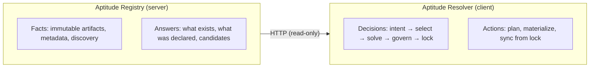
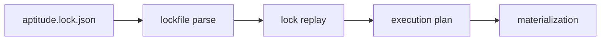

# Aptitude Resolver — Product Overview

> Canonical product description for the Aptitude Resolver.

## What It Is

Aptitude Resolver is the local decision-making engine for AI skill planning and materialization. It is the client-side half of the Aptitude system, complementing the Aptitude Registry server.

Where the registry owns facts — immutable artifacts, metadata, and discovery indexes — the resolver owns decisions. It interprets user intent, selects the best candidate from registry suggestions, solves the full dependency graph, enforces local client policy, generates a deterministic lockfile, and materializes skills to the local filesystem.

The resolver ships as a Python package on PyPI (`aptitude-resolver`) and is usable as a CLI, as a local MCP server for agent hosts, or as a library.

## The Aptitude Split



The server never selects, solves, or governs. The resolver never stores authoritative metadata. This boundary is strict and enforced at the architecture level.

## What the Resolver Owns

- **Intent interpretation.** Parses a human-readable query into a structured discovery request.
- **Candidate selection.** Receives an ordered slug list from the registry and selects the best match using ranking preferences and candidate policy filtering.
- **Dependency solving.** Recursively expands the dependency graph from the selected root by fetching `depends_on` selectors from the registry.
- **Governance.** Two-phase policy enforcement: candidate-level filtering before selection, graph-level validation before lock generation.
- **Lock generation.** Produces a deterministic `aptitude.lock.json` capturing the full resolved graph, install order, policy snapshot, and governance results.
- **Execution planning.** Derives a concrete ordered execution plan from the lock.
- **Materialization.** Downloads `tar.zst` skill artifacts, verifies checksums against lock metadata, extracts safe archive members into a staging area, and promotes the workspace only after all locked skills succeed.
- **Lock replay.** Replays an existing lock without re-running discovery or solving (`aptitude sync --lock`).
- **Policy configuration.** Loads and merges layered `aptitude.toml` config from system, user, and workspace scopes.

## What the Resolver Does Not Own

| Concern                              | Owned by            |
| ------------------------------------ | ------------------- |
| Immutable skill metadata             | Registry server     |
| Discovery candidate generation       | Registry server     |
| Exact artifact bytes                 | Registry server     |
| Audit logs                           | Registry server     |
| Remote / centralized policy services | Not yet implemented |

## Technology Stack

| Component            | Choice                 |
| -------------------- | ---------------------- |
| Language             | Python 3.10+           |
| Validation           | Pydantic               |
| CLI framework        | Typer + Rich           |
| MCP server           | FastMCP (stdio)        |
| Config format        | TOML (`aptitude.toml`) |
| Package manager      | uv                     |
| Build / publish      | uv + PyPI              |
| Linting / formatting | Ruff                   |
| Type checking        | (ty)                   |
| Testing              | pytest                 |

## CLI Commands

```bash
aptitude install "<query>"        # Fresh planning and materialization from a query
aptitude sync --lock <lockfile>   # Replay an existing lockfile
aptitude policy show              # Inspect effective policy and config layers
aptitude manifest                 # Full CLI capability map
aptitude mcp                      # Start the local stdio MCP server
```

The no-argument entrypoint (`aptitude`) launches the install-first wizard.

The `resolve` command exists as a hidden preview for debugging and CI use:

```bash
aptitude resolve "<query>"        # Preview the graph + lock + plan without materializing
```

### Install Examples

```bash
# Fresh install from a query
aptitude install "Postman Primary Skill"

# Install with JSON output for automation
aptitude install "Postman Primary Skill" --json

# Sync from an existing lockfile
aptitude sync --lock aptitude.lock.json

# Inspect effective policy
aptitude policy show
```

## MCP Server

The resolver ships a local stdio MCP server for agent hosts and MCP-compatible apps.

### Configuration (Claude Desktop / Coding agents)

```json
{
  "mcpServers": {
    "aptitude": {
      "command": "uvx",
      "args": ["aptitude-resolver", "mcp"],
      "env": {
        "APTITUDE_READ_TOKEN": "your-local-read-token"
      }
    }
  }
}
```

### MCP Tools

| Tool                     | Mutating | Description                                                 |
| ------------------------ | -------- | ----------------------------------------------------------- |
| `aptitude_search_skills` | No       | Search registry candidates without resolving                |
| `aptitude_inspect_skill` | No       | Inspect one selected skill and return metadata + preview    |
| `aptitude_resolve_skill` | No       | Resolve a query into a graph, lockfile, and plan            |
| `aptitude_show_policy`   | No       | Show effective policy and config layers                     |
| `aptitude_install_skill` | **Yes**  | Resolve and materialize to an explicit target path          |
| `aptitude_sync_lock`     | **Yes**  | Materialize an existing lockfile to an explicit target path |

Mutating tools require an explicit `target` path and are annotated as `destructiveHint=true`. The recommended workflow is to call `aptitude_resolve_skill` or `aptitude_inspect_skill` first, review the output, then confirm before calling install or sync.

### MCP Resources

| URI                             | Description                                |
| ------------------------------- | ------------------------------------------ |
| `aptitude://manifest`           | Full CLI capability map                    |
| `aptitude://policy/effective`   | Effective policy for the current workspace |
| `aptitude://docs/architecture`  | System overview doc                        |
| `aptitude://docs/cli-interface` | CLI interface contract                     |

### MCP Prompts

| Prompt                        | Description                          |
| ----------------------------- | ------------------------------------ |
| `aptitude_plan_install`       | Guided install planning flow         |
| `aptitude_compare_candidates` | Candidate search and comparison flow |
| `aptitude_sync_from_lock`     | Guided lock-sync flow                |

## Quick Start

Requirements: Python 3.10+, `uv`.

Install the package permanently:

```bash
uv tool install aptitude-resolver
aptitude --help
```

Run once without installing:

```bash
uvx aptitude-resolver --help
uvx aptitude-resolver install "Postman Primary Skill"
```

Development setup:

```bash
uv sync --extra dev
PYTHONPATH=src python -m aptitude_resolver --help
```

Developer workflow:

```bash
make format        # Auto-format code
make lint          # Run Ruff linter
make typecheck     # Run type checker
make test          # Run test suite
make test-cov      # Tests with coverage
make check         # format-check + lint + typecheck + test
```

## Current Flow Summary

### Fresh Planning (install / resolve)

```mermaid
flowchart LR
    Q["user query"]
    IP["intent parsing"]
    RD["registry discovery\nPOST /discovery"]
    CS["candidate selection + policy filtering"]
    RS["final root selection\n(with optional interaction)"]
    DG["recursive dependency graph resolution"]
    GG["graph governance"]
    LG["lockfile generation"]
    EP["execution plan"]
    M["materialization\n(install only)"]

    Q --> IP --> RD --> CS --> RS --> DG --> GG --> LG --> EP --> M
```



### Lock Replay (sync)



Lock replay intentionally skips discovery and dependency solving. The lockfile is the execution source of truth.

## Key Reading Order

1. This document — product scope and owned decisions.
2. [`architecture.md`](architecture.md) — package map, layer breakdown, and data flows.
3. [`policies.md`](policies.md) — config layers, policy context, governance phases.
4. [`reference/api-contract.md`](reference/api-contract.md) — registry endpoints used by the resolver.
